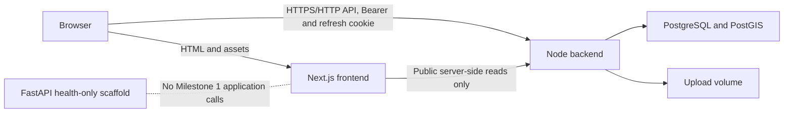

# FloodReady Milestone 1 — Master Implementation Specification

Authority: this document specifies only the work remaining after the existing `backend/` implementation. It is an implementation plan, not an implementation artifact. An executor must complete one ordered work packet at a time, may edit only that packet's authorized paths, and must never infer a missing contract, secret, map-provider term, or demo location.

Specification date: 2026-07-11.

## 1. Scope Summary

### 1.1 Objective

Complete FloodReady Milestone 1 around the existing Node.js backend by adding:

- A mobile-first Next.js frontend in `frontend/`.
- Exact browser integration with the existing `/api/v1` backend.
- A live MapLibre marker map with no application-drawn road geometry.
- A short image-and-location report workflow.
- A health-only FastAPI scaffold in `ai-service/`.
- Root Docker orchestration for frontend, backend, AI service, PostgreSQL/PostGIS, migrations, uploads, and optional demo seeding.
- Repeatable fictional demo data owned by the Node backend.
- Unit, component, contract, integration, accessibility, end-to-end, Docker, and documentation verification.

The Node backend remains the sole system of record and the only component allowed to read or write PostgreSQL, PostGIS, refresh sessions, audit logs, incident/report records, or upload-storage keys.

### 1.2 Route visibility selected by this specification

- Public: `/`, `/login`, `/register`, `/incidents/[incidentId]`, global error, and not-found pages.
- Protected for every active role: `/dashboard`, `/map`, `/reports/new`, `/reports`, `/reports/[reportId]`, and `/profile`.
- Report detail remains owner-only for `USER` and available to `MODERATOR`/`ADMIN`, matching backend authorization.
- The live map is authenticated. Its report layer uses a new privacy-safe projection; it never exposes reporter identity, reporter email, GPS accuracy, descriptions, image paths, or storage keys.
- Moderator controls may appear only on an authorized report-detail response. No administrator user-management UI is part of Milestone 1.

### 1.3 Explicitly deferred

LangGraph, LangChain, RAG, LLM or Ollama calls, image authenticity analysis, AI severity estimation, duplicate detection, reputation, community confirmation, official-data integration, confidence scoring, WebSockets, navigation, route planning, traffic-style road coloring, arbitrary road overlays, advanced analytics, OpenTelemetry, EC2, domains, HTTPS deployment, and government dashboards are outside this specification. They may be documented only as deferred work.

## 2. Current-State Assumptions

### 2.1 Observed repository state

- `backend/` exists and contains Express, TypeScript, Prisma/PostGIS, authentication, users, reports, incidents, uploads, audit, tests, Docker, and documentation.
- `frontend/`, `ai-service/`, `docs/`, root `docker-compose.yml`, root `.env.example`, root `README.md`, and root acceptance scripts do not exist.
- The root `.git` path does not currently resolve as a usable Git working tree. No packet may use Git cleanliness, history, reset, or rollback as acceptance evidence.
- Backend source files, tests, Prisma schema, environment schema, README, and Docker files are the current contract authority. An appended OpenAPI document supersedes source only if it matches runtime tests; otherwise the discrepancy is a blocker.

### 2.2 Fixed toolchain and dependency pins

The executor must use exact versions and commit generated lockfiles. It must not substitute newer packages without a separate approved spec revision.

| Area | Exact version |
|---|---:|
| Node.js / npm | `24.18.0` / `11.16.0` |
| Node image | `node:24.18.0-bookworm-slim@sha256:cb4e8f7c443347358b7875e717c29e27bf9befc8f5a26cf18af3c3dec80e58c5` |
| PostGIS image | `postgis/postgis:18-3.6@sha256:f248a10d133f63d01aefab324f3462d7e1002e9cc1b65c6585626f6cb7a3d85c` |
| Next.js / React / React DOM | `16.2.10` / `19.2.7` / `19.2.7` |
| TypeScript | `6.0.3` |
| Tailwind / Tailwind PostCSS | `4.3.2` / `4.3.2` |
| shadcn CLI | `4.13.0` |
| TanStack Query | `5.101.2` |
| React Hook Form / resolvers | `7.81.0` / `5.4.0` |
| Zod | `4.4.3` |
| MapLibre GL JS | `5.24.0` |
| Lucide React | `1.24.0` |
| Vitest / V8 coverage / jsdom | `4.1.10` / `4.1.10` / `29.1.1` |
| Testing Library React / jest-dom / user-event | `16.3.2` / `6.9.1` / `14.6.1` |
| MSW / Playwright / axe Playwright | `2.15.0` / `1.61.1` / `4.12.1` |
| ESLint / Next ESLint config | `10.7.0` / `16.2.10` |
| Python image | `python:3.13.11-slim-bookworm@sha256:20080e807bfc404f8450b185cf0fc95d553462673598549613735f70a5b4d5d0` |
| FastAPI / Pydantic / Settings / Uvicorn | `0.139.0` / `2.13.4` / `2.14.2` / `0.51.0` |
| pytest / pytest-cov / HTTPX | `9.1.1` / `7.1.0` / `0.28.1` |
| Ruff / mypy / pip-tools | `0.15.21` / `2.2.0` / `7.5.3` |

Frontend utility pins are `class-variance-authority@0.7.1`, `clsx@2.1.1`, `tailwind-merge@3.6.0`, and `tw-animate-css@1.4.0`. Use the shadcn new-york Radix variant and unified `radix-ui@1.6.2`; do not install individual `@radix-ui/react-*` packages or Base UI. Use `postcss@8.5.16`, `@testing-library/dom@10.4.1`, `@types/node@24.13.3`, `@types/react@19.2.17`, and `@types/react-dom@19.2.3`. shadcn components are copied into the repository; `shadcn@4.13.0` is development-only.

`frontend/package.json` has no ranges and no unlisted direct dependency. Runtime `dependencies` are exactly Next, React, React DOM, TanStack Query, React Hook Form, resolvers, Zod, MapLibre GL JS, Lucide React, the four utility/animation pins above, and unified Radix UI. `devDependencies` are exactly TypeScript, the three type packages, Tailwind, Tailwind PostCSS, PostCSS, shadcn, ESLint, Next ESLint config, Vitest, `@vitest/coverage-v8`, jsdom, Testing Library DOM/React/jest-dom/user-event, MSW, `@playwright/test`, and `@axe-core/playwright` at the versions in this section. Do not add `axios`, Redux, another map SDK, a CSS-in-JS runtime, an icon package, or another component library.

### 2.3 Safe defaults selected

- Neutral shadcn theme, CSS variables, system font stack, text wordmark `FloodReady`, and Lucide icons. No unprovided brand asset is invented.
- Canonical local host ports: frontend `3000`, backend `3001`, AI service `8000`; PostgreSQL is not host-published in canonical Compose.
- Map polling: 30 seconds while visible and online; viewport debounce 300 ms; GET retry delays 1 and 2 seconds; mutations have no automatic retry.
- Request timeout: 10 seconds for normal API calls and 15 seconds for image upload.
- Frontend upload limit: 10 MiB and must equal backend `MAX_UPLOAD_SIZE_MB`.
- Frontend coverage thresholds: 85% statements, 85% lines, 85% functions, 80% branches.
- Browser acceptance: Chromium at `1440x900` and `412x915`. Broader cross-browser certification is deferred and documented.

## 3. Repository Inspection Protocol

Before any implementation packet edits files, its executor must:

1. Run `rg --files` from the root and confirm every prerequisite path exists.
2. Read the packet's `Files to inspect` completely.
3. Re-read `backend/README.md`, relevant backend routes, DTO types, validation, tests, and environment definitions before integrating an endpoint.
4. Inspect current package manifests and lockfiles before adding dependencies.
5. Record overlapping user changes and preserve them; do not use destructive Git commands.
6. Compare observed contracts to Sections 6–13. Security requirements and runtime tests outrank stale prose.
7. Stop with `Status: BLOCKED` when a required input or path is missing or contradictory.

WP00 creates `docs/compatibility-report.md`. It must record observed paths, backend contract hashes or timestamps, missing root components, Section 6.8 items 1–5 plus the separate WP14 demo-seed item 6, and all unresolved Section 20 inputs. Later packets must not repeat repository discovery unless their prerequisite report is stale because source changed.

Conflict order is: explicit user correction > this specification > current backend security invariants > runtime-tested backend contract > backend README > generated documentation. A packet may not silently weaken an existing invariant to satisfy UI behavior.

## 4. Architecture and Service Boundaries

### 4.1 Responsibilities

| Component | Owns | Must not own |
|---|---|---|
| Browser frontend | Presentation, in-memory access token, form state, client validation, polling, geolocation consent, map rendering | Refresh token access, DB access, authorization decisions, verification decisions, durable precise-location storage |
| Next.js server | Public page rendering, configuration validation, frontend health | Authenticated SSR, refresh-cookie proxying, DB access, AI calls |
| Node backend | Authentication, authorization, users, reports, incidents, audit, uploads, PostGIS, demo seed | Frontend state, invented AI output |
| FastAPI service | Independent process, validated config, logging, request IDs, health/readiness | Reports, incidents, auth, DB, LangGraph, RAG, model calls, fake AI endpoints |
| PostgreSQL/PostGIS | Durable backend-owned data | Direct access by frontend or AI service |

### 4.2 Request topology

- Browser API calls use `NEXT_PUBLIC_API_BASE_URL=http://localhost:3001/api/v1` in canonical local Docker.
- Server-only public fetches may use `INTERNAL_API_BASE_URL=http://backend:3000/api/v1`.
- Browser code must never use Docker DNS names.
- Containers must never use `localhost` to reach another service.
- Authenticated SSR and Next middleware authorization are prohibited because the access token is memory-only and the backend owns the HttpOnly refresh cookie. Protected pages use a client `AuthGate` and must not render protected data until restoration resolves.
- The frontend does not call `ai-service` in Milestone 1.



## 5. Exact Repository Tree

Paths not shown are prohibited as new or modified paths unless a work packet explicitly justifies one additional single-responsibility file. This rule never authorizes deleting, moving, or rewriting an existing unrelated path; preserve any existing user file, including `UNIT_DRAFTS.md` if it reappears.
The existing workspace directory remains `FloodFlow/`; the product name shown to users is FloodReady. Implementers must not rename the workspace or backend package.

```text
FloodFlow/
  MASTER_SPEC.md
  README.md
  .env.example
  .gitignore
  docker-compose.yml
  docker-compose.dev.yml
  scripts/
    acceptance.mjs
    check-docs.mjs
    check-source.mjs
    verify-compose.mjs
  docs/
    compatibility-report.md
    architecture.md
    milestone-1.md
    api-integration.md
    security.md
  backend/
    existing files
    tsconfig.demo-seed.json
    prisma/
      migrations/
        20260712000000_frontend_compatibility/
          migration.sql
      demo-locations.json
      demo-seed-config.ts
      demo-seed.ts
    tests/integration/
      frontend-compatibility.test.ts
      demo-seed.test.ts
  frontend/
    package.json
    package-lock.json
    tsconfig.json
    next.config.ts
    eslint.config.mjs
    postcss.config.mjs
    vitest.config.ts
    playwright.config.ts
    components.json
    next-env.d.ts
    .env.example
    .env.local
    .env.test
    .gitignore
    .dockerignore
    Dockerfile
    README.md
    scripts/
      check-source.mjs
      with-test-env.mjs
    public/
      favicon.svg
    e2e/
      auth.spec.ts
      map.spec.ts
      report-flow.spec.ts
      details.spec.ts
      mobile.spec.ts
      accessibility.spec.ts
      fixtures/
        api-helper.ts
        environment.ts
        blank-map-style.json
    src/
      app/
        layout.tsx
        loading.tsx
        error.tsx
        global-error.tsx
        not-found.tsx
        globals.css
        api/health/route.ts
        api/health/route.test.ts
        (public)/
          page.tsx
          login/page.tsx
          register/page.tsx
          incidents/[incidentId]/page.tsx
        (protected)/
          layout.tsx
          dashboard/page.tsx
          map/page.tsx
          reports/page.tsx
          reports/new/page.tsx
          reports/[reportId]/page.tsx
          profile/page.tsx
      proxy.ts
      components/
        app-shell/app-header.tsx
        app-shell/app-navigation.tsx
        app-shell/mobile-navigation.tsx
        shared/async-state.tsx
        shared/empty-state.tsx
        shared/error-state.tsx
        shared/status-badge.tsx
        ui/
          alert.tsx
          badge.tsx
          button.tsx
          card.tsx
          dialog.tsx
          form.tsx
          input.tsx
          label.tsx
          select.tsx
          sheet.tsx
          skeleton.tsx
          textarea.tsx
      features/
        auth/
          api.ts
          auth-context.tsx
          auth-gate.tsx
          auth-machine.ts
          auth-store.ts
          login-form.tsx
          register-form.tsx
          schemas.ts
          types.ts
          __tests__/auth.integration.test.tsx
        users/
          api.ts
          profile-form.tsx
          queries.ts
          schemas.ts
          __tests__/profile.integration.test.tsx
        reports/
          api.ts
          image-preview.tsx
          report-card.tsx
          report-detail.tsx
          report-form.tsx
          report-form-schema.ts
          report-list.tsx
          report-review.tsx
          report-status-controls.tsx
          queries.ts
          types.ts
          __tests__/report-form.test.tsx
          __tests__/reports.integration.test.tsx
        incidents/
          api.ts
          incident-card.tsx
          incident-detail.tsx
          queries.ts
          types.ts
          __tests__/incidents.integration.test.tsx
        map/
          category-markers.tsx
          filter-controls.tsx
          geolocation-control.tsx
          location-picker.tsx
          map-canvas.tsx
          map-details-sheet.tsx
          map-results-list.tsx
          queries.ts
          types.ts
          __tests__/map.integration.test.tsx
        dashboard/
          dashboard-view.tsx
          queries.ts
          __tests__/dashboard.integration.test.tsx
      lib/
        api/
          client.ts
          contracts.ts
          errors.ts
          request.ts
          __tests__/client.integration.test.ts
        env/client.ts
        env/server.ts
        env/__tests__/environment.test.ts
        query/client.ts
        query/keys.ts
        security/return-path.ts
        security/csp.ts
        security/__tests__/csp.test.ts
        utils.ts
        utils/format.ts
      providers/app-providers.tsx
      providers/__tests__/app-providers.test.tsx
      tests/setup.ts
      tests/msw/handlers.ts
      tests/msw/server.ts
      tests/fixtures/contracts.ts
      tests/fixtures/source-policy/violations.txt
      tests/integration/accessibility.test.tsx
      tests/integration/page-states.test.tsx
      tests/integration/responsive-states.test.tsx
      tests/integration/security-headers.test.ts
      tests/source-policy/check-source.test.ts
  ai-service/
    pyproject.toml
    requirements.in
    requirements-dev.in
    requirements-prod.lock
    requirements-dev.lock
    .env.example
    .dockerignore
    Dockerfile
    README.md
    app/
      __init__.py
      main.py
      server.py
      config.py
      errors.py
      logging.py
      middleware/__init__.py
      middleware/request_id.py
      middleware/request_limits.py
      routes/__init__.py
      routes/health.py
      schemas/__init__.py
      schemas/envelopes.py
      services/__init__.py
      services/readiness.py
    scripts/check_source.py
    scripts/verify_container.py
    tests/
      conftest.py
      test_config.py
      test_errors.py
      test_health.py
      test_request_id.py
      test_security.py
```

`backend/prisma/demo-locations.json` and ignored `frontend/.env.local` are reviewed user-supplied inputs with the exact Sections 12.3 and 12.4 contracts. They are not generated by an implementer. The tree shows `.env.local` only to make that required input path explicit; Git and every Docker context must exclude it. Generated `frontend/next-env.d.ts`, lockfiles, `.venv/`, `node_modules/`, Prisma client output, coverage output, Next build output, and uploaded/demo image bytes are artifacts rather than authored source; no other application-source exclusion is permitted.

## 6. Backend API Contract Map

### 6.1 Common envelope and headers

- Success: `{ success: true, data: T, requestId: string }`.
- Failure: `{ success: false, error: { code: string, message: string, details: Array<{path:string,message:string}> }, requestId: string }`.
- Report, own-report, report-map, and incident collections use `data = { items: T[], totalCount: number, pagination: { limit, hasMore, nextCursor } }` after WP01. The existing administrator user collection is unchanged and must not gain `totalCount` in this batch. Existing affected endpoints omit `totalCount` until WP01.
- Send `X-Request-Id` as a newly generated UUID for each top-level user action. The backend echoes a valid UUID or replaces an invalid one.
- JSON mutation endpoints require `Content-Type: application/json`.
- Multipart upload must not set `Content-Type` manually; the browser supplies the boundary.
- Every browser request uses `credentials: "include"`; protected calls also use `Authorization: Bearer <memory-token>`.

### 6.2 DTOs

- `UserDto`: `id`, `name`, `email`, `role`, `isActive`, `createdAt`, `updatedAt`.
- `AuthDto`: `accessToken`, `tokenType="Bearer"`, `expiresInSeconds`, `user: UserDto`.
- `ReportDto` after WP01: `id`, `reporterId`, `category`, `description|null`, `severityClaim`, `latitude`, `longitude`, `gpsAccuracy|null`, `locationSource`, `capturedAt`, `submittedAt`, `uploadSource`, `verificationStatus`, `incidentId|null`, `createdAt`, `updatedAt`.
- `ReportMapDto`: `id`, `category`, `severityClaim`, `latitude`, `longitude`, `capturedAt`, `submittedAt`, `verificationStatus`, `incidentId|null`, `updatedAt`, `canViewDetails`. It contains no identity, description, accuracy, image, path, key, or confidence field.
- `IncidentDto` after WP01: `id`, `category`, `severity`, `confidenceScore|null`, `status`, `latitude`, `longitude`, `reportCount`, `firstReportedAt`, `lastReportedAt`, `createdAt`, `updatedAt`. The frontend must ignore `confidenceScore` in Milestone 1.

### 6.3 Enums

- Role: `USER`, `MODERATOR`, `ADMIN`.
- Category: `ROAD_WATERLOGGING`, `FLOODED_ROAD`, `CLOGGED_DRAIN`, `OVERFLOWING_DRAIN`, `OPEN_MANHOLE`, `FALLEN_TREE`, `STRANDED_VEHICLE`, `UNDERPASS_FLOODING`, `OTHER`.
- Severity: `UNKNOWN`, `MINOR`, `MODERATE`, `SEVERE`, `IMPASSABLE`.
- Verification: `SUBMITTED`, `PENDING_REVIEW`, `PROVISIONAL`, `VERIFIED`, `DISPUTED`, `REJECTED`, `RESOLVED`, `STALE`.
- Incident status: `ACTIVE`, `MONITORING`, `RESOLVED`, `STALE`.
- Location source after WP01: `DEVICE_GPS`, `MANUAL`.
- Moderation reason: `INSUFFICIENT_EVIDENCE`, `INVALID_LOCATION`, `DUPLICATE_REPORT`, `UNSUPPORTED_CONTENT`, `SAFETY_RISK`, `ISSUE_RESOLVED`, `OUTDATED_INFORMATION`, `OTHER_REVIEWED`.

The exact report moderation transition graph is:

| From | Allowed next values |
|---|---|
| `SUBMITTED` | `PENDING_REVIEW`, `PROVISIONAL`, `VERIFIED`, `DISPUTED`, `REJECTED` |
| `PENDING_REVIEW` | `PROVISIONAL`, `VERIFIED`, `DISPUTED`, `REJECTED` |
| `PROVISIONAL` | `VERIFIED`, `DISPUTED`, `REJECTED`, `RESOLVED`, `STALE` |
| `VERIFIED` | `DISPUTED`, `RESOLVED`, `STALE` |
| `DISPUTED` | `PENDING_REVIEW`, `VERIFIED`, `REJECTED` |
| `REJECTED` | `PENDING_REVIEW` |
| `RESOLVED` | `VERIFIED`, `STALE` |
| `STALE` | `PENDING_REVIEW`, `VERIFIED`, `RESOLVED` |

Same-state and unlisted transitions fail with `400 INVALID_STATE_TRANSITION`. `reasonCode` is required when the destination is `DISPUTED` or `REJECTED`; it is optional for every other allowed destination. The frontend must offer only allowed destination values and must still treat the backend as final authority.

### 6.4 Existing endpoints

| Endpoint | Authorization and input | Success |
|---|---|---|
| `GET /health` | Public | Liveness data |
| `GET /health/ready` | Public | Readiness data or 503 |
| `POST /auth/register` | JSON `name,email,password` | 201 `UserDto`; no session |
| `POST /auth/login` | JSON `email,password` | 200 `AuthDto` plus refresh cookie |
| `POST /auth/refresh` | Empty body, refresh cookie, production Origin | 200 rotated `AuthDto` plus cookie |
| `POST /auth/logout` | Empty body, optional cookie, production Origin | 200 `data:null`, cookie cleared |
| `GET /auth/me` | Bearer | `UserDto` |
| `GET /users/me` | Bearer | `UserDto` |
| `PATCH /users/me` | Bearer, exact JSON `{name}` | `UserDto` |
| `GET /users/me/reports` | Bearer, list query | Own `ReportDto` page |
| `POST /reports` | Bearer, multipart | 201 `ReportDto`, always `SUBMITTED` |
| `GET /reports` | MODERATOR/ADMIN, list query | `ReportDto` page |
| `GET /reports/:reportId` | Owner/MODERATOR/ADMIN | `ReportDto`; unauthorized USER receives 404 |
| `PATCH /reports/:reportId` | Owner, JSON subset of category/description/severityClaim | `ReportDto`; only editable in SUBMITTED/PENDING_REVIEW |
| `PATCH /reports/:reportId/status` | MODERATOR/ADMIN, `status`, optional `reasonCode` | `ReportDto` |
| `GET /incidents` | Public, list query | `IncidentDto` page |
| `GET /incidents/:incidentId` | Public UUID | `IncidentDto` |

### 6.5 List query contract

Report and incident lists accept `category`, `severity`, `status`, `from`, `to`, `west`, `south`, `east`, `north`, `limit`, `sort`, and `cursor`. Defaults are `limit=20`, `sort=desc`; limit range is 1–100. All four bbox values appear together; require `west < east`, `south < north`, and no antimeridian. `/reports/map` requires all four bbox query strings with at most six fractional digits; it rejects longitude span greater than 2 degrees, latitude span greater than 2 degrees, or rectangular area greater than 1 square degree, and always caps limit at 100. Values exactly on those limits pass. Date ranges are inclusive and at most 366 days. Report time is `submittedAt`; incident time is `lastReportedAt`.

Cursors are opaque, at most 512 characters, and bound to resource, user where applicable, sort, and normalized filters. Existing resource values remain `users`, `reports`, `ownReports`, and `incidents`; WP01 adds only `reportMap`. A report-map cursor is bound to `resource=reportMap` and the authenticated actor UUID because `canViewDetails` is actor-dependent. A cursor from any other resource or actor fails with `400 VALIDATION_ERROR`. Changing any bound field resets the cursor.

### 6.6 Authentication cookie contract

Cookie name is `floodready_refresh`; it is HttpOnly, SameSite Strict, path `/api/v1/auth`, Secure in production, and uses `COOKIE_DOMAIN` only when configured. The frontend never reads it. Login/refresh/logout use `credentials: "include"`. Production refresh/logout require an exact allowed Origin and no request body. Cross-site deployment is unsupported.

### 6.7 Error handling map

| HTTP/code | Frontend behavior |
|---|---|
| `400 VALIDATION_ERROR` | Map safe field paths to controls; otherwise summary alert |
| `400 INVALID_STATE_TRANSITION` | Refresh report and show state-change message |
| `401 INVALID_CREDENTIALS` | Generic login error; no refresh |
| `401 AUTHENTICATION_REQUIRED` | Single-flight refresh once, retry once, then anonymous |
| `401 INVALID_REFRESH_TOKEN` | Clear session/query cache and show login |
| `403 FORBIDDEN` | Access-denied state; no refresh |
| `403 ORIGIN_NOT_ALLOWED` | Configuration error state; no retry |
| `404 NOT_FOUND` | Route not-found/resource-missing state |
| `409 EMAIL_ALREADY_EXISTS` | Registration email field error |
| `409 REPORT_NOT_EDITABLE` | Refresh report and disable editing |
| `409 ADMIN_SAFEGUARD` | Generic forbidden state if ever surfaced; no admin UI |
| `413 FILE_TOO_LARGE` | Image-size error |
| `415 UNSUPPORTED_MEDIA_TYPE` | Image-format or request-format error |
| `422 INVALID_IMAGE` | Image decode error |
| `429 RATE_LIMITED` | Show retry-later message; no mutation retry |
| `500 INTERNAL_ERROR`, `503 SERVICE_UNAVAILABLE`, timeout/network | Retry affordance; never show raw error |

### 6.8 MINIMAL BACKEND COMPATIBILITY CHANGES

These changes are required to satisfy the brief. They are additive except for the backward-compatible location schema extension. They belong only to WP01 and WP14.

1. **Authenticated report map projection.** Add `GET /api/v1/reports/map` before `/:reportId`. Require Bearer authentication, all four bbox values, the Section 6.5 precision/span/area limits, and `limit<=100`. Accept the existing category/severity/status/time/sort/cursor filters. Exclude `REJECTED` records regardless of caller filter. Return `ReportMapDto` and `totalCount`. `canViewDetails` is true only for owner, MODERATOR, or ADMIN. Use the actor-bound `reportMap` cursor resource. After successful authentication, apply a dedicated 60-request-per-900000-ms limiter keyed only by authenticated user UUID; it is also subject to the existing general IP limiter. Route order is `authenticate`, report-map limiter, controller. Existing `/reports` authorization and DTO remain unchanged.
2. **Incident report count.** Add nonnegative `reportCount`, exactly the count of reports whose `incidentId` matches. Label it “linked reports”; never imply verification.
3. **Collection totals.** `totalCount` is a nonnegative integer computed from the resource's base authorization and normalized filter predicate before applying cursor/keyset position, `limit`, or `sort`. `/reports` counts filter-matching rows available to the authorized MODERATOR/ADMIN list; `/users/me/reports` also requires `reporterId` equal to the actor; `/reports/map` requires bbox and forcibly excludes REJECTED; `/incidents` counts all filter-matching public incidents. Category, severity, status, from/to, bbox, ownership, and forced predicates remain active. A cursor page has the same total as its first page absent concurrent writes. `status=REJECTED` on report-map returns zero items and `totalCount=0`. The administrator users collection is unchanged.
4. **Protected image retrieval.** Add `GET /api/v1/reports/:reportId/image`, authorized exactly like report detail with the same 404 non-disclosure behavior. Stream processed bytes with exact JPEG/PNG/WebP `Content-Type`, `Cache-Control: private, no-store`, `Content-Disposition: inline`, and `X-Content-Type-Options: nosniff`. Never return or log the storage key/path. Missing files return generic 404. Frontend fetches with Bearer into component state, never TanStack/durable cache, creates a Blob URL, and revokes it.
5. **Truthful manual location.** Add Prisma enum `LocationSource` and report field `locationSource`, default `DEVICE_GPS`. Make `gpsAccuracy` nullable. Existing requests without `locationSource` are treated as `DEVICE_GPS` and still require positive accuracy. New `DEVICE_GPS` requests require `gpsAccuracy`; new `MANUAL` requests must omit accuracy. Moving a detected pin switches to MANUAL and clears accuracy. Additive DTO fields preserve old clients.
6. **Demo seed.** WP14 adds a development-only idempotent backend seed; it does not add production incident mutation or AI behavior.

The WP01 migration must create `LocationSource` with only `DEVICE_GPS` and `MANUAL`, add `location_source` as non-null with default `DEVICE_GPS`, drop `gps_accuracy` NOT NULL, remove the old inline accuracy constraint, and add the named database constraint `flood_reports_location_source_accuracy_check` with this exact truth condition: `("location_source" = 'DEVICE_GPS' AND "gps_accuracy" IS NOT NULL AND "gps_accuracy" > 0 AND "gps_accuracy" <= 100000) OR ("location_source" = 'MANUAL' AND "gps_accuracy" IS NULL)`. Existing rows become DEVICE_GPS without coordinate or accuracy rewriting. Prisma validation, request validation, repository types, DTO serialization, and integration tests must enforce the same invariant.

WP01 may modify only the literal paths authorized by its packet. Each contract change requires success, validation, authorization, privacy, and regression tests. Run the full backend acceptance command afterward. Section 6.8 item 6 is owned exclusively by WP14.

## 7. Frontend Authentication State Machine

### 7.1 States

| State | Stored data | Protected rendering |
|---|---|---|
| `RESTORING` | None | Neutral full-page gate only |
| `ANONYMOUS` | None | Redirect protected routes to sanitized login target |
| `AUTHENTICATED` | Memory-only token, expiry instant, `UserDto` | Allowed |
| `REFRESHING` | Existing `UserDto`, token may be expired | Keep shell visible, pause new protected queries, show non-blocking progress |
| `SESSION_UNAVAILABLE` | None | No protected data; retry restoration or go to login |

The token store is a module closure, not React state alone, and exposes only `getAccessToken`, `setSession`, `clearSession`, and subscription functions. It must never read or write localStorage, sessionStorage, IndexedDB, cookies, URLs, logs, analytics, or service-worker caches.

### 7.2 Initial restoration

1. Mount `AuthProvider` once at the root.
2. Enter RESTORING and issue exactly one `POST /auth/refresh` with no body and `credentials: include`.
3. 200 validates the envelope and `AuthDto`, stores token/user/expiry in memory, enters AUTHENTICATED, and enables protected queries.
4. Only `401 INVALID_REFRESH_TOKEN` clears memory/query cache and enters ANONYMOUS.
5. `403 ORIGIN_NOT_ALLOWED`, 429, timeout, network, 500, or 503 clears memory/query cache and enters SESSION_UNAVAILABLE with a generic configuration/service message plus Retry restoration and Go to login actions; it must not pretend the user is anonymous or expose protected content.

### 7.3 Single-flight refresh

- Maintain one process-wide `refreshPromise`. Every eligible 401 awaits it; no caller creates a second refresh.
- Set `expiresAt=Date.now()+expiresInSeconds*1000` only after a validated AuthDto. Do not schedule a timer. A protected call starting at or after expiresAt awaits the same single-flight refresh before its first network attempt; it does not send a known-expired token. A server `401 AUTHENTICATION_REQUIRED` remains eligible even before the local expiry instant.
- The refresh request has its own 10-second timeout and does not inherit an individual caller's abort signal.
- Login, register, refresh, logout, health, and already-retried requests never trigger refresh.
- After one successful refresh, retry each original request exactly once with the new token and original body/FormData.
- A second `401 AUTHENTICATION_REQUIRED`, refresh `401 INVALID_REFRESH_TOKEN`, or inactive returned user clears token/user/query cache, enters ANONYMOUS, and routes to login with only the sanitized current path. Refresh 403/429/network/timeout/5xx or malformed success clears protected state and enters SESSION_UNAVAILABLE with Retry restoration and Go to login; it never keeps stale protected content.
- 403 never triggers refresh.
- The original protected action keeps its original `X-Request-Id` for its one post-refresh retry. The shared refresh request uses one different newly generated UUID; all waiting callers observe the same refresh request rather than generating IDs or calls.

This rule is mandatory because concurrent refresh reuse causes the backend to revoke the refresh family.

### 7.4 Login, registration, logout, and routing

- Registration/profile name is NFKC-normalized, trimmed, internal Unicode whitespace collapsed to one ASCII space, and 2–100 Unicode scalar values. Email is trimmed, lowercased, at most 254 characters, and must pass Zod email validation. Password is not trimmed/normalized; require 12–128 Unicode scalar values and at most 512 UTF-8 bytes using `TextEncoder`. Login uses the same email/password boundary validation and never adds composition requirements the backend does not have.
- Registration success does not authenticate; route to `/login?registered=1` without putting email in the URL.
- Login success stores the returned AuthDto and replaces history with a sanitized internal return path or `/dashboard`.
- Return-path input is at most 2048 characters, begins with exactly one `/`, contains no backslash/control, and survives one `decodeURIComponent` without error. Reject when raw or decoded text begins `//`, contains a backslash/control, parses against `NEXT_PUBLIC_APP_ORIGIN` to another origin, includes username/password, or has pathname `/login` or `/register`. Return only parsed `pathname+search+hash`; otherwise `/dashboard`.
- The sole login return parameter is case-sensitive `returnTo`; `next`, `redirect`, and every alias are ignored. An anonymous AuthGate takes the current `pathname+search+hash`, sanitizes it, and only when the result is not `/dashboard` serializes `new URLSearchParams({returnTo: sanitized}).toString()`, then history-replaces `/login?<serialized>`. If sanitization falls back or the complete serialized login URL exceeds 8192 characters, replace with `/login`. The login page accepts exactly one `returnTo` value from `searchParams.getAll`; zero, duplicate, blank, over-2048 after URLSearchParams decoding, or failed sanitizer falls back to `/dashboard`. The sanitizer performs its documented one additional `decodeURIComponent` check to reject double-encoding but returns the once-decoded parsed `pathname+search+hash`, including a valid hash. Login success history-replaces that result. Registration continues to use only `/login?registered=1` and never combines an email or return path.
- Logout posts no body with credentials, then clears memory and all protected Query caches in `finally`. If the network call fails, show a generic warning that server sign-out could not be confirmed; never retain client authentication.
- Auth pages redirect authenticated users to `/dashboard` only after restoration resolves.
- No Next middleware or server component may claim authenticated authorization.
- Query-key roots are exactly `['public', ...]` for public incident data and `['actor', userId, ...]` for auth-me, profile, own reports, report details, report map, and dashboard. Report image bytes and Blob URLs never have a Query key and never enter TanStack or another cache. Each authorized image component owns one AbortController, Blob, and Blob URL in component state; actor/report change, auth terminal transition, replacement, error, and unmount abort the fetch and revoke the URL before protected-tree removal. Before installing a different user or entering ANONYMOUS/SESSION_UNAVAILABLE, cancel and remove every `['actor', ...]` query; public incident cache may remain.

## 8. Frontend Page and User-Flow Specification

### 8.1 Shared presentation rules

- Mobile-first at 320 CSS px; functional at the two acceptance viewports.
- Use semantic landmarks, keyboard focus, visible labels, touch targets at least 44x44 CSS px, meaningful alt text, and no color-only status.
- Data pages implement loading, empty, success, recoverable error, unauthorized/forbidden where applicable, and stale-refresh indicators.
- Mutation views implement idle, validating, submitting, success, and error states and prevent duplicate submission.
- Render descriptions as React text only. `dangerouslySetInnerHTML` is prohibited.
- Every report status is displayed explicitly. Non-VERIFIED report cards/markers state “Unverified citizen report.” Claimed severity is labeled “Claimed severity.”
- Report `severityClaim=UNKNOWN` renders `Claimed severity: Not provided`; other report severities are humanized under the same claimed label. Incident `severity=UNKNOWN` renders `Severity: Unknown` and is never relabeled as a report claim.
- Every map/dashboard includes: “No reports shown does not mean this area is safe.”

### 8.2 Route matrix

| Route | State and exact behavior |
|---|---|
| `/` | Public product purpose, scope disclaimer, map/login/register CTAs, deferred-feature disclaimer; no fabricated metric |
| `/login` | Email/password form; generic invalid credentials; registered-success banner; safe return path |
| `/register` | Name/email/password form with exact Section 7.4 normalization and length/byte rules; success routes to login, not dashboard |
| `/dashboard` | Protected; exact own-report and ACTIVE incident totals, five recent own reports/incidents, two quick actions |
| `/map` | Protected client-only map, consented geolocation, report/incident markers, filters, result list/sheet, polling |
| `/reports/new` | Protected four-stage report flow defined in Section 10 |
| `/reports` | Protected own-report list, cursor “Load more,” status/category/time, no image paths |
| `/reports/[reportId]` | Protected owner/staff detail; safe image Blob; owner edits when editable; moderator transition controls |
| `/incidents/[incidentId]` | Public incident detail, linked-report count, status/severity/times/location, no confidence display |
| `/profile` | Protected GET/PATCH name only; current email/role read-only |
| not found | Generic resource message and safe navigation; no internal ID/path disclosure |
| global error | Generic failure, retry, home navigation; no stack or raw message |

`/incidents/[incidentId]` is the only Milestone 1 server-side backend read. Its Server Component validates the UUID, calls `${INTERNAL_API_BASE_URL}/incidents/{encoded UUID}` with `cache:"no-store"`, forwards no browser header/cookie/token, uses the same 10-second/1-second/2-second eligible GET attempt policy, validates the envelope/IncidentDto, maps backend 404 to Next not-found, and maps exhausted network/5xx/malformed success to the generic recoverable error state. Every authenticated/backend mutation remains browser-side.

### 8.3 Dashboard semantics

- `ownReportCount` is `totalCount` from `/users/me/reports?limit=5&sort=desc` with no status filter.
- `activeIncidentCount` is `totalCount` from `/incidents?status=ACTIVE&limit=5&sort=desc`.
- Recent lists are those same five items; no extra analytics, trend, risk score, or safety percentage.
- If one query fails, show its independent error card; do not fabricate zero.

## 9. Map Specification

### 9.1 Provider configuration

Production map rendering is blocked until Section 20 map inputs exist. The frontend validates these public build-time values: style URL, attribution text, allowed style/tile/image origins, default latitude, default longitude, and default zoom. Attribution is 1–240 trimmed Unicode scalar values, contains no control character, CR/LF, `<`, `>`, or `&`, and is rendered by React as plain text in an always-visible map attribution control; never pass it to MapLibre as HTML. The supplied provider contract must confirm this exact rendering satisfies its terms. No token is committed. Tests use `e2e/fixtures/blank-map-style.json` through request interception only; it is exactly `{"version":8,"name":"FloodReady test blank","sources":{},"layers":[]}` plus one trailing LF and is not a production basemap. Playwright intercepts only an exact GET whose full URL is byte-equal to validated `NEXT_PUBLIC_MAP_STYLE_URL` and fulfills status 200 with headers `Content-Type: application/json`, `Access-Control-Allow-Origin: http://localhost:3000`, `Cache-Control: no-store`, and the exact fixture bytes. It records and aborts every other request whose origin is in the configured map connect/image origin sets, then fails the test if that record is nonempty; the blank style requires no tile, glyph, sprite, or image request.

### 9.2 Rendering and layers

- Load MapLibre client-only; no server rendering of the map object.
- Initialize MapLibre with exact `minZoom=1`, `maxZoom=18`, and the validated default center/zoom; never rely on library-default zoom limits.
- Instantiate MapLibre with `attributionControl:false` so remote style/source attribution HTML is never injected; the reviewed plain-text control from Section 9.1 must cover the provider and every basemap data source and cannot be hidden or collapsed.
- Keep the provider basemap unchanged. Add only HTML report markers, HTML incident markers, a user-location marker, and the required plain-text attribution control.
- Do not add line, fill, heatmap, road, routing, traffic, blue-road, or synthetic geometry layers.
- Report icons are category-specific Lucide icons. Status is conveyed by badge/text and a redundant shape/border treatment. Incident markers are visually distinct.
- The category icon map is exact and shared by cards, lists, and both marker kinds: `ROAD_WATERLOGGING→Droplets`, `FLOODED_ROAD→Waves`, `CLOGGED_DRAIN→CircleOff`, `OVERFLOWING_DRAIN→CircleAlert`, `OPEN_MANHOLE→CircleDashed`, `FALLEN_TREE→TreePine`, `STRANDED_VEHICLE→CarFront`, `UNDERPASS_FLOODING→Construction`, and `OTHER→TriangleAlert`. Import only these named exports from `lucide-react`; never infer an icon from text or remote data.
- Report marker sheet fields: category, claimed severity, verification label, captured/submitted time, and detail link only when `canViewDetails=true`.
- Incident sheet fields: category, severity, incident status, last reported time, and `reportCount` labeled “Linked reports.”
- Ignore `confidenceScore` completely.
- Provide a synchronized keyboard-accessible list of visible results below/alongside the map.

### 9.3 Viewport and filters

- Debounce map movement 300 ms, quantize each bbox bound with the exact Section 10.2 six-decimal serializer, then evaluate ordering/span/area and build query strings/keys from those reparsed serialized values. Reject a post-quantization collapsed/invalid bbox. Include the exact serialized bbox/filter values in stable Query keys.
- If MapLibre reports a wrapped/antimeridian-crossing bbox or any bound outside Section 6 ranges, suppress both data requests and show `Move the map away from the date line.` Do not clamp, split, or reinterpret it.
- Always send all four bbox values to report-map and incident queries with `limit=100`, `sort=desc`.
- If the current bbox exceeds any report-map limit in Section 6.5, suppress only the report-map request and show `Zoom in to view reports.` The incident request may continue under its existing contract. This prompt is a query-limit state, never a safety claim.
- Filters: category, severity, report verification status, incident status, report-layer toggle, incident-layer toggle. Report-status choices are `SUBMITTED`, `PENDING_REVIEW`, `PROVISIONAL`, `VERIFIED`, `DISPUTED`, `RESOLVED`, and `STALE`; do not offer `REJECTED` because the endpoint never returns it. Incident-status choices are `ACTIVE`, `MONITORING`, `RESOLVED`, and `STALE`. A changed filter resets cursor/data.
- A disabled layer cancels/removes its active request and stops its polling without deleting the other layer; re-enabling starts a fresh first-page query for the current bbox/filters.
- Do not automatically fetch subsequent pages for a saturated viewport. If `hasMore`, show “100+ results; zoom in or filter.”
- Empty means only “No matching markers in this view.” It never means safe.

### 9.4 Polling and request control

- Poll both visible layers every 30,000 ms only while the page is visible, the browser is online, and a valid bbox exists.
- Pause when `document.visibilityState !== "visible"`; refetch immediately on visibility return and online/focus events.
- Pass TanStack's `AbortSignal` to fetch; map movement cancels stale requests.
- The API transport owns GET retry: one initial attempt plus at most two retries after 1,000 and 2,000 ms, only for network, timeout, 500, or 503. All attempts reuse the action request UUID. Do not retry 4xx. TanStack Query has `retry:false` for queries and mutations and only deduplicates identical active keys, so no second retry layer exists.
- “Last updated” is the time of the last successful client response, not server data time.
- Refresh control invalidates each enabled map query once and is disabled while any enabled layer is fetching.

### 9.5 Geolocation and manual selection

- Never request geolocation on mount. Explain the purpose and request only after the user activates “Use my location.”
- Use `{ enableHighAccuracy: true, timeout: 10000, maximumAge: 0 }`.
- Each activation makes exactly one `getCurrentPosition` call, including a later re-center activation; never use `watchPosition`.
- The map/location picker accepts latitude only in the closed Web-Mercator-safe range `-85.051128..85.051128` and longitude `-180..180`, even though the backend's storage contract is wider. A device value outside that map range is unusable, is not clamped, and enters the same generic manual-fallback state; manual placement is constrained to the same range.
- Granted state records coordinates and browser accuracy as DEVICE_GPS without persistence, places the user marker, and calls `map.jumpTo({center:[longitude,latitude],zoom:15})` exactly once after validation. The no-animation jump makes the resulting report bbox query-safe at both acceptance viewports; do not clamp or replace the returned coordinates.
- Denied, unavailable, timeout, or user choice opens manual pin placement centered on the configured default viewport.
- Dragging/clicking the pin changes source to MANUAL and clears accuracy. Never retain the old GPS accuracy after a correction.
- The non-map keyboard path is mandatory. Render text inputs labeled `Latitude` and `Longitude` with `inputMode="decimal"`, never `type="number"`; after trimming, accept only `/^-?(0|[1-9][0-9]*)(\.[0-9]{1,6})?$/`, then apply the Section 10.2 coordinate serializer/range recheck. After denial/manual choice they are editable immediately. After valid GPS they are read-only until `Edit coordinates` is activated; editing uses a separate draft and does not alter the valid GPS value unless committed. `Use these coordinates` validates both atomically, focuses the first invalid field with an associated error, then on success sets MANUAL, clears accuracy, moves the marker with `jumpTo({center:[longitude,latitude],zoom:15})`, and updates the textual readout. `Cancel coordinate editing` restores the prior valid state. Map click/drag updates the same inputs. A keyboard-only user can complete submission without interacting with the canvas.
- Coordinates live only in current form/component memory and request payload.

## 10. Report Submission Specification

### 10.1 Four-stage flow

1. **Evidence:** one file input with `accept="image/jpeg,image/png,image/webp"` and `capture="environment"` hint chooses/captures one JPEG, PNG, or WebP; validate and preview without trusting extension.
2. **Location:** explicitly request geolocation or choose manual; show source, coordinates, and accuracy only for DEVICE_GPS.
3. **Details:** select category, optional claimed severity, optional description.
4. **Review:** show image, coordinates, source, captured time, category, claimed-severity label, unverified warning, and submit action.

Back preserves in-memory form values. Refresh/navigation away discards the draft after a confirmation prompt; no draft is placed in durable browser storage.

### 10.2 Frontend validation

- File required; MIME exactly `image/jpeg`, `image/png`, or `image/webp`; size `1..NEXT_PUBLIC_MAX_UPLOAD_SIZE_MB*1048576`.
- Create preview with `URL.createObjectURL`; revoke on replacement, successful submit, reset, and unmount.
- Backend latitude contract is finite `-90..90` and longitude `-180..180`; the new map-based frontend intentionally applies the narrower Section 9.5 Web-Mercator latitude range. Quantize each accepted coordinate by `value.toFixed(6)`, remove trailing fractional zeros and then a trailing decimal point, convert exact `-0` to `0`, and reparse/revalidate the serialized value/range. Never clamp or use exponential notation.
- DEVICE_GPS accuracy must first be finite with `0 < value <= 100000`. Quantize by `value.toFixed(2)`, remove trailing fractional zeros and then a trailing decimal point, convert exact `-0` to `0`, then reparse and require `0 < serialized <= 100000`; otherwise reject the device reading and offer manual fallback. Thus `0.004` rejects after becoming `0`, `0.005` serializes as `0.01`, `99999.999` serializes as `100000`, and an original value above `100000` always rejects before rounding.
- MANUAL has no accuracy.
- Category is an exact enum. Severity is omitted when not selected so backend defaults to UNKNOWN.
- Description uses JavaScript `String.prototype.trim()` exactly, is at most 1000 UTF-16 code units after trimming (`trimmed.length <= 1000`), and is omitted when blank. Do not NFKC-normalize or count Unicode scalars because the existing backend contract does neither.
- Boundary fixtures are exact: 1000 BMP code units pass; 1001 fail; 500 astral emoji pass because they occupy 1000 UTF-16 code units; 501 fail; surrounding ECMAScript whitespace is trimmed before counting; an NFKC-sensitive character is preserved unchanged except for trimming. Mirror these in frontend form tests and the WP01 backend regression test.
- Numeric serialization fixtures include coordinate trailing-zero removal, negative-zero normalization, a coordinate that rounds to each valid boundary, rejection when the original coordinate is out of range, and accuracy `0.004`, `0.005`, `99999.999`, `100000`, and `100000.001`; assert exact multipart strings.
- `capturedAt` is the browser time at image acquisition/selection, serialized as ISO UTC and not more than five minutes ahead of submission. Do not read or expose EXIF.

### 10.3 Exact multipart request

Append string fields `category`, `latitude`, `longitude`, `capturedAt`, and `locationSource`; append `gpsAccuracy` only for DEVICE_GPS; append `severityClaim` and `description` only when present; append binary field `image` exactly once. Do not append reporter, status, incident, upload source, timestamps other than capturedAt, or identifiers. Do not set the multipart Content-Type header manually.

On 201, validate that `verificationStatus === "SUBMITTED"`; otherwise treat the response as a contract failure. Clear the draft, invalidate own-report/dashboard/map queries, announce success, and navigate to `/reports/{id}`. Do not display the report as verified.

## 11. FastAPI Scaffold Specification

### 11.1 Dependency and process contract

- Python base and packages are pinned in Section 2.2. `requirements.in` contains only FastAPI, Pydantic, pydantic-settings, and Uvicorn direct production pins. `requirements-dev.in` begins with `-r requirements.in` and adds only pytest, pytest-cov, HTTPX, Ruff, mypy, and pip-tools direct pins. Generate `requirements-prod.lock` from `requirements.in` and `requirements-dev.lock` from `requirements-dev.in` with `python -m piptools compile --generate-hashes --resolver=backtracking --strip-extras --allow-unsafe --newline=lf`; commit both. The runtime Docker image installs only `requirements-prod.lock` with `python -m pip install --no-cache-dir --require-hashes -r requirements-prod.lock`. Local verification installs `requirements-dev.lock` into an isolated virtual environment. Neither lock may contain an editable, URL, VCS, local-path, or unpinned requirement.
- `create_app(settings: Settings | None = None) -> FastAPI` is the application factory. `app/main.py` exports `app = create_app()` for imports/tests. `app/server.py` is the sole runtime launcher: `main()` loads validated `Settings` and calls `uvicorn.run("app.main:app", host=settings.ai_host, port=settings.ai_port, log_config=None, access_log=False, timeout_graceful_shutdown=settings.ai_shutdown_timeout_seconds)`. Its module guard calls `main()`.
- Uvicorn runs one process and handles normal SIGTERM within the configured graceful-shutdown timeout. Docker CMD is exactly `python -m app.server`; Compose does not override it. No worker manager is introduced.

### 11.2 Environment

All seven settings are required with no runtime default. `AI_ENV` is `development|test|production`; `AI_HOST` is an IP literal; `AI_PORT` is integer `1..65535`; `AI_LOG_LEVEL` is `debug|info|warning|error|critical`; `AI_TRUSTED_HOSTS` is a comma-separated, trimmed, unique nonempty list of IPv4/IPv6 literals or DNS host labels with no wildcard, scheme, port, slash, control, or blank entry; `AI_BODY_LIMIT_BYTES` is integer `1024..1048576`; `AI_SHUTDOWN_TIMEOUT_SECONDS` is integer `1..30`. Production rejects `debug`. Test fixtures pass all fields explicitly. `.env.example` contains exactly the non-secret Section 12.5 local values. No CORS setting exists because browsers do not call this service.

### 11.3 HTTP contract

- `GET /health`: 200 `{success:true,data:{status:"ok"},requestId}` independent of readiness.
- `GET /health/ready`: 200 `{success:true,data:{status:"ready"},requestId}` only after lifespan startup; 503 `SERVICE_UNAVAILABLE` during startup/shutdown.
- Accept a valid UUID `X-Request-Id`; otherwise generate one; return it in header and body.
- Errors use the Node-shaped failure envelope with generic messages. 404 is `NOT_FOUND`; validation is `VALIDATION_ERROR`; unknown errors are `INTERNAL_ERROR` without traces.
- Health routes reject request bodies. A general streaming body-limit middleware caps future requests at configured bytes without reading unbounded input.
- Exact additional failures are JSON envelopes: invalid Host `400 INVALID_HOST`; a health request with body or malformed request shape `400 VALIDATION_ERROR`; method mismatch `405 METHOD_NOT_ALLOWED`; configured body-limit breach `413 PAYLOAD_TOO_LARGE`; readiness false `503 SERVICE_UNAVAILABLE`. Never return Starlette's default HTML/text error body.
- FastAPI receives `docs_url=None`, `redoc_url=None`, and `openapi_url=None` in every environment; the only application routes are `/health` and `/health/ready`.

### 11.4 Logging and security

Use stdlib JSON logging with allowlisted timestamp, level, event, requestId, method, matched route, status, and duration. Never log headers, cookies, authorization, query strings, bodies, client IP, paths, exceptions, or settings. TrustedHost middleware is mandatory. CORS middleware is prohibited. No AI/report/auth/agent route, fake dependency check, placeholder response, database client, LangGraph, or model package is allowed.

## 12. Docker and Environment Specification

### 12.1 Canonical root services

| Service | Container port | Host binding | Dependencies |
|---|---:|---|---|
| `frontend` | 3000 | `127.0.0.1:3000` | backend healthy |
| `backend` | 3000 | `127.0.0.1:3001` | db healthy, migrate success |
| `ai-service` | 8000 | `127.0.0.1:8000` | none |
| `migrate` | none | none | db healthy |
| `db` | 5432 | none in canonical file | none |
| `demo-seed` | none | none; `demo` profile | migrate success |

Frontend `GET /api/health` is public and deterministic: status 200, `Content-Type: application/json`, `Cache-Control: no-store`, and a JSON object with exactly one property `{ "status": "ok" }`. It performs no backend/AI/database check and exposes no environment value. Any unsupported method uses the framework's 405 without a custom application route.

`docker-compose.dev.yml` is an exact database-tooling override and contains only `services.db.ports: ["127.0.0.1:5432:5432"]`; it has no `version`, `name`, build, command, environment, mount, volume, network, or app-service override. Milestone 1 local application development runs all three apps in canonical Compose, rebuilding images after source changes; host-run Next/backend/AI and hot-reload bind mounts are explicitly unsupported. Therefore the local-development reachability matrix is identical to Section 12.2: browser→backend uses `http://localhost:3001/api/v1`, Next server→backend uses `http://backend:3000/api/v1`, and containers use service DNS. The dev override only lets a host database tool reach `localhost:5432`; it never changes application URLs or security controls.

Root Compose build targets/commands are exact: `backend` uses backend target `runtime`; `migrate` uses backend target `migration` and its existing `npm run prisma:migrate:deploy` command; `demo-seed` uses backend target `demo-seed` whose image command is `node dist-demo/prisma/demo-seed.js --manifest-json`; `frontend` uses its final runtime target; `ai-service` uses its final runtime target. The backend Dockerfile adds a non-root migration target and a production-dependency-only demo-seed target; root Compose never runs `tsx` or mounts backend source.

### 12.2 URL rules

- Frontend origin: `http://localhost:3000`.
- Browser API: `http://localhost:3001/api/v1`.
- Next server/Docker API: `http://backend:3000/api/v1`.
- AI host URL: `http://localhost:8000`; internal `http://ai-service:8000`. The frontend does not use either.
- Backend root-Compose local values: `NODE_ENV=development`, `PUBLIC_API_ORIGIN=http://localhost:3001`, `CORS_ORIGINS=http://localhost:3000`, `COOKIE_DOMAIN=`. Local HTTP must not weaken production HTTPS validation.
- Use `localhost` consistently; do not mix `127.0.0.1` in browser origins.

### 12.3 Frontend environment

| Variable | Visibility | Source and validation |
|---|---|---|
| `FRONTEND_ENV` | Server/build | Exact enum `test`, `local`, `production`; root local value `local`; production enforces HTTPS origins |
| `NEXT_PUBLIC_API_BASE_URL` | Client build | Exact absolute `/api/v1` URL; root env |
| `INTERNAL_API_BASE_URL` | Server runtime | Docker DNS URL; root env |
| `NEXT_PUBLIC_APP_ORIGIN` | Client build | Exact frontend origin |
| `NEXT_PUBLIC_MAP_STYLE_URL` | Client build | Section 20 provider input; absolute HTTPS in production |
| `NEXT_PUBLIC_MAP_ATTRIBUTION` | Client build | Provider-approved plain-text attribution satisfying Section 9.1 |
| `NEXT_PUBLIC_MAP_CONNECT_ORIGINS` | Client build | Comma-separated exact CSP origins from provider |
| `NEXT_PUBLIC_MAP_IMAGE_ORIGINS` | Client build | Comma-separated exact CSP image origins from provider |
| `NEXT_PUBLIC_DEFAULT_MAP_LATITUDE` | Client build | User-approved demo/operational center, exact Web-Mercator range `-85.051128..85.051128` |
| `NEXT_PUBLIC_DEFAULT_MAP_LONGITUDE` | Client build | User-approved center, exact antimeridian-safe range `-179.98..179.98` |
| `NEXT_PUBLIC_DEFAULT_MAP_ZOOM` | Client build | User-approved value, `1..18` |
| `NEXT_PUBLIC_MAX_UPLOAD_SIZE_MB` | Client build | Must equal backend value; default 10, range 1–20 |

Client env is read only in `src/lib/env/client.ts`; server env only in `src/lib/env/server.ts`. Public values are Docker build arguments and require image rebuild when changed.

URL validation is exact: app origin is an origin with no path/query/fragment/userinfo; browser API is that form plus path exactly `/api/v1`; internal API is an absolute URL plus `/api/v1` and may use Docker hostname `backend` only server-side. Style URL has no userinfo/fragment, is HTTPS outside the exact test fixture, and its origin must appear in map connect origins. Each map-origin entry is a unique absolute origin with no path/query/fragment/userinfo; lists are trimmed, deduplicated by rejection rather than silently, and sorted only when constructing CSP. In production app/browser/map origins are HTTPS; in local mode only exact app/browser `localhost` origins may be HTTP.

Starting with WP07, the authoritative product-build input is ignored `frontend/.env.local`. The user supplies it; no work packet creates, edits, or substitutes it. It is UTF-8 with LF endings and contains exactly these twelve names in this order, once each, with no blank/extra line, comment, export prefix, interpolation, or surrounding quote:

```text
FRONTEND_ENV=local
NEXT_PUBLIC_API_BASE_URL=http://localhost:3001/api/v1
INTERNAL_API_BASE_URL=http://backend:3000/api/v1
NEXT_PUBLIC_APP_ORIGIN=http://localhost:3000
NEXT_PUBLIC_MAP_STYLE_URL=<MAP-INPUT-01_STYLE_URL>
NEXT_PUBLIC_MAP_ATTRIBUTION=<MAP-INPUT-01_PLAIN_TEXT_ATTRIBUTION>
NEXT_PUBLIC_MAP_CONNECT_ORIGINS=<MAP-INPUT-01_COMMA_SEPARATED_CONNECT_ORIGINS>
NEXT_PUBLIC_MAP_IMAGE_ORIGINS=<MAP-INPUT-01_COMMA_SEPARATED_IMAGE_ORIGINS>
NEXT_PUBLIC_DEFAULT_MAP_LATITUDE=<MAP-INPUT-02_DEFAULT_LATITUDE>
NEXT_PUBLIC_DEFAULT_MAP_LONGITUDE=<MAP-INPUT-02_DEFAULT_LONGITUDE>
NEXT_PUBLIC_DEFAULT_MAP_ZOOM=<MAP-INPUT-02_DEFAULT_ZOOM>
NEXT_PUBLIC_MAX_UPLOAD_SIZE_MB=10
```

Angle-bracket values are schema markers and make the shown file invalid. Every supplied value is nonblank, has no leading/trailing whitespace, CR, LF, NUL, `#`, `$`, backslash, or double quote, and passes the table and URL rules above. The three center strings exactly equal the JSON numeric lexical values in `backend/prisma/demo-locations.json`; do not silently reformat them. `frontend/src/lib/env/client.ts`, `frontend/src/lib/env/server.ts`, WP07 prerequisites, and final acceptance reject any mismatch, duplicate, extra, or forbidden character before a product build. Next's native production environment loading makes a bare `npm run build` load this file. The acceptance runner additionally parses it with the exact restricted grammar above and passes the same twelve values explicitly; process values and parsed file values must be byte-identical. `.gitignore` keeps `.env.local` ignored, and `.dockerignore` excludes it so only validated Compose build arguments enter the image.

The committed documentation-only `frontend/.env.example` contains exactly these lines in this order, encoded as UTF-8 without BOM, using LF endings and one final LF:

```text
FRONTEND_ENV=local
NEXT_PUBLIC_API_BASE_URL=http://localhost:3001/api/v1
INTERNAL_API_BASE_URL=http://backend:3000/api/v1
NEXT_PUBLIC_APP_ORIGIN=http://localhost:3000
NEXT_PUBLIC_MAP_STYLE_URL=
NEXT_PUBLIC_MAP_ATTRIBUTION=
NEXT_PUBLIC_MAP_CONNECT_ORIGINS=
NEXT_PUBLIC_MAP_IMAGE_ORIGINS=
NEXT_PUBLIC_DEFAULT_MAP_LATITUDE=
NEXT_PUBLIC_DEFAULT_MAP_LONGITUDE=
NEXT_PUBLIC_DEFAULT_MAP_ZOOM=
NEXT_PUBLIC_MAX_UPLOAD_SIZE_MB=10
```

Those seven blank map-provider/viewport values are permitted only in this documentation example so it cannot be mistaken for an approved provider or location choice. No build, test, runtime, Compose, or acceptance path loads or accepts `frontend/.env.example`; product work uses the validated ignored `.env.local`, and pre-WP07 fixture work uses `.env.test`.

Before MAP-INPUT-01/02 are available, WP02–WP06 use only `npm run build:test`. The committed non-secret `frontend/.env.test` contains exactly:

```text
FRONTEND_ENV=test
NEXT_PUBLIC_API_BASE_URL=http://localhost:3001/api/v1
INTERNAL_API_BASE_URL=http://backend:3000/api/v1
NEXT_PUBLIC_APP_ORIGIN=http://localhost:3000
NEXT_PUBLIC_MAP_STYLE_URL=https://map.test.invalid/style.json
NEXT_PUBLIC_MAP_ATTRIBUTION=Test fixture only
NEXT_PUBLIC_MAP_CONNECT_ORIGINS=https://map.test.invalid
NEXT_PUBLIC_MAP_IMAGE_ORIGINS=https://map.test.invalid
NEXT_PUBLIC_DEFAULT_MAP_LATITUDE=0
NEXT_PUBLIC_DEFAULT_MAP_LONGITUDE=0
NEXT_PUBLIC_DEFAULT_MAP_ZOOM=2
NEXT_PUBLIC_MAX_UPLOAD_SIZE_MB=10
```

`frontend/scripts/with-test-env.mjs` accepts no arguments except the literal sequence `next build`, parses only the twelve allowlisted keys above from `.env.test`, rejects missing/duplicate/extra/blank keys, and constructs the Section 13.4 Node child environment plus those twelve fixture values. It invokes `process.execPath` with absolute `frontend/node_modules/next/dist/bin/next` and argument `build`, using `shell:false`; it never launches a `.cmd` shim. `build:test` is exactly `node scripts/with-test-env.mjs next build`. It is proof of toolchain/foundation buildability only; its output is never copied into Docker or accepted as a product map build. Bare `npm run build` uses the user-approved `.env.local` contract and remains mandatory starting in WP07 and final acceptance. Vitest runs in `mode=test` and loads the same `.env.test`; production application code never imports that file.

### 12.4 Demo-seed input and fixed dataset

`backend/prisma/demo-locations.json` must be supplied by the user before WP14 and must be strict JSON with no extra keys:

```json
{
  "schemaVersion": 1,
  "cityLabel": "USER_APPROVED_LABEL",
  "defaultCenter": { "latitude": 0, "longitude": 0, "zoom": 1 },
  "points": [
    { "id": "P01", "label": "USER_APPROVED_PUBLIC_AREA", "latitude": 0, "longitude": 0 },
    { "id": "P02", "label": "USER_APPROVED_PUBLIC_AREA", "latitude": 0, "longitude": 0 },
    { "id": "P03", "label": "USER_APPROVED_PUBLIC_AREA", "latitude": 0, "longitude": 0 },
    { "id": "P04", "label": "USER_APPROVED_PUBLIC_AREA", "latitude": 0, "longitude": 0 },
    { "id": "P05", "label": "USER_APPROVED_PUBLIC_AREA", "latitude": 0, "longitude": 0 },
    { "id": "P06", "label": "USER_APPROVED_PUBLIC_AREA", "latitude": 0, "longitude": 0 },
    { "id": "P07", "label": "USER_APPROVED_PUBLIC_AREA", "latitude": 0, "longitude": 0 },
    { "id": "P08", "label": "USER_APPROVED_PUBLIC_AREA", "latitude": 0, "longitude": 0 }
  ]
}
```

The zeros and labels above are schema placeholders only and make the input invalid. The supplied file must contain exactly P01–P08 once each; latitude/longitude as canonical plain JSON decimal tokens matching `-?(0|[1-9][0-9]*)(\.[0-9]{1,6})?` with no exponent, every latitude within the Section 9.5 Web-Mercator range and every default/point longitude within `-179.98..179.98` so a 1440 px zoom-15 acceptance viewport cannot cross the antimeridian; zoom as a canonical plain JSON number in `1..18`; one approved city label; eight pairwise byte-distinct, non-residential, explicitly approved public-area labels; and no address, person, incident claim, or real flood evidence. Canonical means the source token is byte-equal to ECMAScript `String(JSON.parse(token))`, so `-0`, trailing zeros, and exponent forms are rejected. The frontend/root map-center env strings and multipart coordinate strings equal `String()` of the validated JSON numbers exactly.

Every label must already equal both `value.trim()` and `value.normalize("NFC")`; validation rejects instead of rewriting. Measure length with JavaScript UTF-16 `.length`: `cityLabel` is 1–80 and every point `label` is 1–120. Reject `\r`, `\n`, U+2028, U+2029, NUL, any Unicode `\p{Cc}`/`\p{Cf}` code point, and `<`, `>`, `&`. After inserting a point label into the exact demo description template, apply Section 10.2 trim/no-normalization rules and require `.length <= 1000` before any database/filesystem connection. No truncation or substitution is allowed.

All eight coordinate pairs are pairwise distinct and at least 50.0 meters apart. Compute distance with the haversine formula using radius `6371008.8` meters, input degrees converted with `Math.PI/180`, and reject when the finite result is `<50.0`; no rounding before comparison. Tests cover identical, 49.999, and exactly 50.0-meter constructed fixtures. This is an input-review constraint, not a claim about real flood conditions.

The seed requires `DEMO_SEED_ENABLED=true`, `DEMO_CITIZEN_PASSWORD`, `DEMO_MODERATOR_PASSWORD`, and `DEMO_ADMIN_PASSWORD`. The three passwords are ignored runtime secrets, pairwise distinct, 12–128 Unicode scalar values, and at most 512 UTF-8 bytes. No value has a Compose default or documentation example. The seed uses these exact users:

| ID | UUID | Name | Email | Role | Password source |
|---|---|---|---|---|---|
| U1 | `10000000-0000-4000-8000-000000000001` | Demo Citizen One | `citizen.one@floodready.invalid` | USER | `DEMO_CITIZEN_PASSWORD` |
| U2 | `10000000-0000-4000-8000-000000000002` | Demo Citizen Two | `citizen.two@floodready.invalid` | USER | `DEMO_CITIZEN_PASSWORD` |
| U3 | `10000000-0000-4000-8000-000000000003` | Demo Moderator | `moderator@floodready.invalid` | MODERATOR | `DEMO_MODERATOR_PASSWORD` |
| U4 | `10000000-0000-4000-8000-000000000004` | Demo Administrator | `administrator@floodready.invalid` | ADMIN | `DEMO_ADMIN_PASSWORD` |

All four users have `isActive=true`, zero failed logins, null failure-window/lock fields, and `createdAt=updatedAt=2026-07-01T08:00:00.000Z`. Hash each password once with the existing Argon2id parameters. On rerun, verify the stored hash against the current corresponding environment password and fail on mismatch; never replace a password hash silently.

It creates these exact reports. `point` supplies coordinates, every report uses `locationSource=MANUAL`, `gpsAccuracy=null`, `uploadSource=WEB`, `description="DEMO — FICTIONAL: <point label>. No real flood condition is asserted."`, and a deterministic processed JPEG. Generate a 1200×800 SVG input with solid `#0F172A` background, centered white `DEMO — FICTIONAL` text at y=360 in 72 px sans-serif bold, and centered white report ID `R1`…`R8` at y=450 in 48 px sans-serif; convert it to JPEG, then pass it through the existing `processImage` JPEG path (quality 85, 4:2:0). The file is created through `ImageStorage` only when its fixed report is absent or its demo-owned file is missing/invalid; a normal rerun keeps the existing key/file. `capturedAt` is five minutes before `submittedAt`; `createdAt` is `submittedAt`; R1 `updatedAt` is `submittedAt`; R2–R8 `updatedAt` is the last status-transition time defined below. Ownership alternates U1/U2.

| ID | UUID | Owner | Point | Category | Severity claim | Final status | Incident | Submitted at UTC |
|---|---|---|---|---|---|---|---|---|
| R1 | `20000000-0000-4000-8000-000000000001` | U1 | P01 | ROAD_WATERLOGGING | MINOR | SUBMITTED | none | `2026-07-01T09:05:00.000Z` |
| R2 | `20000000-0000-4000-8000-000000000002` | U2 | P02 | FLOODED_ROAD | MODERATE | PENDING_REVIEW | I1 | `2026-07-01T09:20:00.000Z` |
| R3 | `20000000-0000-4000-8000-000000000003` | U1 | P03 | FLOODED_ROAD | SEVERE | PROVISIONAL | I1 | `2026-07-01T09:35:00.000Z` |
| R4 | `20000000-0000-4000-8000-000000000004` | U2 | P04 | OPEN_MANHOLE | IMPASSABLE | VERIFIED | I2 | `2026-07-01T09:50:00.000Z` |
| R5 | `20000000-0000-4000-8000-000000000005` | U1 | P05 | CLOGGED_DRAIN | MODERATE | DISPUTED | I3 | `2026-07-01T10:05:00.000Z` |
| R6 | `20000000-0000-4000-8000-000000000006` | U2 | P06 | FALLEN_TREE | SEVERE | RESOLVED | I4 | `2026-07-01T10:20:00.000Z` |
| R7 | `20000000-0000-4000-8000-000000000007` | U1 | P07 | STRANDED_VEHICLE | SEVERE | STALE | none | `2026-07-01T10:35:00.000Z` |
| R8 | `20000000-0000-4000-8000-000000000008` | U2 | P08 | UNDERPASS_FLOODING | MODERATE | REJECTED | none | `2026-07-01T10:50:00.000Z` |

Every report has a fixed-ID `REPORT_CREATED` audit at `submittedAt` with reporter actor and metadata exactly `{ "uploadSource": "WEB", "verificationStatus": "SUBMITTED" }`. Non-SUBMITTED records then have the following exact valid `REPORT_STATUS_CHANGED` chain by U3, one step per minute after submission; `updatedAt` equals the last step time: R2 `SUBMITTED→PENDING_REVIEW`; R3 `SUBMITTED→PROVISIONAL`; R4 `SUBMITTED→VERIFIED`; R5 `SUBMITTED→DISPUTED` with `DUPLICATE_REPORT`; R6 `SUBMITTED→VERIFIED→RESOLVED` with `ISSUE_RESOLVED` on the second step; R7 `SUBMITTED→PROVISIONAL→STALE` with `OUTDATED_INFORMATION` on the second step; R8 `SUBMITTED→REJECTED` with `INSUFFICIENT_EVIDENCE`. Status metadata is exactly `{ "previousStatus": "<from>", "newStatus": "<to>" }` and adds `"reasonCode": "<listed code>"` only on the four steps above that name a reason. Audit UUIDs are exactly `40000000-0000-4000-8000-00000000RRSS`, where `RR` is report number `01..08` and `SS=00` is REPORT_CREATED or `SS=01..02` is the ordered status step. Thus R1 creation is `40000000-0000-4000-8000-000000000100`, R8 creation is `40000000-0000-4000-8000-000000000800`, and R6's second transition is `40000000-0000-4000-8000-000000000602`. Each audit uses `entityType="FLOOD_REPORT"`, the report UUID as `entityId`, and `ipAddress="127.0.0.1"`; the seed test asserts every ID, actor, action, timestamp, and metadata value.

The seed creates these incidents with `confidenceScore=null`, coordinates from the listed point, `createdAt=firstReportedAt`, `updatedAt=lastReportedAt`, and report relationships exactly as listed:

| ID | UUID | Point | Category | Severity | Status | First/last reported UTC | Linked reports/count |
|---|---|---|---|---|---|---|---|
| I1 | `30000000-0000-4000-8000-000000000001` | P02 | FLOODED_ROAD | SEVERE | ACTIVE | R2/R3 submitted times | R2, R3 / 2 |
| I2 | `30000000-0000-4000-8000-000000000002` | P04 | OPEN_MANHOLE | IMPASSABLE | MONITORING | R4 submitted time | R4 / 1 |
| I3 | `30000000-0000-4000-8000-000000000003` | P05 | CLOGGED_DRAIN | MODERATE | RESOLVED | R5 submitted time | R5 / 1 |
| I4 | `30000000-0000-4000-8000-000000000004` | P06 | FALLEN_TREE | SEVERE | STALE | R6 submitted time | R6 / 1 |

Idempotency means create missing fixed records, verify every existing fixed ID/email/path has the exact demo identity and immutable values, repair only demo-owned mutable values/files inside one transaction plus staged-file commit, and fail on any collision with non-demo data. It never truncates, deletes, or rewrites unrelated rows/files. The second run must produce the same row counts, relationship set, audit set, file names, file count, and SHA-256 hashes.

The canonical seed manifest has properties in this exact order: `schemaVersion`, `users`, `reports`, `incidents`, `audits`, `incidentReportLinks`. `schemaVersion` is 1. `users` contains objects `{id,role}` sorted by id; `reports` contains `{id,verificationStatus,imageSha256}` sorted by id with a lowercase 64-hex digest; `incidents` contains `{id,status,reportCount}` sorted by id; `audits` contains `{id,action,entityId}` sorted by id; `incidentReportLinks` contains `{incidentId,reportId}` sorted by incidentId then reportId. Use `JSON.stringify` with no indentation and one trailing LF. No other property is allowed.

### 12.5 Complete root environment contract

Root `.env.example` contains every name below exactly once. It contains the stated non-secret value and an empty value for every `required input`/`required secret`; it contains no `replace`, example password, generated credential, shell expression, or Compose default. Root `.env` and `.acceptance/` are ignored. In human-run local/demo use, all twelve frontend values in root `.env` must be byte-identical to `frontend/.env.local`; `scripts/verify-compose.mjs` rejects drift. Use `${NAME:?NAME is required}` for unconditional nonempty inputs. Use `${COOKIE_DOMAIN?COOKIE_DOMAIN must be declared}` and the equivalent `${DEMO_*?NAME must be declared}` form for intentionally empty or profile-conditional values. `DEMO_SEED_ENABLED` must be declared. Before invoking the demo profile, verification requires `DEMO_SEED_ENABLED=true` plus all three nonempty valid demo passwords; a non-demo configuration never invents demo credentials.

| Names | Exact local value or source |
|---|---|
| `POSTGRES_DB`, `POSTGRES_USER` | `floodready`, `floodready` |
| `POSTGRES_PASSWORD` | Required secret: at least 32 random bytes encoded base64url |
| `DATABASE_URL` | Required secret-derived value: `postgresql://floodready:<POSTGRES_PASSWORD>@db:5432/floodready`; base64url needs no URL escaping |
| `DB_POOL_MAX`, `DB_CONNECTION_TIMEOUT_MS`, `DB_IDLE_TIMEOUT_MS`, `DB_QUERY_TIMEOUT_MS` | `10`, `2000`, `10000`, `5000` |
| `ACCESS_TOKEN_SECRET`, `REFRESH_TOKEN_SECRET` | Required distinct secrets, each exactly 64 random bytes encoded canonical base64url |
| `ACCESS_TOKEN_TTL`, `REFRESH_TOKEN_TTL`, `JWT_ISSUER`, `JWT_AUDIENCE` | `15m`, `30d`, `floodready`, `floodready-api` |
| `PUBLIC_API_ORIGIN`, `CORS_ORIGINS`, `COOKIE_DOMAIN` | `http://localhost:3001`, `http://localhost:3000`, empty |
| `MAX_UPLOAD_SIZE_MB`, `MAX_IMAGE_PIXELS`, `UPLOAD_PROCESSING_CONCURRENCY`, `UPLOAD_QUEUE_MAX` | `10`, `20000000`, `2`, `8` |
| `JSON_BODY_LIMIT_KB`, `RATE_LIMIT_WINDOW_MS`, `RATE_LIMIT_MAX_REQUESTS` | `100`, `900000`, `100` |
| `AUTH_RATE_LIMIT_WINDOW_MS`, `AUTH_RATE_LIMIT_MAX_REQUESTS` | `900000`, `20` |
| `REPORT_RATE_LIMIT_WINDOW_MS`, `REPORT_RATE_LIMIT_MAX_REQUESTS` | `3600000`, `10` |
| `LOGIN_FAILURE_WINDOW_MS`, `LOGIN_FAILURE_MAX`, `LOGIN_LOCK_MS` | `900000`, `5`, `900000` |
| `TRUST_PROXY_HOPS`, `SHUTDOWN_TIMEOUT_MS`, `LOG_LEVEL` | `0`, `10000`, `info` |
| Twelve frontend names from Section 12.3 | `FRONTEND_ENV=local`; URL/upload constants as shown there; all seven map provider/viewport values are required MAP-INPUT-01/02 values, not defaults |
| `AI_ENV`, `AI_HOST`, `AI_PORT`, `AI_LOG_LEVEL` | `development`, `0.0.0.0`, `8000`, `info` |
| `AI_TRUSTED_HOSTS` | `localhost,127.0.0.1,ai-service`, parsed as three exact hosts; wildcard and ports are invalid |
| `AI_BODY_LIMIT_BYTES`, `AI_SHUTDOWN_TIMEOUT_SECONDS` | `65536`, `10` |
| `DEMO_SEED_ENABLED` | `false` in example; explicit `true` only for the demo profile/run command |
| `DEMO_CITIZEN_PASSWORD`, `DEMO_MODERATOR_PASSWORD`, `DEMO_ADMIN_PASSWORD` | Empty required demo secrets when demo profile is invoked; Section 12.4 rules |

Root Compose hardcodes only these non-secret service constants: backend `NODE_ENV=development`, backend `PORT=3000`, backend/demo-seed `UPLOAD_DIRECTORY=/app/uploads`, and frontend `PORT=3000`. It omits `TEST_DATABASE_URL` and all legacy `SEED_ADMIN_*` values. Assignments are exact: `db` receives only the three `POSTGRES_*` names; `migrate` receives only `DATABASE_URL`; `backend` receives the 31 root variables from `DATABASE_URL` through `LOG_LEVEL` plus the hardcoded backend constants; `demo-seed` receives that same backend environment plus the four `DEMO_*` names; frontend build args and frontend runtime each receive all twelve Section 12.3 names so server validation, the client bundle, and per-request CSP use the same reviewed contract; `ai-service` receives only the seven `AI_*` names and uses its image CMD. No frontend or AI service receives database/JWT/demo secrets.

For acceptance, `scripts/acceptance.mjs` uses `node:crypto.randomBytes`: 32 bytes for `POSTGRES_PASSWORD`, 64 bytes separately for each token secret, 24 bytes separately for each demo password, and 24 bytes for `E2E_USER_PASSWORD`; encode each base64url and assert all seven values differ. The E2E password remains only in runner/Playwright memory and is not a root Compose variable. The runner writes the complete root environment to the run-scoped mode-0600 file without printing it. For normal local use, a human supplies values meeting the same rules in ignored root `.env` and constructs `DATABASE_URL` exactly as above. `scripts/verify-compose.mjs` parses `DATABASE_URL` and requires scheme `postgresql`, host `db`, port `5432`, decoded username equal to `POSTGRES_USER`, decoded password equal to `POSTGRES_PASSWORD`, path equal to `/${POSTGRES_DB}`, and no query or fragment.

### 12.6 Container security

- Frontend and backend use the existing pinned Node image; AI uses the pinned Python image. Multi-stage images install only runtime dependencies.
- App containers run numeric UID/GID 10001, read-only root filesystem, `cap_drop: [ALL]`, `no-new-privileges:true`, and `/tmp` tmpfs. Only backend upload volume is writable.
- PostgreSQL and uploads use distinct named volumes. Root Compose reuses the backend PostGIS digest.
- Secrets are required through ignored `.env` or acceptance-generated ignored files; never build args, image ENV, source, or Compose defaults.
- Long-running services use `restart: unless-stopped`; migrate and demo-seed use `restart: "no"`.
- Keep `backend/docker-compose.yml` intact for standalone backend acceptance; root Compose is the canonical complete stack.

## 13. Security and Privacy Requirements

### 13.1 Source policy

New or packet-modified application, test, configuration, Dockerfile, migration, and script sources contain no comments, TODOs, `any`, suppression directives, focused/skipped/todo tests, `console.*`, Python `print`, silent catches, hardcoded secrets, duplicated endpoint contracts, or placeholder behavior. Direct `process.env`/`os.environ` access is limited to named config modules, including `frontend/e2e/fixtures/environment.ts` for the exact Section 17 E2E names. Newly authored root acceptance/Compose verification scripts and `frontend/scripts/with-test-env.mjs` may copy only their explicitly listed allowlist into child-process environments; they must never enumerate, serialize, or log the ambient environment. Existing unmodified `backend/scripts/acceptance.mjs` and `backend/scripts/test-runner.mjs` remain governed by the inspected backend contract rather than this new-source rule; the root runner invokes them only through an allowlisted npm environment, so any internal ambient clone contains no unapproved parent value. Frontend policy additionally rejects localStorage, sessionStorage, IndexedDB token use, `dangerouslySetInnerHTML`, and unvalidated external redirects.
Within each packet's new/modified ownership and each new service/root tree, source scanners may exclude only generated lockfiles, generated `frontend/next-env.d.ts`, generated Prisma client files, generated coverage/build output, and the two hash-locked generated Python requirements files. They scan every new or packet-modified application, test, configuration, Dockerfile, SQL migration, and script file plus each scanner's exact broader service/root paths. Unmodified existing backend paths remain governed by the existing backend scanner and WP00 compatibility report; this batch does not silently broaden that scanner's path/format policy. The schema-placeholder JSON block in this specification is not copied into runtime input.

Root `scripts/check-source.mjs` accepts no arguments and scans exactly root `scripts/*.mjs`, `docker-compose.yml`, `docker-compose.dev.yml`, `.env.example`, `.gitignore`, and every service Dockerfile. It requires every listed path to exist, rejects symlinks, UTF-8/BOM or newline violations, comments/TODOs/placeholders, `console.*`, ambient-environment spread/enumeration, `shell:true`, suppression text, hardcoded credential-like assignments, Compose defaults for secret names, and forbidden destructive Docker/filesystem operations. It uses a lexical state machine so forbidden text inside its own fixed diagnostic strings is not treated as executable source, exits nonzero on any finding, and prints only relative path/rule/line without source values. Service scanners retain responsibility for their complete service trees; overlap is intentional for security-critical Dockerfiles.

### 13.2 Frontend controls

- Validate runtime responses with Zod before use; malformed success is a contract error.
- Use AbortController timeouts and abort stale requests.
- Generic login errors; no account enumeration.
- Tokens never appear in URLs, logs, HTML, image URLs, or client storage.
- User descriptions render as text. No markdown/HTML parser is introduced.
- Blob URLs are short-lived and revoked.
- Map configuration contains no secret token; if a provider requires a browser key, it must be public, origin-restricted, and supplied through Section 20.
- `frontend/next.config.ts` emits only `X-Content-Type-Options: nosniff`, `Referrer-Policy: no-referrer`, `X-Frame-Options: DENY`, and `Permissions-Policy: geolocation=(self), camera=(self), microphone=()`. It must not emit CSP.
- CSP for HTML is generated only by `frontend/src/proxy.ts`; no reverse proxy or second CSP source is authorized. Each matched HTML request receives a fresh `crypto.randomBytes(16).toString("base64")` nonce. Proxy discards inbound `x-nonce` and `Content-Security-Policy`, sets both `x-nonce` and the new CSP on the forwarded request headers so Next can nonce framework assets, and sets the identical CSP on the response. It never emits `x-nonce` as a response header. Root layout calls `await connection()` so nonce-bearing pages render dynamically.
- Directive order is exact: `default-src 'self'; base-uri 'self'; object-src 'none'; frame-ancestors 'none'; form-action 'self'; script-src 'self' 'nonce-<nonce>' 'strict-dynamic'<development-only unsafe-eval>; script-src-attr 'none'; style-src 'self' 'nonce-<nonce>'; style-src-attr 'unsafe-inline'; connect-src 'self' <API origin> <sorted map connect origins>; img-src 'self' data: blob: <sorted map image origins>; worker-src 'self' blob:; font-src 'self' data:; manifest-src 'self'; frame-src 'none'; media-src 'none'`. `FRONTEND_ENV=production` appends `upgrade-insecure-requests` and rejects every HTTP app/API/map origin. `FRONTEND_ENV=local` permits HTTP only for exact `localhost` app/API origins and still requires HTTPS map origins. Only `next dev` (`NODE_ENV=development`) adds `'unsafe-eval'`; a local production build does not. `script-src 'unsafe-inline'` and wildcard sources are prohibited. The sole inline allowance is `style-src-attr 'unsafe-inline'` for controlled React/MapLibre element style attributes; inline style elements require the nonce.
- Proxy exports one matcher for `/((?!api|_next/static|_next/image|favicon.ico|favicon.svg).*)` with both missing-header clauses `{type:"header",key:"next-router-prefetch"}` and `{type:"header",key:"purpose",value:"prefetch"}`; those paths and prefetch requests never receive nonce CSP. `frontend/src/lib/security/__tests__/csp.test.ts` proves two requests receive different valid nonces, inbound nonce replacement, request/response nonce equality, exact directive order, deduplicated sorted provider origins, production HTTPS/upgrade behavior, local restrictions, development-only unsafe-eval, matcher exclusions, and no script unsafe-inline. Playwright records `securitypolicyviolation` events and fails on any event.

### 13.3 Privacy and safety language

- Public incident responses display no reporter identity.
- Authenticated report map responses display no reporter identity, description, accuracy, or image.
- Report image/detail authorization remains backend-enforced.
- The frontend validates but never renders `reporterId`; it displays no reporter email/identity on any Milestone 1 surface, including authorized report detail.
- Precise location is requested with explicit consent and is not persisted in frontend storage.
- No absence-of-data message claims safety.
- New reports are labeled SUBMITTED/unverified; claimed severity is never presented as verified severity.
- Demo records are visibly marked fictional; no residential address, personal email, or real credential is used.

### 13.4 Child-process and environment-file contract

No newly authored root/frontend/AI script passes `process.env`, `os.environ`, or an ambient-environment clone to a child. Fixed-name lookup is permitted; enumeration, wildcard copying, logging, or serialization of ambient values is not. A runner may enumerate a newly constructed local child-environment object solely to prove that its keys equal the specification's fixed expected set; that object must contain no ambient spread or unknown key. The existing backend-script exception and containment rule are exactly Section 13.1. A missing required launcher value is BLOCKED before mutation.

The exact launcher base is as follows. On Windows copy `PATH`, `SystemRoot`, `ComSpec`, `TEMP`, and `USERPROFILE` and require each nonblank; copy `WINDIR`, `PATHEXT`, `TMP`, `APPDATA`, `LOCALAPPDATA`, `PROGRAMDATA`, `HOMEDRIVE`, and `HOMEPATH` only when nonblank. Emit the canonical key spellings shown even if Windows exposes another case. On POSIX copy and require nonblank `PATH` and `HOME`; copy `TMPDIR`, `LANG`, and `LC_ALL` only when nonblank. On both systems, network-install children may additionally copy only nonblank `HTTP_PROXY`, `HTTPS_PROXY`, `NO_PROXY`, `http_proxy`, `https_proxy`, `no_proxy`, `NODE_EXTRA_CA_CERTS`, `SSL_CERT_FILE`, `SSL_CERT_DIR`, `REQUESTS_CA_BUNDLE`, `CURL_CA_BUNDLE`, `NPM_CONFIG_CAFILE`, and `PIP_CERT`. Docker children may additionally copy only nonblank `DOCKER_HOST`, `DOCKER_CONTEXT`, `DOCKER_CONFIG`, `DOCKER_TLS_VERIFY`, and `DOCKER_CERT_PATH`. Never forward `NODE_OPTIONS`, a registry credential/token, cloud credential, Git credential, or any other `NPM_CONFIG_*`/`PIP_*` name.

Executable discovery never uses a shell. Resolve Docker by scanning the fixed `PATH` directories for `docker.exe` on Windows or executable `docker` on POSIX. On Windows, run npm by invoking `process.execPath` with `<dirname(process.execPath)>/node_modules/npm/bin/npm-cli.js` and fail if that file is absent; on POSIX resolve executable `npm` from `PATH`. Resolve initial Python as the first exact-3.13.11 executable named `python.exe` on Windows or `python3` then `python` on POSIX; after virtual-environment creation use its absolute interpreter path. Every spawn uses an absolute executable, argument array, `shell:false`, explicit cwd, checked exit status, and no user-controlled command fragment.

Per-command additions are exact:

- Node/npm/static/test/documentation children receive launcher base plus network values and forced `CI=1`, `NO_COLOR=1`. The one root child that invokes `npm run acceptance` in `backend/` additionally receives the Docker values plus forced `COMPOSE_ANSI=never` and `COMPOSE_PROGRESS=plain`, because that existing nested runner launches Docker; no other ordinary npm child receives Docker values.
- A product `next build` additionally receives exactly the twelve validated Section 12.3 product values. Unit/test-fixture builds receive no product values.
- Python/pip children receive launcher base plus network values and forced `PYTHONUTF8=1`, `PYTHONDONTWRITEBYTECODE=1`, `PIP_DISABLE_PIP_VERSION_CHECK=1`, `NO_COLOR=1`.
- Docker/Compose children receive launcher base plus network and Docker values and forced `COMPOSE_ANSI=never`, `COMPOSE_PROGRESS=plain`, `NO_COLOR=1`.
- The Playwright test child receives the Node/npm set, the seven map/viewport values parsed from `.env.local`, and only the exact E2E variables in Section 17.2. No Docker/database/JWT secret enters that child.

Committed examples, ignored root `.env`, ignored `frontend/.env.local`, and generated `rootEnv` use the same restricted format: UTF-8, LF, one `NAME=value` per line in the specification order, final LF, no BOM, blank line, comment, `export`, quote, escape, or interpolation. Names must match their contract exactly once. Values must contain no leading/trailing whitespace, CR, LF, NUL, `#`, `$`, backslash, or double quote. Empty values are allowed only where Section 12.5 explicitly permits them or in these exact documentation-only assignments: the seven blank map-provider/viewport names in `frontend/.env.example` from Section 12.3; and `DATABASE_URL`, `TEST_DATABASE_URL`, `ACCESS_TOKEN_SECRET`, `REFRESH_TOKEN_SECRET`, `COOKIE_DOMAIN`, `SEED_ADMIN_NAME`, `SEED_ADMIN_EMAIL`, `SEED_ADMIN_PASSWORD`, `POSTGRES_PASSWORD`, `DEMO_CITIZEN_PASSWORD`, `DEMO_MODERATOR_PASSWORD`, and `DEMO_ADMIN_PASSWORD` in `backend/.env.example` after WP14. Neither example is ever a launcher input. Acceptance serializes generated base64url secrets and already-validated constants directly under this grammar, reparses the file, and requires byte-equal values before Compose. Therefore spaces and URL query `?`/`&`/`=` are literal; unsupported special characters are rejected rather than guessed or silently escaped.

## 14. Test Strategy

### 14.1 Frontend layers

- Unit: schemas, auth transitions, return-path sanitization, formatting, query keys, map normalization.
- Component: forms, async states, marker sheets/lists, profile, dashboard, status controls.
- API integration: MSW at the network boundary with real fetch/client, envelope validation, errors, timeout, cancellation, single-flight refresh, and FormData assertions.
- E2E: Playwright Chromium against the real Compose stack at desktop and mobile viewports.
- Accessibility: semantic component assertions plus axe; zero critical or serious violations on required pages.
- Coverage: Vitest thresholds from Section 2.3. Generated shadcn components and type-only files may be excluded; feature/application code may not.

Required scenarios include every scenario in the project brief plus: no protected-content flash, one refresh for concurrent 401s, one retry only, registration does not authenticate, return-path sanitization, object-URL revocation, map saturation state, hidden-tab polling pause, stale request abort, manual accuracy omission, and new-report unverified labeling.

### 14.2 Backend compatibility tests

`backend/tests/integration/frontend-compatibility.test.ts` must cover map endpoint authentication; mandatory bbox; six-decimal boundary; each oversize span/area; exact-limit acceptance; the 61st per-user request returning 429; cross-resource, cross-actor, and changed-bbox cursor rejection; REJECTED exclusion; safe projection fields; `canViewDetails`; identical filter totals across cursor pages and independence from limit/page length; incident report count; image authorization/non-disclosure/MIME/missing file; legacy DEVICE_GPS request; explicit DEVICE_GPS validation; MANUAL accuracy omission; MANUAL rejection when accuracy is supplied; and the description boundary fixtures in Section 10.2.

### 14.3 FastAPI tests

Cover health, readiness lifecycle, invalid config startup, request-ID accept/generate, response header/body match, generic 404/500, trusted-host rejection, no CORS headers, body limit, structured-log allowlist, Ruff, mypy strict over app/tests/scripts, source policy, and pytest coverage at 90% lines/branches.

### 14.4 Docker and cross-service tests

Verify clean no-cache builds, healthy startup, browser/API service connectivity, frontend-server/backend DNS connectivity, DB persistence, upload persistence through protected image retrieval, backend restart recovery, graceful stop, non-root IDs, read-only filesystems, unexposed DB port, no embedded secrets in image history/config, demo seed idempotency, and cleanup limited to the isolated acceptance project.

### 14.5 Standard validation commands

Frontend scripts must provide `lint`, `quality:source`, `typecheck`, `test`, `test:coverage`, `build:test`, `build`, `test:e2e`, and `verify`. AI commands are the two exact `pip-compile` invocations in WP12, Ruff check/format, mypy over every then-existing authored Python path, `python scripts/check_source.py`, and pytest coverage. Root source quality is `node scripts/check-source.mjs`. The root final gate is `node scripts/acceptance.mjs` and must execute, not merely describe, Section 17.

## 15. Ordered Codex Work Packets

Packets WP00 through WP19 are executed sequentially. The packet format, output record, variables, and exact packet definitions follow.

### 15.1 Execution rules

- Execute WP00 through WP19 in order. A later packet cannot PASS while any prerequisite is not PASS.
- Inspect before editing. Edit only `Files to create` and `Files to modify` for the active packet.
- Leave the repository buildable and independently testable after every PASS.
- Write feature tests in the owning packet; WP16 and WP17 close cross-feature gaps rather than postponing basic tests.
- Never claim a command that was not executed on the current workspace.
- Never mock authentication, authorization, JWT/refresh behavior, image processing, Docker health, or persistence. MSW mocks only the HTTP boundary in frontend unit/component tests.
- Request approval for required network, Docker, browser, or elevation actions and resume after approval.

### 15.2 Exact specification format for one work packet

Every packet definition uses exactly these headings in this order:

```text
WORK PACKET [NUMBER]: [TITLE]

Objective:
[One precise completion outcome.]

Prerequisites:
[Prior PASS packets, paths, services, and approved inputs.]

Files to inspect:
[Exact paths.]

Files to create:
[Exact paths or None.]

Files to modify:
[Exact paths or None.]

Implementation requirements:
[Numbered binary requirements.]

API contracts:
[Exact methods, paths, request/response fields, credentials, and errors; or None.]

Security requirements:
[Packet-specific invariants.]

Tests:
[Exact test paths and scenarios.]

Commands:
[Exact commands, in order.]

Acceptance criteria:
[Binary checklist.]

Out of scope:
[Explicit exclusions.]

Failure protocol:
[Exact FAIL/BLOCKED behavior and owning route.]
```

### 15.3 Exact executor output for one completed packet

After applying a packet, output exactly one 180–450-word Markdown record. Tone is terse, factual, security-aware, and contains no praise, narrative, future promise, code, diff, raw log, secret, credential, token, coordinate, or image data.

```text
## WORK PACKET <PACKET_ID> — <TITLE>
Status: PASS | FAIL | BLOCKED
Prerequisites: <PASS packet IDs or exact blocker>

Changed:
- <repository-relative path> — <specific purpose>

Behavior:
- <observable completed behavior>

Security:
- <invariant and enforcement>

Verification:
- `<exact command>` — PASS|FAIL (<short factual result>)

Acceptance:
- [x] <criterion proved by code and/or a passing command>

Deviations: None | <exact deviation>
Blocker: None | <missing external prerequisite, required input, permission, or contract conflict and dependent requirement>
```

PASS requires every command and criterion. FAIL means the packet ran far enough to prove a specification defect in its owned implementation: show the exact failing command/evidence, leave every unproved criterion unchecked, use `Blocker: None`, and do not proceed to a dependent packet. BLOCKED is only a missing/unavailable external prerequisite, required user input, permission, or irreconcilable contract outside the packet's authority; show it under `Blocker` and leave unproved criteria unchecked. List every created, modified, or deleted path; group only paths with the same precise purpose. `Deviations: None` is mandatory unless a real deviation exists and never waives this specification.

### 15.4 Variables that change per packet and their sources

| Variable | Source |
|---|---|
| `PACKET_ID`, `TITLE`, `OBJECTIVE` | The matching definition below |
| `PREREQUISITES`, `INSPECT_PATHS`, `CREATE_PATHS`, `MODIFY_PATHS` | The matching definition below and Section 5 |
| `CURRENT_REPOSITORY_STATE` | WP00 compatibility report plus immediate inspection |
| `BACKEND_CONTRACT` | Section 6 and inspected backend source/tests |
| `DEPENDENCY_PINS` | Section 2.2; never “latest” |
| `BROWSER_API_URL`, `INTERNAL_API_URL`, service ports | Section 12; exact `frontend/.env.local` product input and mirrored/generated root environment |
| `MAP_STYLE_URL`, attribution, CSP origins, center, zoom | User-supplied `frontend/.env.local` plus `backend/prisma/demo-locations.json` under Section 20; never inferred |
| `UPLOAD_LIMIT` | Backend `MAX_UPLOAD_SIZE_MB`; frontend public value must match |
| `DEMO_LOCATIONS` | User-approved non-sensitive location set in Section 20 |
| `MANUAL_DEMO_IMAGE` | Optional manual-only `DEMO-INPUT-03` absolute path; never chosen or committed by executor |
| `DEMO_PASSWORDS`, database/JWT secrets | Ignored local/acceptance environment; generated or user-supplied, never source |
| `RUN_ID`, E2E identities, E2E password, report fixtures | Exact Section 17.2 derivation and Section 17.3 payloads; never invented per test |
| `TEST_FILTER`, `COMMANDS`, `ACCEPTANCE` | Matching packet definition |
| `CHANGED_PATHS`, `STATUS_RESULTS` | Actual current-workspace edits and command output |
| `BLOCKER` | Exact missing external prerequisite, required input, permission, or irreconcilable contract conflict; never guessed |

### WORK PACKET WP00: Repository inspection and contract freeze

Objective:
Produce the authoritative current-state compatibility report without changing application behavior.

Prerequisites:
Root workspace and readable `backend/`.

Files to inspect:
`backend/README.md`, `backend/package.json`, `backend/package-lock.json`, `backend/.env.example`, `backend/docker-compose.yml`, `backend/Dockerfile`, `backend/prisma/schema.prisma`, `backend/prisma/seed.ts`, `backend/src/config/env.ts`, `backend/src/routes/index.ts`, `backend/src/modules/auth/auth.routes.ts`, `backend/src/modules/auth/auth.types.ts`, `backend/src/modules/auth/auth.validation.ts`, `backend/src/modules/users/users.routes.ts`, `backend/src/modules/users/users.types.ts`, `backend/src/modules/users/users.validation.ts`, `backend/src/modules/reports/reports.routes.ts`, `backend/src/modules/reports/reports.types.ts`, `backend/src/modules/reports/reports.validation.ts`, `backend/src/modules/reports/reports.upload.ts`, `backend/src/modules/incidents/incidents.routes.ts`, `backend/src/modules/incidents/incidents.types.ts`, `backend/src/modules/incidents/incidents.validation.ts`, `backend/src/shared/types/pagination.ts`, `backend/src/shared/validation/cursor.ts`, `backend/src/shared/storage/image-storage.ts`, `backend/src/shared/storage/local-image-storage.ts`, `backend/tests/integration/app-foundation.test.ts`, `backend/tests/integration/auth-refresh.test.ts`, `backend/tests/integration/auth-register-login.test.ts`, `backend/tests/integration/contracts.ts`, `backend/tests/integration/database.test.ts`, `backend/tests/integration/health-runtime.test.ts`, `backend/tests/integration/http-security.test.ts`, `backend/tests/integration/incidents.test.ts`, `backend/tests/integration/reports-create.test.ts`, `backend/tests/integration/reports-moderation.test.ts`, `backend/tests/integration/reports-read-update.test.ts`, `backend/tests/integration/report-test-support.ts`, `backend/tests/integration/users-admin.test.ts`, `backend/tests/integration/users-me.test.ts`.

Files to create:
`docs/compatibility-report.md`.

Files to modify:
None.

Implementation requirements:
1. Record the actual repository tree and missing required roots.
2. Freeze endpoint, DTO, enum, validation, cookie, CORS, pagination, upload, and role contracts.
3. Record all Section 6.8 gaps and Section 20 blockers.
4. Record that Git-based evidence is unavailable until `.git` is repaired.

API contracts:
Read-only documentation of Section 6; no endpoint change.

Security requirements:
Do not print or copy secrets, `.env` values, tokens, uploads, or generated database URLs.

Tests:
Confirm every cited path and contract exists; compare endpoint routes to integration tests.

Commands:
From root: `rg --files`. From `backend/`: `npm ci`; `npm run lint`; `npm run quality:source`; `npm run typecheck`.

Acceptance criteria:
- [ ] Compatibility report contains no assumption presented as fact.
- [ ] Every frontend-used contract has a source path.
- [ ] All blockers name dependent packets.

Out of scope:
All source, package, schema, Docker, and behavior changes.

Failure protocol:
Return BLOCKED with the exact unreadable/missing backend path or unresolved contract conflict.

### WORK PACKET WP01: Minimal backend frontend-compatibility contracts

Objective:
Implement Section 6.8 items 1–5 only and preserve all existing backend behavior; WP14 exclusively owns item 6.

Prerequisites:
WP00 PASS; Docker/PostGIS available. Before any source edit, run the pre-edit baseline command in this packet and require it to pass; a failure outside the exact Section 6.8 scope is BLOCKED.

Files to inspect:
`docs/compatibility-report.md`, `backend/README.md`, `backend/prisma/schema.prisma`, `backend/prisma/migrations/20260711000000_init/migration.sql`, `backend/src/shared/types/pagination.ts`, `backend/src/shared/validation/cursor.ts`, `backend/src/middleware/rate-limit.ts`, `backend/src/modules/reports/reports.controller.ts`, `backend/src/modules/reports/reports.repository.ts`, `backend/src/modules/reports/reports.routes.ts`, `backend/src/modules/reports/reports.service.ts`, `backend/src/modules/reports/reports.types.ts`, `backend/src/modules/reports/reports.validation.ts`, `backend/src/modules/incidents/incidents.controller.ts`, `backend/src/modules/incidents/incidents.repository.ts`, `backend/src/modules/incidents/incidents.routes.ts`, `backend/src/modules/incidents/incidents.service.ts`, `backend/src/modules/incidents/incidents.types.ts`, `backend/src/modules/incidents/incidents.validation.ts`, `backend/src/shared/storage/image-storage.ts`, `backend/src/shared/storage/local-image-storage.ts`, `backend/tests/integration/reports-create.test.ts`, `backend/tests/integration/reports-read-update.test.ts`, `backend/tests/integration/reports-moderation.test.ts`, `backend/tests/integration/incidents.test.ts`.

Files to create:
`backend/prisma/migrations/20260712000000_frontend_compatibility/migration.sql`, `backend/tests/integration/frontend-compatibility.test.ts`.

Files to modify:
`backend/prisma/schema.prisma`, `backend/src/shared/types/pagination.ts`, `backend/src/shared/validation/cursor.ts`, `backend/src/middleware/rate-limit.ts`, `backend/src/modules/reports/reports.controller.ts`, `backend/src/modules/reports/reports.repository.ts`, `backend/src/modules/reports/reports.routes.ts`, `backend/src/modules/reports/reports.service.ts`, `backend/src/modules/reports/reports.types.ts`, `backend/src/modules/reports/reports.validation.ts`, `backend/src/modules/incidents/incidents.controller.ts`, `backend/src/modules/incidents/incidents.repository.ts`, `backend/src/modules/incidents/incidents.routes.ts`, `backend/src/modules/incidents/incidents.service.ts`, `backend/src/modules/incidents/incidents.types.ts`, `backend/src/modules/incidents/incidents.validation.ts`, `backend/src/shared/storage/image-storage.ts`, `backend/src/shared/storage/local-image-storage.ts`, `backend/README.md`.

Implementation requirements:
1. Add backward-compatible LocationSource and nullable manual accuracy semantics.
2. Add authenticated bbox-bounded `/reports/map` before `/:reportId`; exclude REJECTED and return only ReportMapDto.
3. Add `reportCount` to incident list/detail.
4. Add filter-matching cursor-independent `totalCount` to required collections.
5. Add authorized streaming image endpoint with no path disclosure.
6. Preserve existing report-list RBAC, DTOs, transitions, audit, upload processing, and test guards.

API contracts:
Exactly Section 6.8 items 1–5. Legacy report multipart remains valid as DEVICE_GPS. No demo-seed behavior is implemented here.

Security requirements:
No broadened `/reports` access, reporter identity leak, unbounded single-request report-map query, rate-limit bypass, path/key leak, image token URL, or invented accuracy.

Tests:
Create `backend/tests/integration/frontend-compatibility.test.ts` with every scenario in Section 14.2, including migration/database assertions.

Commands:
Before editing, from `backend/`: `npm run acceptance`. Only after that exits 0, implement the packet. After editing, from `backend/`: `npm run lint`; `npm run quality:source`; `npm run typecheck`; `npm run prisma:validate`; `npm run prisma:generate`; `npm test -- frontend-compatibility`; `npm run build`; `npm run acceptance`.

Acceptance criteria:
- [ ] Every compatibility contract and negative security case passes.
- [ ] Existing tests remain green.
- [ ] Backend acceptance passes.

Out of scope:
Frontend, demo data, public unauthenticated report feed, static uploads, new production mutations, refactoring.

Failure protocol:
Return BLOCKED only for a conflicting invariant outside WP01 authority or unavailable external prerequisite. Return FAIL for an owned implementation or command failure, naming the exact command/evidence; do not weaken authorization.

### WORK PACKET WP02: Frontend foundation and toolchain

Objective:
Create a strict, buildable Next.js frontend foundation with pinned dependencies, source policy, tests, validated environment, and non-root Dockerfile.

Prerequisites:
WP00 PASS; Node/npm pins available; WP01 PASS before API integration.

Files to inspect:
`MASTER_SPEC.md`, `backend/package.json`, `backend/package-lock.json`, `backend/.env.example`, `backend/Dockerfile`, `backend/docker-compose.yml`.

Files to create:
`.gitignore`, `frontend/package.json`, `frontend/package-lock.json`, `frontend/tsconfig.json`, `frontend/next.config.ts`, `frontend/eslint.config.mjs`, `frontend/postcss.config.mjs`, `frontend/vitest.config.ts`, `frontend/playwright.config.ts`, `frontend/components.json`, generated `frontend/next-env.d.ts`, `frontend/.env.example`, `frontend/.env.test`, `frontend/.gitignore`, `frontend/.dockerignore`, `frontend/Dockerfile`, `frontend/README.md`, `frontend/scripts/check-source.mjs`, `frontend/scripts/with-test-env.mjs`, `frontend/src/proxy.ts`, `frontend/src/app/layout.tsx`, `frontend/src/app/globals.css`, `frontend/src/app/loading.tsx`, `frontend/src/app/api/health/route.ts`, `frontend/src/app/api/health/route.test.ts`, `frontend/src/lib/env/client.ts`, `frontend/src/lib/env/server.ts`, `frontend/src/lib/env/__tests__/environment.test.ts`, `frontend/src/lib/query/client.ts`, `frontend/src/lib/security/csp.ts`, `frontend/src/lib/security/__tests__/csp.test.ts`, `frontend/src/providers/app-providers.tsx`, `frontend/src/providers/__tests__/app-providers.test.tsx`, `frontend/src/tests/setup.ts`, `frontend/src/tests/msw/server.ts`, `frontend/src/tests/fixtures/source-policy/violations.txt`, `frontend/src/tests/integration/page-states.test.tsx`, `frontend/src/tests/source-policy/check-source.test.ts`.

Files to modify:
None.

Implementation requirements:
1. Use exact pins from Section 2.2 and Next `output: "standalone"`.
2. Enable strict TypeScript, no unchecked indexing, exact optional properties, and zero-warning ESLint.
3. Initialize Tailwind and neutral shadcn CSS variables. `components.json` uses style `new-york`, RSC/TSX true, CSS `src/app/globals.css`, base color `neutral`, CSS variables true, empty prefix, Lucide icons, aliases `@/components`, `@/components/ui`, `@/lib`, `@/lib/utils`, `@/hooks`, and no external registry. Select the Radix variant; WP03 components import primitives only from unified `radix-ui`. Do not create UI primitive files; WP03 owns every listed primitive.
4. Implement client/server Zod env boundaries and fail build/start on invalid values.
5. Implement the source-policy scanner from Section 13.1.
6. Configure Vitest/RTL/MSW, Playwright, and coverage thresholds.
7. Build a multi-stage numeric-non-root image and health route.
8. Implement the nonce CSP/proxy and exact static headers in Section 13.2; no feature page or API integration is added.
9. Exclude `.env.test`, `.next`, coverage, tests, source maps, local env files, and development dependencies from the runtime image; no test-fixture environment or `build:test` output enters Docker.
10. Root `.gitignore` covers `.env`, `.env.*`, `.acceptance/`, `node_modules/`, `.next/`, `coverage/`, `dist/`, `dist-demo/`, `.venv/`, `__pycache__/`, `.pytest_cache/`, `.mypy_cache/`, `.ruff_cache/`, `playwright-report/`, and `test-results/`; explicit negations retain root/service `.env.example` files and committed `frontend/.env.test`. Service `.gitignore` files may add only equivalent service-scoped artifacts.

API contracts:
Frontend health is the exact Section 12.1 `GET /api/health` status, headers, and one-property body; no other property or dependency claim is allowed.

Security requirements:
No app token storage, comments, external font fetch, wildcard CSP, secret public env, or placeholder page.

Tests:
`frontend/src/lib/env/__tests__/environment.test.ts` covers exact test/local/production success and every missing/invalid/cross-origin case; `frontend/src/app/api/health/route.test.ts` requires 200, `application/json`, `no-store`, parsed value exactly `{status:"ok"}`, no extra key, and no backend call; `frontend/src/providers/__tests__/app-providers.test.tsx` covers one QueryClient provider mount without auth; `frontend/src/lib/security/__tests__/csp.test.ts` covers Section 13.2; `frontend/src/tests/source-policy/check-source.test.ts` runs the scanner against `frontend/src/tests/fixtures/source-policy/violations.txt`; `frontend/src/tests/integration/page-states.test.tsx` covers foundation loading and root landmarks without fake data.

Commands:
From `frontend/`: `node --version` and require `v24.18.0`; `npm --version` and require `11.16.0`; `npm install --package-lock-only --ignore-scripts`; `npm ci`; `npm run lint`; `npm run quality:source`; `npm run typecheck`; `npm test -- src/lib/env/__tests__/environment.test.ts src/app/api/health/route.test.ts src/providers/__tests__/app-providers.test.tsx src/lib/security/__tests__/csp.test.ts src/tests/source-policy/check-source.test.ts src/tests/integration/page-states.test.tsx`; `npm run test:coverage`; `npm run build:test`.

Acceptance criteria:
- [ ] Clean install and strict test-fixture build pass; no product-map PASS is claimed.
- [ ] Invalid env fails deterministically.
- [ ] Source gate reports zero violations.

Out of scope:
Feature pages, auth behavior, map, API calls, FastAPI, root Compose.

Failure protocol:
Return BLOCKED for unavailable registry/network or an incompatible exact pin. Missing MAP-INPUT-01/02 does not block WP02–WP06 because only the exact Section 12.3 test fixture is used; never substitute that fixture for product acceptance.

### WORK PACKET WP03: Design system and application shell

Objective:
Complete the responsive shared shell, public landing, navigation, loading/error/not-found presentation, and route-state primitives.

Prerequisites:
WP02 PASS.

Files to inspect:
`MASTER_SPEC.md`, `frontend/components.json`, `frontend/src/app/layout.tsx`, `frontend/src/app/loading.tsx`, `frontend/src/app/globals.css`, `frontend/src/providers/app-providers.tsx`, `frontend/src/tests/integration/page-states.test.tsx`.

Files to create:
`frontend/src/components/app-shell/app-header.tsx`, `frontend/src/components/app-shell/app-navigation.tsx`, `frontend/src/components/app-shell/mobile-navigation.tsx`, `frontend/src/components/shared/async-state.tsx`, `frontend/src/components/shared/empty-state.tsx`, `frontend/src/components/shared/error-state.tsx`, `frontend/src/components/shared/status-badge.tsx`, `frontend/src/components/ui/alert.tsx`, `frontend/src/components/ui/badge.tsx`, `frontend/src/components/ui/button.tsx`, `frontend/src/components/ui/card.tsx`, `frontend/src/components/ui/dialog.tsx`, `frontend/src/components/ui/form.tsx`, `frontend/src/components/ui/input.tsx`, `frontend/src/components/ui/label.tsx`, `frontend/src/components/ui/select.tsx`, `frontend/src/components/ui/sheet.tsx`, `frontend/src/components/ui/skeleton.tsx`, `frontend/src/components/ui/textarea.tsx`, `frontend/src/lib/utils.ts`, `frontend/src/lib/utils/format.ts`, `frontend/src/app/(public)/page.tsx`, `frontend/src/app/(protected)/layout.tsx`, `frontend/src/app/error.tsx`, `frontend/src/app/global-error.tsx`, `frontend/src/app/not-found.tsx`, `frontend/public/favicon.svg`.

Files to modify:
`frontend/package.json`, `frontend/package-lock.json`, `frontend/components.json`, `frontend/src/app/layout.tsx`, `frontend/src/app/loading.tsx`, `frontend/src/app/globals.css`, `frontend/src/providers/app-providers.tsx`, `frontend/src/tests/integration/page-states.test.tsx`.

Implementation requirements:
1. Implement semantic header/main/navigation and mobile sheet navigation.
2. Use a text wordmark and system fonts.
3. Provide reusable loading, empty, error, and status components.
4. Landing states product purpose, unverified evidence, no-data-not-safe, and deferred features.
5. Navigation source defines exactly dashboard, map, report, my reports, and profile entries, all initially `enabled:false`; disabled entries are omitted from rendered desktop/mobile navigation rather than shown as dead/disabled links. WP05, WP07, WP09, WP10, and WP06 respectively enable only dashboard, map, report, my reports, and profile when the owning route exists. Auth controls remain absent until WP05; never link to an uncreated route or use fake session data.
6. Before customizing a UI primitive, run exactly `npm exec -- shadcn add alert badge button card dialog form input label select sheet skeleton textarea --yes --overwrite` once from `frontend/`. Require the local CLI version 4.13.0, unified `radix-ui` imports, and no new direct dependency beyond Section 2.2; never rerun the overwrite command after customization.

API contracts:
None.

Security requirements:
No unsafe HTML, external images/fonts, fabricated counts/status, or protected data placeholders.

Tests:
Expand `frontend/src/tests/integration/page-states.test.tsx` for landmarks, keyboard navigation, mobile menu, disclaimers, global error, and not found.

Commands:
From `frontend/`: `npm exec -- shadcn --version` and require exactly `4.13.0`; `npm run lint`; `npm run quality:source`; `npm run typecheck`; `npm test -- src/tests/integration/page-states.test.tsx`; `npm run test:coverage`; `npm run build:test`.

Acceptance criteria:
- [ ] Shell works at 320 px and desktop.
- [ ] Public/error states are accessible and factual.

Out of scope:
Authentication, API data, maps, forms, metrics.

Failure protocol:
Return BLOCKED only for a concrete WP02 defect; use the neutral design default when no brand asset exists.

### WORK PACKET WP04: Typed API client, contracts, and Query layer

Objective:
Create the single typed HTTP boundary and exact Zod contract/query configuration used by all frontend features.

Prerequisites:
WP01 and WP03 PASS.

Files to inspect:
`MASTER_SPEC.md`, `docs/compatibility-report.md`, `backend/src/modules/auth/auth.types.ts`, `backend/src/modules/users/users.types.ts`, `backend/src/modules/reports/reports.types.ts`, `backend/src/modules/reports/reports.validation.ts`, `backend/src/modules/incidents/incidents.types.ts`, `backend/src/modules/incidents/incidents.validation.ts`, `backend/src/shared/types/pagination.ts`, `backend/tests/integration/contracts.ts`, `backend/tests/integration/frontend-compatibility.test.ts`, `frontend/src/lib/env/client.ts`, `frontend/src/lib/env/server.ts`, `frontend/src/lib/query/client.ts`, `frontend/src/providers/app-providers.tsx`, `frontend/src/tests/msw/server.ts`, `frontend/src/tests/setup.ts`.

Files to create:
`frontend/src/lib/api/client.ts`, `frontend/src/lib/api/contracts.ts`, `frontend/src/lib/api/errors.ts`, `frontend/src/lib/api/request.ts`, `frontend/src/lib/query/keys.ts`, `frontend/src/tests/fixtures/contracts.ts`, `frontend/src/tests/msw/handlers.ts`, `frontend/src/lib/api/__tests__/client.integration.test.ts`.

Files to modify:
`frontend/src/lib/query/client.ts`, `frontend/src/providers/app-providers.tsx`, `frontend/src/tests/msw/server.ts`, `frontend/src/tests/setup.ts`.

Implementation requirements:
1. Encode every Section 6 DTO/envelope/enum with strict Zod objects.
2. Build URLs from validated base URLs and `URLSearchParams`; never concatenate untrusted paths.
3. Generate request UUIDs, include credentials, add Bearer only when present, and parse every response through one of the two closed response modes below.
4. Implement a closed internal timeout class `normal | imageUpload`: `normal` is the default and exactly 10000 ms; `imageUpload` is exactly 15000 ms. No caller-supplied numeric timeout is accepted. Compose either timer with caller abort, typed ApiError, and no raw-body logging. Only WP09's `POST /reports` wrapper selects `imageUpload`; every other Milestone 1 request uses `normal`.
5. The API transport makes exactly one initial GET attempt plus at most two retries for network/timeout/500/503 at 1s/2s, reusing the action request UUID. It never retries 4xx or mutations.
6. Set TanStack Query `retry:false` for queries and mutations; define stable query-key factories including normalized filters and actor scope.
7. Distinguish an internal timeout from caller cancellation: timeout is eligible for GET retry, while caller abort immediately cancels fetch/retry delay and returns a non-user-visible cancellation result. Each attempt gets a fresh timeout controller; all listeners/timers are removed in `finally`.
8. Response mode defaults to `json`: parse and strictly validate the Section 6 envelope. The only binary mode is `protectedReportImage`, accepted only for authenticated `GET /reports/<validated UUID>/image`. On non-2xx, parse the normal JSON error envelope. On 2xx, require the CORS-readable `Content-Type` to be exactly `image/jpeg`, `image/png`, or `image/webp` with no parameter, `Cache-Control` to contain both `private` and `no-store`, and bytes to be nonempty and no larger than `NEXT_PUBLIC_MAX_UPLOAD_SIZE_MB*1048576`. Return a fresh `{blob,mime}` without a path/key/URL, use the normal 10000 ms timeout and GET retry policy, and never log/cache bytes. Do not attempt to read non-CORS-exposed `Content-Disposition`, `X-Content-Type-Options`, or `X-Request-Id`; WP01 backend integration tests prove those server headers. After WP05, an eligible image 401 uses the same one refresh/one retry state machine and original action request ID.

API contracts:
All Section 6 existing and WP01 contracts; no feature-specific state machine yet.

Security requirements:
No refresh loop, open redirect, token logging, malformed-data trust, wildcard credentials, or internal URL in client bundle.

Tests:
`frontend/src/lib/api/__tests__/client.integration.test.ts` covers success/malformed envelopes, every Section 6.7 error, exact 10000/15000 timeout-class mapping and default, timeout, abort, query encoding, credentials, request-ID reuse, token header, exact three-attempt eligible GET policy, no retry for 4xx/mutations, rejection of binary mode on any other method/path, protected-image success for each MIME, readable cache/MIME/nonempty/size bounds, JSON binary-path errors, abort, no attempt to read non-exposed headers, and proof that no Blob enters Query/cache/logging.

Commands:
From `frontend/`: `npm run lint`; `npm run quality:source`; `npm run typecheck`; `npm test -- src/lib/api/__tests__/client.integration.test.ts`; `npm run test:coverage`; `npm run build:test`.

Acceptance criteria:
- [ ] One HTTP boundary serves all features.
- [ ] Contract failures are generic and typed.
- [ ] Retry/abort behavior is proved.

Out of scope:
Auth transitions, feature UI, server-auth proxy, BFF routes.

Failure protocol:
Return BLOCKED with the exact unresolvable backend contract; do not loosen schemas.

### WORK PACKET WP05: Authentication integration

Objective:
Implement the complete memory-only authentication state machine, auth forms, restoration, single-flight refresh, logout, and protected-content gate.

Prerequisites:
WP04 PASS and backend auth acceptance green.

Files to inspect:
`MASTER_SPEC.md`, `backend/src/modules/auth/auth.routes.ts`, `backend/src/modules/auth/auth.controller.ts`, `backend/src/modules/auth/auth.service.ts`, `backend/src/modules/auth/auth.types.ts`, `backend/src/modules/auth/auth.validation.ts`, `backend/tests/integration/auth-register-login.test.ts`, `backend/tests/integration/auth-refresh.test.ts`, `frontend/src/lib/api/client.ts`, `frontend/src/lib/api/request.ts`, `frontend/src/lib/api/contracts.ts`, `frontend/src/lib/query/client.ts`, `frontend/src/providers/app-providers.tsx`, `frontend/src/app/(protected)/layout.tsx`, `frontend/src/components/app-shell/app-header.tsx`, `frontend/src/components/app-shell/app-navigation.tsx`, `frontend/src/components/app-shell/mobile-navigation.tsx`, `frontend/src/tests/msw/handlers.ts`.

Files to create:
`frontend/src/features/auth/api.ts`, `frontend/src/features/auth/auth-context.tsx`, `frontend/src/features/auth/auth-gate.tsx`, `frontend/src/features/auth/auth-machine.ts`, `frontend/src/features/auth/auth-store.ts`, `frontend/src/features/auth/login-form.tsx`, `frontend/src/features/auth/register-form.tsx`, `frontend/src/features/auth/schemas.ts`, `frontend/src/features/auth/types.ts`, `frontend/src/features/auth/__tests__/auth.integration.test.tsx`, `frontend/src/app/(public)/login/page.tsx`, `frontend/src/app/(public)/register/page.tsx`, `frontend/src/app/(protected)/dashboard/page.tsx`, `frontend/src/lib/security/return-path.ts`.

Files to modify:
`frontend/src/providers/app-providers.tsx`, `frontend/src/app/(public)/page.tsx`, `frontend/src/app/(protected)/layout.tsx`, `frontend/src/components/app-shell/app-header.tsx`, `frontend/src/components/app-shell/app-navigation.tsx`, `frontend/src/components/app-shell/mobile-navigation.tsx`, `frontend/src/lib/query/client.ts`, `frontend/src/lib/api/client.ts`, `frontend/src/lib/api/request.ts`, `frontend/src/tests/msw/handlers.ts`.

Implementation requirements:
Implement every Section 7 transition and the fully worked requirements in Section 16.1. Enable only the dashboard protected-navigation entry. The initial protected dashboard is a real authenticated home: render the validated current user's name, exact text `You are signed in to FloodReady.`, and logout control, with no metric, fake data, future-feature card, or link to an uncreated route; WP11 later replaces its body.

API contracts:
Register, login, refresh, logout, and auth-me exactly as Section 6.

Security requirements:
Memory-only token, one refresh promise, one retry, no protected flash, safe return path, generic errors, and protected-cache clearing.

Tests:
`frontend/src/features/auth/__tests__/auth.integration.test.tsx` with the complete Section 16.1 matrix; the concurrency case uses exactly three simultaneous protected 401 responses and proves one refresh plus three one-time retries. Valid login's `/dashboard` fallback must render the authenticated home rather than not-found, and only the dashboard nav entry is enabled at WP05.

Commands:
From `frontend/`: `npm run lint`; `npm run quality:source`; `npm run typecheck`; `npm test -- src/features/auth/__tests__/auth.integration.test.tsx`; `npm run test:coverage`; `npm run build:test`.

Acceptance criteria:
- [ ] Every auth state and concurrent-401 rule passes.
- [ ] No durable token-storage API appears in source or runtime tests.

Out of scope:
MFA, password recovery, email verification, social login, authenticated SSR.

Failure protocol:
Return BLOCKED with the exact cookie/origin/response discrepancy; never add token persistence or a refresh proxy.

### WORK PACKET WP06: Protected routing, role-aware shell, and profile

Objective:
Finish protected route behavior, role-aware navigation, and the GET/PATCH current-user profile page.

Prerequisites:
WP05 PASS.

Files to inspect:
`MASTER_SPEC.md`, `backend/src/modules/users/users.routes.ts`, `backend/src/modules/users/users.controller.ts`, `backend/src/modules/users/users.service.ts`, `backend/src/modules/users/users.types.ts`, `backend/src/modules/users/users.validation.ts`, `backend/tests/integration/users-me.test.ts`, `frontend/src/app/(protected)/layout.tsx`, `frontend/src/features/auth/auth-context.tsx`, `frontend/src/features/auth/auth-gate.tsx`, `frontend/src/features/auth/auth-store.ts`, `frontend/src/components/app-shell/app-header.tsx`, `frontend/src/components/app-shell/app-navigation.tsx`, `frontend/src/components/app-shell/mobile-navigation.tsx`, `frontend/src/tests/msw/handlers.ts`.

Files to create:
`frontend/src/features/users/api.ts`, `frontend/src/features/users/profile-form.tsx`, `frontend/src/features/users/queries.ts`, `frontend/src/features/users/schemas.ts`, `frontend/src/features/users/__tests__/profile.integration.test.tsx`, `frontend/src/app/(protected)/profile/page.tsx`.

Files to modify:
`frontend/src/app/(protected)/layout.tsx`, `frontend/src/components/app-shell/app-header.tsx`, `frontend/src/components/app-shell/app-navigation.tsx`, `frontend/src/components/app-shell/mobile-navigation.tsx`, `frontend/src/features/auth/auth-context.tsx`, `frontend/src/features/auth/auth-store.ts`, `frontend/src/tests/msw/handlers.ts`, `frontend/src/tests/integration/page-states.test.tsx`, `frontend/src/lib/query/keys.ts`.

Implementation requirements:
1. Gate all protected routes during restoration, unavailable, and anonymous states.
2. Keep public incident detail public.
3. Show current name/role, read-only email/activity, and strict name-only form.
4. Render the backend role as a read-only profile label; do not create moderation controls before WP10 or infer privileges from client state.
5. Same-value profile response remains success. On every validated PATCH success, atomically replace the in-memory AuthProvider user with the returned UserDto, then update/invalidate auth-me and users-me caches so header/profile names cannot diverge.
6. Enable the profile desktop/mobile navigation entry only after `/profile` exists; keep map/report/history omitted until their packets.

API contracts:
`GET /users/me`, `PATCH /users/me` exact `{name}`; 401 refresh flow; 400 field mapping.

Security requirements:
No role from client claims, email editing, mass assignment, protected flash, or sensitive cache retained after logout.

Tests:
`frontend/src/features/users/__tests__/profile.integration.test.tsx` for gating, role visibility, load/update/no-op/error, logout cache clearing, and profile-nav enablement without future dead links.

Commands:
From `frontend/`: `npm run lint`; `npm run quality:source`; `npm run typecheck`; `npm test -- src/features/users/__tests__/profile.integration.test.tsx`; `npm run test:coverage`; `npm run build:test`.

Acceptance criteria:
- [ ] Protected route matrix and profile contract pass.
- [ ] Role-aware UI never bypasses backend.

Out of scope:
Admin user management and account deletion.

Failure protocol:
Return BLOCKED on an auth/profile contract mismatch; do not add client role overrides.

### WORK PACKET WP07: Map foundation and location picker

Objective:
Create a client-only MapLibre foundation, explicit geolocation consent, truthful manual picker, and accessible map controls without data layers.

Prerequisites:
WP02–WP06 PASS; valid user-supplied `frontend/.env.local` and `backend/prisma/demo-locations.json` resolve Section 20 inputs for product rendering. Tests may use the blank fixture.

Files to inspect:
`MASTER_SPEC.md`, `frontend/.env.local`, `backend/prisma/demo-locations.json`, `frontend/package.json`, `frontend/package-lock.json`, `frontend/next.config.ts`, `frontend/src/app/globals.css`, `frontend/src/lib/env/client.ts`, `frontend/src/lib/env/server.ts`, `frontend/src/components/app-shell/app-navigation.tsx`, `frontend/src/components/app-shell/mobile-navigation.tsx`, `frontend/src/tests/integration/page-states.test.tsx`.

Files to create:
`frontend/src/features/map/map-canvas.tsx`, `frontend/src/features/map/geolocation-control.tsx`, `frontend/src/features/map/location-picker.tsx`, `frontend/src/features/map/types.ts`, `frontend/src/features/map/__tests__/map.integration.test.tsx`, `frontend/src/app/(protected)/map/page.tsx`, `frontend/e2e/fixtures/blank-map-style.json`.

Files to modify:
`frontend/src/lib/env/client.ts`, `frontend/src/lib/env/server.ts`, `frontend/next.config.ts`, `frontend/src/app/globals.css`, `frontend/src/components/app-shell/app-navigation.tsx`, `frontend/src/components/app-shell/mobile-navigation.tsx`, `frontend/src/tests/integration/page-states.test.tsx`.

Implementation requirements:
1. Dynamically load MapLibre with SSR disabled.
2. Validate style/provider values and preserve attribution.
3. Implement explicit consent and exact geolocation options.
4. Implement pin click/drag, MANUAL transition, accuracy clearing, and coordinate validation.
5. Add the exact Section 9.5 labeled coordinate-input commit/cancel path, keyboard-accessible controls, and non-map textual location readout.
6. Add no application line/fill/heatmap sources.
7. Treat non-finite/out-of-range geolocation coordinates or accuracy that is non-finite, `<=0`, or `>100000` as unusable DEVICE_GPS data; show a generic location-unavailable state and offer manual placement without retaining any rejected value.
8. Enable the `/map` desktop/mobile navigation entry only after the route is created; leave later report/history entries omitted.

API contracts:
No backend data calls; location output is `{locationSource,latitude,longitude,gpsAccuracy}` where `locationSource` is DEVICE_GPS with a positive number or MANUAL with `gpsAccuracy=null`.

Security requirements:
No silent geolocation, persistence, secret map token, disabled attribution, or invented accuracy.

Tests:
`frontend/src/features/map/__tests__/map.integration.test.tsx` covers style failure/loading, attribution, consent, zero mount calls, exactly one geolocation call per activation/re-center, granted/denied/unavailable/timeout, invalid device coordinates/accuracy, every Section 10.2 numeric quantization boundary, manual placement, moved-pin accuracy clearing, coordinate-input lexical/range/error/focus/commit/cancel synchronization, complete keyboard-only selection with no canvas event, keyboard readout, prohibited-layer absence, map-nav enablement with later entries absent, and cleanup.

Commands:
From `frontend/`: `npm run lint`; `npm run quality:source`; `npm run typecheck`; `npm test -- src/features/map/__tests__/map.integration.test.tsx`; `npm run test:coverage`; `npm run build`.

Acceptance criteria:
- [ ] Geolocation/manual behavior is truthful and accessible.
- [ ] Source inspection proves no prohibited geometry layer.

Out of scope:
Markers, polling, routing, geocoding, and address search.

Failure protocol:
If either required Section 20 map input is absent or invalid, make no WP07 edit, run no WP07 mutation command, and return BLOCKED naming the exact input and dependent requirement. The already completed WP02–WP06 test-fixture evidence remains valid but is not WP07 product evidence.

### WORK PACKET WP08: Live report/incident map and incident detail

Objective:
Integrate safe report and incident markers, filters, polling, results sheet/list, and public incident details.

Prerequisites:
WP01 and WP07 PASS; Section 20 map inputs supplied.

Files to inspect:
`MASTER_SPEC.md`, `docs/compatibility-report.md`, `backend/src/modules/reports/reports.routes.ts`, `backend/src/modules/reports/reports.types.ts`, `backend/src/modules/incidents/incidents.routes.ts`, `backend/src/modules/incidents/incidents.types.ts`, `backend/tests/integration/frontend-compatibility.test.ts`, `backend/tests/integration/incidents.test.ts`, `frontend/src/lib/api/contracts.ts`, `frontend/src/lib/query/keys.ts`, `frontend/src/features/map/map-canvas.tsx`, `frontend/src/features/map/types.ts`, `frontend/src/features/map/__tests__/map.integration.test.tsx`.

Files to create:
`frontend/src/features/map/category-markers.tsx`, `frontend/src/features/map/filter-controls.tsx`, `frontend/src/features/map/map-details-sheet.tsx`, `frontend/src/features/map/map-results-list.tsx`, `frontend/src/features/map/queries.ts`, `frontend/src/features/incidents/api.ts`, `frontend/src/features/incidents/incident-card.tsx`, `frontend/src/features/incidents/incident-detail.tsx`, `frontend/src/features/incidents/queries.ts`, `frontend/src/features/incidents/types.ts`, `frontend/src/features/incidents/__tests__/incidents.integration.test.tsx`, `frontend/src/app/(public)/incidents/[incidentId]/page.tsx`.

Files to modify:
`frontend/src/app/(protected)/map/page.tsx`, `frontend/src/features/map/map-canvas.tsx`, `frontend/src/features/map/__tests__/map.integration.test.tsx`, `frontend/src/lib/query/keys.ts`, `frontend/src/lib/api/contracts.ts`, `frontend/src/tests/msw/handlers.ts`.

Implementation requirements:
1. Implement exact bbox/filter queries and 100-result saturation behavior.
2. Render category/status markers and user marker only.
3. Implement details sheet and synchronized accessible result list.
4. Poll, abort, and deduplicate exactly Section 9.4.
5. Label report evidence and claimed severity correctly; ignore confidenceScore.
6. Use `canViewDetails`; never reconstruct authorization client-side.
7. Incident detail displays linked-report count, not verified count.

API contracts:
`GET /reports/map`, `GET /incidents`, `GET /incidents/:id`; errors and pagination from Section 6.

Security requirements:
No reporter identity, description, accuracy, storage field, unsafe HTML, inferred verification, or data-absence safety claim.

Tests:
Expand `frontend/src/features/map/__tests__/map.integration.test.tsx` and create `frontend/src/features/incidents/__tests__/incidents.integration.test.tsx` for filters, bbox limit suppression, markers, privacy, polling visibility/offline, focus, refresh, abort, saturation, empty/error, incident linked count, confidence omission, and detail 404.

Commands:
From `frontend/`: `npm run lint`; `npm run quality:source`; `npm run typecheck`; `npm test -- src/features/map/__tests__/map.integration.test.tsx src/features/incidents/__tests__/incidents.integration.test.tsx`; `npm run test:coverage`; `npm run build`.

Acceptance criteria:
- [ ] Both layers and all state/polling/privacy rules pass.
- [ ] No arbitrary road overlay exists.

Out of scope:
WebSockets, clustering, heatmaps, route planning, and public report details.

Failure protocol:
Return BLOCKED with the missing provider input or exact WP01 contract failure.

### WORK PACKET WP09: Flood-report submission workflow

Objective:
Implement the four-stage protected mobile workflow and exact multipart submission, success, invalidation, and detail navigation.

Prerequisites:
WP01, WP05, and WP07 PASS.

Files to inspect:
`MASTER_SPEC.md`, `backend/src/modules/reports/reports.routes.ts`, `backend/src/modules/reports/reports.controller.ts`, `backend/src/modules/reports/reports.types.ts`, `backend/src/modules/reports/reports.validation.ts`, `backend/src/modules/reports/reports.upload.ts`, `backend/tests/integration/reports-create.test.ts`, `backend/tests/integration/frontend-compatibility.test.ts`, `frontend/src/lib/api/client.ts`, `frontend/src/lib/api/request.ts`, `frontend/src/lib/api/contracts.ts`, `frontend/src/features/auth/auth-store.ts`, `frontend/src/features/map/location-picker.tsx`, `frontend/src/features/map/types.ts`, `frontend/src/lib/query/keys.ts`, `frontend/src/tests/msw/handlers.ts`.

Files to create:
`frontend/src/features/reports/api.ts`, `frontend/src/features/reports/types.ts`, `frontend/src/features/reports/queries.ts`, `frontend/src/features/reports/image-preview.tsx`, `frontend/src/features/reports/report-form.tsx`, `frontend/src/features/reports/report-form-schema.ts`, `frontend/src/features/reports/report-review.tsx`, `frontend/src/features/reports/report-detail.tsx`, `frontend/src/features/reports/__tests__/report-form.test.tsx`, `frontend/src/app/(protected)/reports/new/page.tsx`, `frontend/src/app/(protected)/reports/[reportId]/page.tsx`.

Files to modify:
`frontend/src/lib/api/request.ts`, `frontend/src/lib/query/keys.ts`, `frontend/src/tests/msw/handlers.ts`, `frontend/src/components/app-shell/app-navigation.tsx`, `frontend/src/components/app-shell/mobile-navigation.tsx`.

Implementation requirements:
Implement every Section 10 requirement and fully worked Section 16.2 packet. The report-create API wrapper is the only caller that passes `timeoutClass: "imageUpload"`; both the first mutation attempt and its one permitted post-refresh reconstruction receive exactly 15000 ms. Create a complete initial authorized detail destination using `GET /reports/:reportId`: loading; generic 404/error; and success showing category, claimed severity, SUBMITTED/unverified status, captured/submitted times, and safe description text. It has no image/edit/moderation UI until WP10. Enable the report and created-detail navigation only after both routes exist.

API contracts:
`POST /reports` multipart with WP01 locationSource semantics; 201 must be SUBMITTED. Initial destination uses Bearer/credentials `GET /reports/:reportId`, validates `ReportDto`, and handles 200 owner success, generic non-disclosing 404, 401 through the one-refresh rule, 429, malformed success, 5xx, and network error.

Security requirements:
No forged Content-Type, durable draft/location, stale Blob URL, mass assignment, automatic mutation retry, or verified success label.

Tests:
`frontend/src/features/reports/__tests__/report-form.test.tsx` with the Section 16.2 matrix, including a complete keyboard-only manual-coordinate submission, exact 15000 ms upload timeout on initial and post-refresh attempts, no numeric/custom timeout, and proof that valid 201 navigation lands on the real initial detail success state rather than not-found.

Commands:
From `frontend/`: `npm run lint`; `npm run quality:source`; `npm run typecheck`; `npm test -- src/features/reports/__tests__/report-form.test.tsx`; `npm run test:coverage`; `npm run build`.

Acceptance criteria:
- [ ] Image, location, form, multipart, refresh retry, error, success, and cleanup behavior pass.

Out of scope:
Image editing, EXIF extraction, AI analysis, duplicate detection, and background upload.

Failure protocol:
Return BLOCKED if WP01 manual contract is absent or upload limit cannot be proven; never invent accuracy.

### WORK PACKET WP10: My reports, report detail, image, editing, and moderation

Objective:
Complete own-report history and authorized report-detail behavior, including safe image lifecycle, owner edits, and role-aware status changes.

Prerequisites:
WP06, WP08, and WP09 PASS.

Files to inspect:
`MASTER_SPEC.md`, `backend/src/modules/reports/reports.routes.ts`, `backend/src/modules/reports/reports.controller.ts`, `backend/src/modules/reports/reports.service.ts`, `backend/src/modules/reports/reports.types.ts`, `backend/src/modules/reports/reports.validation.ts`, `backend/tests/integration/reports-read-update.test.ts`, `backend/tests/integration/reports-moderation.test.ts`, `backend/tests/integration/frontend-compatibility.test.ts`, `frontend/src/features/reports/api.ts`, `frontend/src/features/reports/types.ts`, `frontend/src/features/reports/queries.ts`, `frontend/src/lib/query/keys.ts`, `frontend/src/tests/msw/handlers.ts`.

Files to create:
`frontend/src/features/reports/report-card.tsx`, `frontend/src/features/reports/report-list.tsx`, `frontend/src/features/reports/report-status-controls.tsx`, `frontend/src/features/reports/__tests__/reports.integration.test.tsx`, `frontend/src/app/(protected)/reports/page.tsx`.

Files to modify:
`frontend/src/features/reports/api.ts`, `frontend/src/features/reports/queries.ts`, `frontend/src/features/reports/types.ts`, `frontend/src/features/reports/report-detail.tsx`, `frontend/src/app/(protected)/reports/[reportId]/page.tsx`, `frontend/src/components/app-shell/app-navigation.tsx`, `frontend/src/components/app-shell/mobile-navigation.tsx`, `frontend/src/tests/msw/handlers.ts`, `frontend/src/lib/query/keys.ts`.

Implementation requirements:
1. Cursor “Load more” own reports with `limit=20` and exact controls for category, verification status, inclusive from date, inclusive to date, and sort `desc|asc`; omit severity and bbox controls. Interpret a date input in the browser's current local zone: `from` is local 00:00:00.000 and `to` is local 23:59:59.999, each serialized to ISO UTC; reject from-after-to or a duration over 366 days. Empty controls omit the parameter. Any filter/sort change discards accumulated items and cursor before refetch.
2. Detail handles owner/staff success and 404 non-disclosure.
3. Fetch image only through WP04 `protectedReportImage` mode with Bearer/credentials. Hold the returned Blob and one created Blob URL only in component state, never Query/cache; abort/revoke on every Section 7.4 lifecycle event. Use exact alt text `Flood report evidence — <humanized category> — <localized submitted date and time>` derived only from validated ReportDto fields.
4. Owner edit only category/description/severity and only when backend allows.
5. MODERATOR/ADMIN controls follow transition matrix; require reason for DISPUTED/REJECTED.
6. Refresh detail/list/dashboard/map after mutation.
7. USER never sees moderation control; non-owner map marker without permission has no detail link.
8. Enable the my-reports desktop/mobile navigation entry only after `/reports` exists.

API contracts:
Own list, detail, image, owner PATCH, status PATCH; errors from Section 6.7.

Security requirements:
No token in image URL, reporter/email exposure on map, path/key leak, optimistic status invention, or UI-only authorization.

Tests:
`frontend/src/features/reports/__tests__/reports.integration.test.tsx` covers exact list filters/cursor reset, detail 404, protected binary image MIME/readable cache policy/authorization/alt text, absence of image Query keys/cache entries, abort and Blob revocation on actor/report/auth/error/unmount, edit/no-op/conflict, transition matrix, moderation reason/role/error, and query invalidation.

Commands:
From `frontend/`: `npm run lint`; `npm run quality:source`; `npm run typecheck`; `npm test -- src/features/reports/__tests__/reports.integration.test.tsx`; `npm run test:coverage`; `npm run build`.

Acceptance criteria:
- [ ] History/detail/image/edit/moderation states pass.
- [ ] Privacy and Blob cleanup pass.

Out of scope:
Public report detail/image and admin user UI.

Failure protocol:
Return BLOCKED on missing image or transition contract; do not expose storage.

### WORK PACKET WP11: Dashboard

Objective:
Implement the exact simple dashboard using existing list totals and recent items.

Prerequisites:
WP08 and WP10 PASS.

Files to inspect:
`MASTER_SPEC.md`, `frontend/src/app/(protected)/dashboard/page.tsx`, `frontend/src/features/reports/queries.ts`, `frontend/src/features/reports/types.ts`, `frontend/src/features/incidents/queries.ts`, `frontend/src/features/incidents/types.ts`, `frontend/src/components/shared/async-state.tsx`, `frontend/src/components/shared/empty-state.tsx`, `frontend/src/components/shared/error-state.tsx`, `frontend/src/lib/query/keys.ts`, `frontend/src/tests/msw/handlers.ts`.

Files to create:
`frontend/src/features/dashboard/dashboard-view.tsx`, `frontend/src/features/dashboard/queries.ts`, `frontend/src/features/dashboard/__tests__/dashboard.integration.test.tsx`.

Files to modify:
`frontend/src/app/(protected)/dashboard/page.tsx`, `frontend/src/lib/query/keys.ts`, `frontend/src/tests/msw/handlers.ts`, `frontend/src/components/app-shell/app-navigation.tsx`, `frontend/src/components/app-shell/mobile-navigation.tsx`.

Implementation requirements:
1. Query own reports and ACTIVE incidents with `limit=5&sort=desc`.
2. Display exact `totalCount`; never derive from page length.
3. Render independent loading/empty/error/success cards.
4. Show five recent safe records and two quick actions.
5. Quick actions are exactly `Report flooding` linking to `/reports/new` and `View live map` linking to `/map`.
6. Each recent report card shows category, `Claimed severity: <value>`, verification status, submitted date/time, and authorized detail link. Each recent incident card shows category, severity, incident status, last-reported date/time, `Linked reports: <reportCount>`, and public detail link.
7. Include no chart, risk score, trend, confidence, or safety metric.

API contracts:
`GET /users/me/reports`, `GET /incidents` with Section 6 collections.

Security requirements:
Protected route, no fabricated zero on failure, no confidence display, and no reporter leak.

Tests:
`frontend/src/features/dashboard/__tests__/dashboard.integration.test.tsx` for exact counts, partial failure, empty, loading, actions, and recent ordering.

Commands:
From `frontend/`: `npm run lint`; `npm run quality:source`; `npm run typecheck`; `npm test -- src/features/dashboard/__tests__/dashboard.integration.test.tsx`; `npm run test:coverage`; `npm run build`.

Acceptance criteria:
- [ ] Counts/recent items match responses.
- [ ] No unsupported metric exists.

Out of scope:
Analytics, charts, forecasts, and trends.

Failure protocol:
Return BLOCKED if totalCount is absent; do not page the entire dataset client-side.

### WORK PACKET WP12: FastAPI core scaffold

Objective:
Create the independently runnable, health-only, strictly validated FastAPI service with tests and locked dependencies.

Prerequisites:
Python 3.13.11 and network access to generate the hash lock.

Files to inspect:
`MASTER_SPEC.md`, `backend/src/shared/errors/app-error.ts`, `backend/src/middleware/request-id.ts`, `backend/src/modules/health/health.types.ts`, `backend/src/modules/health/health.routes.ts`.

Files to create:
`ai-service/pyproject.toml`, `ai-service/requirements.in`, `ai-service/requirements-dev.in`, `ai-service/requirements-prod.lock`, `ai-service/requirements-dev.lock`, `ai-service/.env.example`, `ai-service/README.md`, `ai-service/app/__init__.py`, `ai-service/app/main.py`, `ai-service/app/server.py`, `ai-service/app/config.py`, `ai-service/app/errors.py`, `ai-service/app/logging.py`, `ai-service/app/middleware/__init__.py`, `ai-service/app/middleware/request_id.py`, `ai-service/app/middleware/request_limits.py`, `ai-service/app/routes/__init__.py`, `ai-service/app/routes/health.py`, `ai-service/app/schemas/__init__.py`, `ai-service/app/schemas/envelopes.py`, `ai-service/app/services/__init__.py`, `ai-service/app/services/readiness.py`, `ai-service/scripts/check_source.py`, `ai-service/tests/conftest.py`, `ai-service/tests/test_config.py`, `ai-service/tests/test_errors.py`, `ai-service/tests/test_health.py`, `ai-service/tests/test_request_id.py`, `ai-service/tests/test_security.py`.

Files to modify:
None.

Implementation requirements:
1. Generate hash-locked requirements from exact direct pins.
2. Implement factory/lifespan, exact settings-driven Uvicorn launcher, health/readiness, envelopes, request ID, body limit, trusted hosts, generic errors, and JSON logging.
3. Omit CORS and every AI/application endpoint/dependency.
4. Enforce source policy, Ruff, mypy strict, pytest, and 90% line/branch coverage.

API contracts:
Exactly Section 11.3.

Security requirements:
No wildcard production host, CORS, stack/log leak, secret setting, fake readiness dependency, print, comment, Any, or suppression.

Tests:
`ai-service/tests/test_config.py`, `ai-service/tests/test_errors.py`, `ai-service/tests/test_health.py`, `ai-service/tests/test_request_id.py`, and `ai-service/tests/test_security.py` cover every Section 14.3 scenario, including a patched `uvicorn.run` assertion that all seven settings and `timeout_graceful_shutdown=10` are wired exactly; `ai-service/tests/conftest.py` supplies only deterministic test settings/clients.

Commands:
From `ai-service/` in PowerShell: `python -c "import sys; assert sys.version_info[:3] == (3, 13, 11), sys.version"`; `python -m venv --clear .venv`; `.\.venv\Scripts\python.exe -m pip install --disable-pip-version-check pip-tools==7.5.3`; `.\.venv\Scripts\python.exe -m piptools compile --generate-hashes --resolver=backtracking --strip-extras --allow-unsafe --newline=lf --output-file requirements-prod.lock requirements.in`; `.\.venv\Scripts\python.exe -m piptools compile --generate-hashes --resolver=backtracking --strip-extras --allow-unsafe --newline=lf --output-file requirements-dev.lock requirements-dev.in`; `.\.venv\Scripts\python.exe -m pip install --disable-pip-version-check --no-cache-dir --require-hashes -r requirements-dev.lock`; `.\.venv\Scripts\python.exe -m ruff check .`; `.\.venv\Scripts\python.exe -m ruff format --check .`; `.\.venv\Scripts\python.exe -m mypy app tests scripts`; `.\.venv\Scripts\python.exe scripts/check_source.py`; `.\.venv\Scripts\python.exe -m pytest --cov=app --cov-branch --cov-fail-under=90`.

Acceptance criteria:
- [ ] Lock, static gates, coverage, health, security, and errors pass.
- [ ] Route inventory contains only health/readiness plus framework docs disabled in production.

Out of scope:
Docker, database, auth, reports, agents, and AI calls.

Failure protocol:
Return BLOCKED on Python/package incompatibility or network; never loosen pins or hash verification.

### WORK PACKET WP13: FastAPI container and service documentation

Objective:
Package the passing FastAPI scaffold in a minimal non-root image with health and shutdown verification.

Prerequisites:
WP12 PASS; Docker available.

Files to inspect:
`MASTER_SPEC.md`, `ai-service/requirements-prod.lock`, `ai-service/requirements-dev.lock`, `ai-service/app/config.py`, `ai-service/app/main.py`, `ai-service/app/routes/health.py`, `ai-service/scripts/check_source.py`, `ai-service/tests/test_health.py`, `ai-service/tests/test_security.py`, `backend/Dockerfile`, `backend/docker-compose.yml`.

Files to create:
`ai-service/Dockerfile`, `ai-service/.dockerignore`, `ai-service/scripts/verify_container.py`.

Files to modify:
`ai-service/README.md`, `ai-service/scripts/check_source.py`.

Implementation requirements:
1. Multi-stage hash-locked install from the pinned image.
2. Copy only runtime packages/app and run UID/GID 10001.
3. Add a stdlib healthcheck for `/health/ready` and normal Uvicorn shutdown.
4. No compiler, test dependency, source cache, `.env`, or unrelated docs in runtime image.
5. `ai-service/scripts/verify_container.py --build-context ai-service` uses only the Python standard library and Docker CLI. It creates `run_id=uuid.uuid4().hex[:12]`, requires exactly 12 lowercase hexadecimal characters, and owns only image tag `floodready-ai-service:wp13-<run_id>`, image label `com.floodready.wp13-run=<run_id>`, and container `floodready-ai-wp13-<run_id>`. It preflights all three as absent, builds with `--pull --no-cache` plus the exact label/tag, and injects exactly `AI_ENV=production`, `AI_HOST=0.0.0.0`, `AI_PORT=8000`, `AI_LOG_LEVEL=info`, `AI_TRUSTED_HOSTS=localhost,127.0.0.1,ai-service`, `AI_BODY_LIMIT_BYTES=65536`, and `AI_SHUTDOWN_TIMEOUT_SECONDS=10`. It publishes port 8000 to a Docker-assigned loopback port, starts with `--user 10001:10001`, `--read-only`, `/tmp` tmpfs, `--cap-drop ALL`, and `no-new-privileges`, and cleans in `finally`. It verifies the image ID still has its exact ownership label before removing that ID and refuses removal on mismatch. It verifies image User `10001:10001`, workdir `/app`, healthcheck, healthy runtime, UID/GID 10001, writable `/tmp`, non-writable `/app`, exact valid/invalid request-ID behavior, health/readiness, and zero-exit SIGTERM shutdown within 15 seconds. It rejects pytest, pytest-cov, HTTPX, Ruff, mypy, pip-tools, compiler, tests, caches, `.env`, secret-like config/history, and any unlisted runtime content.
6. Extend the AI source scanner to cover `scripts/verify_container.py`, `Dockerfile`, `.dockerignore`, and the modified README's executable command blocks, while retaining every WP12 path/rule and generated-lock exclusions.

API contracts:
Unchanged Section 11 health contracts.

Security requirements:
Non-root, no secrets, no writable app tree, no curl dependency, and no CORS/AI additions.

Tests:
`ai-service/scripts/verify_container.py` performs every unique-ownership, build, image, health, request-ID, UID/GID, read-only-root, content, secret-history, SIGTERM, and scoped-cleanup assertion in implementation requirement 5.

Commands:
From `ai-service/`: `.\.venv\Scripts\python.exe -m ruff check app tests scripts`; `.\.venv\Scripts\python.exe -m ruff format --check app tests scripts`; `.\.venv\Scripts\python.exe -m mypy app tests scripts`; `.\.venv\Scripts\python.exe scripts/check_source.py`. Then from root: `ai-service\.venv\Scripts\python.exe ai-service/scripts/verify_container.py --build-context ai-service`.

Acceptance criteria:
- [ ] Image starts healthy and exits cleanly.
- [ ] Runtime UID is nonzero and no secret/test tool exists.

Out of scope:
Root Compose and frontend integration.

Failure protocol:
Return BLOCKED only when Docker/network/permission is unavailable outside WP13 authority. Return FAIL when the Dockerfile, verifier, image, or owned command assertion fails; name the exact evidence and do not switch to root.

### WORK PACKET WP14: Backend-owned demo seed

Objective:
Create repeatable development-only fictional users, reports, images, incidents, links, and audits without a production mutation API.

Prerequisites:
WP01 PASS; Section 20 approved demo locations supplied. Real manual/Compose seed execution additionally requires ignored demo passwords; packet tests generate their own ephemeral test-only values exactly as below.

Files to inspect:
`MASTER_SPEC.md`, `backend/prisma/demo-locations.json`, `backend/prisma/seed.ts`, `backend/prisma/schema.prisma`, `backend/src/config/env.ts`, `backend/src/modules/reports/reports.repository.ts`, `backend/src/modules/reports/reports.service.ts`, `backend/src/modules/reports/reports.types.ts`, `backend/src/shared/storage/image-processor.ts`, `backend/src/shared/storage/image-storage.ts`, `backend/src/shared/storage/local-image-storage.ts`, `backend/scripts/check-source.mjs`, `backend/.env.example`, `backend/.gitignore`, `backend/.dockerignore`, `backend/Dockerfile`, `backend/tsconfig.json`, `backend/tsconfig.build.json`, `backend/package.json`, `backend/README.md`, `backend/tests/integration/frontend-compatibility.test.ts`.

Files to create:
`backend/prisma/demo-seed-config.ts`, `backend/prisma/demo-seed.ts`, `backend/tests/integration/demo-seed.test.ts`, `backend/tsconfig.demo-seed.json`.

Files to modify:
`backend/package.json`, `backend/scripts/check-source.mjs`, `backend/.env.example`, `backend/.gitignore`, `backend/.dockerignore`, `backend/Dockerfile`, `backend/README.md`.

Implementation requirements:
1. Add package script `prisma:seed:demo` exactly `tsx prisma/demo-seed.ts`; the program fails unless NODE_ENV is development/test and `DEMO_SEED_ENABLED=true`.
2. Validate the location file and password environment exactly as Section 12.4 before connecting to or mutating the database or filesystem.
3. Materialize only the exact Section 12.4 users, reports, transition audits, incidents, links, timestamps, and deterministic images.
4. Hash passwords with the existing Argon2id policy; passwords come only from env and never enter logs, docs, image layers, audits, or persisted plaintext.
5. Create or verify only fixed demo IDs; never truncate/delete unrelated rows and fail on a non-demo collision.
6. Generate the visibly fictional deterministic JPEGs with existing Sharp/image-storage safeguards and commit staged files only with a successful database transaction.
7. Running twice leaves identical counts, links, audits, file inventory, and hashes; APIs return the exact expected totals and hide R8 from the report map.
8. `npm run --silent prisma:seed:demo -- --manifest-json` emits exactly one canonical single-line JSON object to stdout after successful commit; diagnostics use stderr. The object contains `schemaVersion`, sorted fixed user/report/incident/audit UUIDs, sorted incident-report links, statuses, and SHA-256 by report UUID, but no credential, token, coordinate, label, description, absolute path, or storage key. Unknown arguments fail before database/filesystem mutation. Two successful runs emit byte-identical manifests.
9. Add package script `build:demo-seed` exactly `prisma generate && tsc -p tsconfig.demo-seed.json`; ignore host `dist-demo/` in Git and Docker context. `backend/tsconfig.demo-seed.json` compiles the seed and its imported backend modules to `dist-demo/`. Refactor the Dockerfile to add one `runtime-base` stage from the exact pinned Section 2.2 Node image. In that stage set `WORKDIR /app`, install only `openssl` with `apt-get --no-install-recommends` and remove apt lists in the same layer, create group `floodready` GID 10001 and user `floodready` UID/GID 10001 with a home, and create/chown `/app` and `/app/uploads` to 10001:10001. Final `runtime`, `migration`, and `demo-seed` stages must all inherit this stage and end with `USER 10001:10001`; no final stage may inherit `production-dependencies` directly. `demo-seed-build` runs the exact build script in the build/development-dependency stage. Final `demo-seed` copies production `node_modules` from `production-dependencies` and `/app/dist-demo` from `demo-seed-build` using `--chown=10001:10001`, contains the reviewed JSON at `/app/dist-demo/prisma/demo-locations.json`, and uses the exact Section 12.1 command. Final `migration` may copy the Prisma CLI dependency set and migrations from the build stage solely to run `npm run prisma:migrate:deploy`, but it contains no source bind mount and still uses `runtime-base`/UID 10001. Image inspection must prove OpenSSL is callable, UID/GID 10001 exists, `/app/uploads` is owned by 10001:10001, the demo seed reaches Prisma in a disposable container, and neither one-shot image contains plaintext credentials.
10. Extend `backend/scripts/check-source.mjs` without relaxing existing rules to scan the new/modified seed TypeScript/test, `tsconfig.demo-seed.json`, `package.json`, `.env.example`, `.gitignore`, `.dockerignore`, Dockerfile, and README executable command blocks; retain existing permitted ambient-clone exceptions only for the two unchanged backend runners.
11. `backend/prisma/demo-seed-config.ts` is the sole demo config module allowed to read `process.env`. It exports a pure `parseDemoSeedConfig(source)` and `parseDemoSeedArgs(args)` plus `loadDemoSeedConfig()` that reads only the five fixed names `NODE_ENV`, `DEMO_SEED_ENABLED`, and the three demo-password names. `demo-seed.ts` exports an injectable `runDemoSeed({config,locations,prisma,storage,now})`; its CLI loads config/args then calls that function. Tests call the pure parsers and function in-process with explicit objects—never spawn a child or clone ambient env. Compose stage 9 proves the compiled real CLI path.
12. Preserve the existing standalone backend `.env.example` name order, but replace only the five insecure placeholder values with empty assignments: `DATABASE_URL=`, `TEST_DATABASE_URL=`, `ACCESS_TOKEN_SECRET=`, `REFRESH_TOKEN_SECRET=`, and `POSTGRES_PASSWORD=`. Preserve every existing non-secret value and the three empty legacy `SEED_ADMIN_*` declarations. Immediately after `SEED_ADMIN_PASSWORD=`, add in this exact order `DEMO_SEED_ENABLED=false`, `DEMO_CITIZEN_PASSWORD=`, `DEMO_MODERATOR_PASSWORD=`, `DEMO_ADMIN_PASSWORD=`. Empty example secrets are documentation prompts, not runtime defaults; README states they must be supplied. The backend source scanner permits empty secret assignments only in this example and rejects every remaining `replace_*` token.

API contracts:
No new production endpoint. Seeded records must read correctly through existing/WP01 APIs.

Security requirements:
Production fail-closed, no plaintext password, no real identity/address, no path leak, and no arbitrary deletion.

Tests:
`backend/tests/integration/demo-seed.test.ts` provisions isolated PostGIS and upload storage. At test start it generates three pairwise-distinct `crypto.randomBytes(24).toString("base64url")` passwords, supplies them only in an explicit object to `parseDemoSeedConfig`/`runDemoSeed` together with `NODE_ENV=test` and `DEMO_SEED_ENABLED=true`, and never reads ambient demo passwords or prints/stores the generated values. It covers production rejection, missing/invalid explicit config and location rejection before mutation, unknown args, exact manifest/data, fixed ownership, images, links/reportCount, null confidence, audits, unrelated-record preservation, API privacy/totals, R8 map exclusion, and two byte-identical in-process seed manifests; then clears references and cleans only its fixtures. Root Compose acceptance separately invokes the compiled CLI twice.

Commands:
From `backend/`: `npm ci`; `npm run lint`; `npm run quality:source`; `npm run typecheck`; `npm run prisma:validate`; `npm run prisma:generate`; `npm test -- demo-seed`; `npm run build`; `npm run build:demo-seed`; `npm run acceptance`. The integration test itself invokes the seed twice; no unstated manual seed command is accepted as evidence.

Acceptance criteria:
- [ ] Safe fictional dataset is idempotent and API-readable.
- [ ] Backend acceptance remains green.

Out of scope:
Production seed, real evidence, incident mutation endpoint, and AI-generated claims.

Failure protocol:
Without approved locations, return BLOCKED and make no data changes. Missing real demo-password env blocks only a manual/Compose seed run, not this packet's self-contained tests. Return FAIL for an owned seed/test defect.

### WORK PACKET WP15: Root Docker orchestration and environment

Objective:
Run frontend, backend, AI service, migrate, PostGIS, uploads, and optional demo seed together with secure local networking.

Prerequisites:
WP02, WP13, and WP14 PASS; Docker available; Section 20 product map inputs for normal build.

Files to inspect:
`MASTER_SPEC.md`, `frontend/Dockerfile`, `frontend/.dockerignore`, `frontend/.env.example`, `frontend/.env.local`, `frontend/next.config.ts`, `frontend/src/app/api/health/route.ts`, `backend/Dockerfile`, `backend/.env.example`, `backend/docker-compose.yml`, `backend/prisma/demo-locations.json`, `backend/src/modules/health/health.routes.ts`, `ai-service/Dockerfile`, `ai-service/.dockerignore`, `ai-service/.env.example`, `ai-service/app/routes/health.py`, `.gitignore`.

Files to create:
`docker-compose.yml`, `docker-compose.dev.yml`, `.env.example`, `README.md`, `scripts/acceptance.mjs`, `scripts/verify-compose.mjs`, `scripts/check-source.mjs`.

Files to modify:
`.gitignore`, `frontend/Dockerfile`, `frontend/.dockerignore`, `frontend/.env.example`, `frontend/next.config.ts`, `frontend/src/lib/env/server.ts`.

Implementation requirements:
1. Implement exact services, ports, dependencies, volumes, profiles, and security from Section 12.
2. Preserve backend standalone Compose.
3. Canonical DB is not host-published; dev override may publish loopback only.
4. Root local backend uses NODE_ENV=development for HTTP cookie correctness; production validation remains unchanged.
5. Acceptance script generates only ignored ephemeral secret values and accepts exactly the modes in Section 17.2. `--compose-only`, `--e2e-only`, and zero-argument final mode require resolved real Section 20 map inputs; no blank/deterministic map value can satisfy WP15 or batch PASS. Playwright may intercept the validated external provider requests only after configuration passes.
6. Verify internal DNS, health, UID, rootfs, DB port, secret absence, and cleanup.
7. Implement the exact root source-quality gate in Section 13.1. `scripts/verify-compose.mjs --env-file` accepts either an absolute path or literal `.env`; the latter resolves only to `<repository root>/.env`. Any other relative path exits 2 before Docker. Both forms parse the same Section 13.4 grammar and cross-check all twelve frontend values against `frontend/.env.local`.

API contracts:
Browser/server URL matrix from Section 12.2 and all health endpoints.

Security requirements:
No default secrets, public DB, root app process, broad capability, wildcard origin, Docker hostname in browser bundle, or cross-site cookie.

Tests:
`scripts/check-source.mjs`, `scripts/acceptance.mjs --compose-only`, and `scripts/verify-compose.mjs` execute the exact source-policy and Section 17.2 compose-only stages/assertions, including absolute/literal-root env handling and frontend-value drift rejection.

Commands:
From `frontend/`: `npm ci`; `npm run lint`; `npm run quality:source`; `npm run typecheck`. Then from root: `node scripts/check-source.mjs`; `node scripts/acceptance.mjs --compose-only`.

Acceptance criteria:
- [ ] Complete stack builds and becomes healthy.
- [ ] Security/runtime topology matches Section 12.

Out of scope:
Production HTTPS/domain/cloud deployment.

Failure protocol:
Return BLOCKED for unavailable Docker/ports/permission or map build input. Return FAIL for an owned Compose, script, image, health, or security assertion defect; do not weaken canonical security to make startup pass.

### WORK PACKET WP16: Frontend cross-feature quality and accessibility

Objective:
Close cross-feature test, accessibility, security-header, responsive-state, coverage, and source-policy gaps without adding features.

Prerequisites:
WP03–WP11 PASS.

Files to inspect:
`MASTER_SPEC.md`, `frontend/package.json`, `frontend/vitest.config.ts`, `frontend/next.config.ts`, `frontend/src/proxy.ts`, `frontend/src/lib/security/csp.ts`, `frontend/src/lib/security/__tests__/csp.test.ts`, `frontend/src/tests/integration/page-states.test.tsx`, `frontend/src/tests/source-policy/check-source.test.ts`, `frontend/src/features/auth/__tests__/auth.integration.test.tsx`, `frontend/src/features/users/__tests__/profile.integration.test.tsx`, `frontend/src/features/map/__tests__/map.integration.test.tsx`, `frontend/src/features/incidents/__tests__/incidents.integration.test.tsx`, `frontend/src/features/reports/__tests__/report-form.test.tsx`, `frontend/src/features/reports/__tests__/reports.integration.test.tsx`, `frontend/src/features/dashboard/__tests__/dashboard.integration.test.tsx`, `frontend/src/lib/api/__tests__/client.integration.test.ts`.

Files to create:
`frontend/src/tests/integration/accessibility.test.tsx`, `frontend/src/tests/integration/responsive-states.test.tsx`, `frontend/src/tests/integration/security-headers.test.ts`.

Files to modify:
`frontend/package.json`, `frontend/vitest.config.ts`, `frontend/src/lib/security/__tests__/csp.test.ts`, `frontend/src/tests/integration/page-states.test.tsx`, `frontend/src/tests/source-policy/check-source.test.ts`, `frontend/src/features/auth/__tests__/auth.integration.test.tsx`, `frontend/src/features/users/__tests__/profile.integration.test.tsx`, `frontend/src/features/map/__tests__/map.integration.test.tsx`, `frontend/src/features/incidents/__tests__/incidents.integration.test.tsx`, `frontend/src/features/reports/__tests__/report-form.test.tsx`, `frontend/src/features/reports/__tests__/reports.integration.test.tsx`, `frontend/src/features/dashboard/__tests__/dashboard.integration.test.tsx`, `frontend/src/lib/api/__tests__/client.integration.test.ts`.

Implementation requirements:
1. Audit every required page/state/scenario against Section 14.
2. Enforce coverage thresholds and zero skipped/focused tests.
3. Test security headers/CSP construction with exact provider origins.
4. Verify 320 px through desktop, keyboard focus, announcements, labels, contrast tokens, and reduced motion.
5. Confirm source contains no forbidden storage, HTML, logging, or comment construct.
6. Define `frontend/package.json` script `verify` exactly as `npm run lint && npm run quality:source && npm run typecheck && npm run test:coverage && npm run build`.

API contracts:
No changes; strict Section 6 mocks only.

Security requirements:
Do not relax source gate, Zod contracts, CSP, auth, or accessibility to pass tests.

Tests:
The three created integration files cover axe, responsive/keyboard/reduced-motion states, and exact headers respectively; the authorized owning tests close only missing Section 14 cases. Production defects are routed back to WP02–WP11 rather than edited in WP16.

Commands:
From `frontend/`: `npm run verify`.

Acceptance criteria:
- [ ] Full frontend test/coverage/static/build matrix passes.
- [ ] Every applicable page state and accessibility rule is covered.

Out of scope:
Playwright real-stack tests, new product features, and visual-brand redesign.

Failure protocol:
Return FAIL with the exact scenario/path for an owned test, coverage, accessibility, source-policy, or build defect. Return BLOCKED only for an unavailable external prerequisite or a defect routed to a previously passed owning WP02–WP11 packet; do not exclude application code from coverage.

### WORK PACKET WP17: Real-stack Playwright smoke and persistence

Objective:
Prove the integrated browser flow, mobile layout, accessibility, restart, DB persistence, and upload persistence against root Compose.

Prerequisites:
WP15 and WP16 PASS; Docker engine and the Section 17.1 integrated Compose plugin available; Section 20 inputs resolved. No pre-existing or pre-seeded stack is required. Chromium is installed immediately before the isolated runner.

Files to inspect:
`MASTER_SPEC.md`, `frontend/.env.local`, `frontend/playwright.config.ts`, `frontend/e2e/fixtures/blank-map-style.json`, `scripts/acceptance.mjs`, `scripts/verify-compose.mjs`, `docker-compose.yml`, `docker-compose.dev.yml`, `backend/prisma/demo-seed.ts`, `backend/prisma/demo-locations.json`, `frontend/src/app/layout.tsx`, `frontend/src/app/error.tsx`, `frontend/src/app/global-error.tsx`, `frontend/src/app/not-found.tsx`, `frontend/src/app/(public)/page.tsx`, `frontend/src/app/(public)/login/page.tsx`, `frontend/src/app/(public)/register/page.tsx`, `frontend/src/app/(public)/incidents/[incidentId]/page.tsx`, `frontend/src/app/(protected)/layout.tsx`, `frontend/src/app/(protected)/dashboard/page.tsx`, `frontend/src/app/(protected)/map/page.tsx`, `frontend/src/app/(protected)/reports/page.tsx`, `frontend/src/app/(protected)/reports/new/page.tsx`, `frontend/src/app/(protected)/reports/[reportId]/page.tsx`, `frontend/src/app/(protected)/profile/page.tsx`.

Files to create:
`frontend/e2e/auth.spec.ts`, `frontend/e2e/map.spec.ts`, `frontend/e2e/report-flow.spec.ts`, `frontend/e2e/details.spec.ts`, `frontend/e2e/mobile.spec.ts`, `frontend/e2e/accessibility.spec.ts`, `frontend/e2e/fixtures/environment.ts`, `frontend/e2e/fixtures/api-helper.ts`.

Files to modify:
`frontend/playwright.config.ts`, `scripts/acceptance.mjs`, `scripts/verify-compose.mjs`, `frontend/e2e/fixtures/blank-map-style.json`.

Implementation requirements:
1. Use real backend/DB/refresh cookies and no route mocks except external map-style/tile interception to the blank fixture.
2. Cover register, login, invalid login, restoration, protected redirect, map, grant/deny/manual location, submit, my reports, report/image detail, incident detail, and logout.
3. Run desktop and mobile projects.
4. Run axe and require zero critical/serious findings.
5. Recreate DB/backend containers without removing volumes and prove user/report/image persistence.
6. Restart backend and prove recovery.

API contracts:
Real Section 6 endpoints.

Security requirements:
Ephemeral acceptance credentials only; no token/cookie/log capture in artifacts; redact traces on failure.

Tests:
`frontend/e2e/auth.spec.ts`, `frontend/e2e/map.spec.ts`, `frontend/e2e/report-flow.spec.ts`, `frontend/e2e/details.spec.ts`, `frontend/e2e/mobile.spec.ts`, and `frontend/e2e/accessibility.spec.ts` collectively implement requirements 1–6 and all Section 18 browser assertions.

Commands:
From `frontend/`: `npm ci`; `npm run lint`; `npm run quality:source`; `npm run typecheck`; `npm exec -- playwright install chromium`. From root: `node scripts/acceptance.mjs --e2e-only`. A direct `npm run test:e2e` is not packet PASS evidence because the E2E-only runner owns stack creation, migration, seeding, browser execution, persistence, restart, and cleanup.

Acceptance criteria:
- [ ] Complete demo flow passes at both viewports.
- [ ] Persistence, restart, accessibility, and privacy assertions pass.

Out of scope:
External tile-provider reliability, non-Chromium certification, and load testing.

Failure protocol:
Return BLOCKED for missing browser/network/elevation/permission or Section 20 inputs. Return FAIL for an owned Playwright/config/acceptance assertion defect and name the exact test; do not disable failing assertions.

### WORK PACKET WP18: Documentation

Objective:
Document the implemented Milestone 1 architecture, setup, security, integration, demo, tests, and limitations exactly.

Prerequisites:
WP00–WP17 PASS.

Files to inspect:
`MASTER_SPEC.md`, `docs/compatibility-report.md`, `frontend/package.json`, `backend/package.json`, `ai-service/pyproject.toml`, `.env.example`, `frontend/.env.example`, `backend/.env.example`, `ai-service/.env.example`, `docker-compose.yml`, `docker-compose.dev.yml`, `scripts/acceptance.mjs`, `scripts/verify-compose.mjs`, `scripts/check-source.mjs`, `frontend/src/app/layout.tsx`, `frontend/src/app/error.tsx`, `frontend/src/app/global-error.tsx`, `frontend/src/app/not-found.tsx`, `frontend/src/app/(public)/page.tsx`, `frontend/src/app/(public)/login/page.tsx`, `frontend/src/app/(public)/register/page.tsx`, `frontend/src/app/(public)/incidents/[incidentId]/page.tsx`, `frontend/src/app/(protected)/layout.tsx`, `frontend/src/app/(protected)/dashboard/page.tsx`, `frontend/src/app/(protected)/map/page.tsx`, `frontend/src/app/(protected)/reports/page.tsx`, `frontend/src/app/(protected)/reports/new/page.tsx`, `frontend/src/app/(protected)/reports/[reportId]/page.tsx`, `frontend/src/app/(protected)/profile/page.tsx`, `backend/src/routes/index.ts`, `ai-service/app/main.py`, `README.md`, `frontend/README.md`, `backend/README.md`, `ai-service/README.md`.

Files to create:
`docs/architecture.md`, `docs/milestone-1.md`, `docs/api-integration.md`, `docs/security.md`, `scripts/check-docs.mjs`.

Files to modify:
`README.md`, `frontend/README.md`, `ai-service/README.md`, `backend/README.md`.

Implementation requirements:
1. Cover every topic required by the brief using actual commands/paths.
2. Include the Section 4 Mermaid architecture and service ownership.
3. Document auth state/refresh storm prevention, URL matrix, report/manual location, map restrictions, demo guard, test commands, limitations, and deferred work.
4. Mark AI scaffold health-only and confidenceScore unused.
5. Link-check local paths/headings and compare commands to manifests.

API contracts:
Document Section 6, including compatibility additions and error handling.

Security requirements:
No secret/token/demo password, unapproved coordinate set, raw path, or claim of unexecuted verification.

Tests:
`scripts/check-docs.mjs` validates the five required documentation files, headings, local links/anchors, manifest command existence, and forbidden claims that a deferred feature exists.

Commands:
From root: `node scripts/acceptance.mjs --docs-only`. That mode itself executes `node scripts/check-docs.mjs`, manifest-command validation, and local-link validation.

Acceptance criteria:
- [ ] Required docs, diagram, links, commands, limitations, and security model match implementation.

Out of scope:
Marketing copy and cloud/HTTPS deployment runbooks.

Failure protocol:
Return FAIL for an owned documentation, link, manifest, or check-script defect. Return BLOCKED only when current implementation contradicts this specification outside WP18 authority, and route it to the owning packet; do not document intended behavior as complete.

### WORK PACKET WP19: Final Milestone 1 acceptance

Objective:
Execute one self-contained final gate proving clean installs, all tests/builds, complete Compose health, persistence, security, demo flow, and documentation.

Prerequisites:
WP00–WP18 PASS; Section 20 blockers resolved; Node, Python, Docker, and Chromium available.

Files to inspect:
`MASTER_SPEC.md`, `scripts/acceptance.mjs`, `scripts/verify-compose.mjs`, `scripts/check-source.mjs`, `scripts/check-docs.mjs`, `docker-compose.yml`, `docker-compose.dev.yml`, `.env.example`, `backend/package.json`, `backend/package-lock.json`, `backend/Dockerfile`, `frontend/package.json`, `frontend/package-lock.json`, `frontend/Dockerfile`, `frontend/playwright.config.ts`, `ai-service/pyproject.toml`, `ai-service/requirements-prod.lock`, `ai-service/requirements-dev.lock`, `ai-service/Dockerfile`, `README.md`, `docs/compatibility-report.md`, `docs/architecture.md`, `docs/milestone-1.md`, `docs/api-integration.md`, `docs/security.md`.

Files to create:
None. `.acceptance/` is a generated ignored runtime directory, not an authored path.

Files to modify:
`scripts/acceptance.mjs`, `scripts/verify-compose.mjs`.

Implementation requirements:
1. Implement and execute Section 17 exactly.
2. Generate ignored ephemeral secrets and clean only the unique acceptance project/resources.
3. Fail fast on missing prerequisites but always attempt scoped cleanup.
4. Emit nonzero on a skipped gate, unhealthy service, leak, root UID, public DB, persistence failure, or demo-flow failure.
5. Leave no acceptance container, volume, env file, credential, or upload artifact.

API contracts:
All sections; no new contract.

Security requirements:
Never print generated secrets or browser auth artifacts; never run destructive cleanup outside the unique project.

Tests:
`scripts/acceptance.mjs` with zero arguments executes every Section 17.3 full-mode test and assertion; no separate or omitted test is accepted.

Commands:
From root: `node scripts/acceptance.mjs`.

Acceptance criteria:
- [ ] The command exits 0 and reports every Section 17 stage PASS.
- [ ] Cleanup verification reports no residual acceptance resources.

Out of scope:
New features, dependency upgrades, and production deployment.

Failure protocol:
Return BLOCKED only for an unavailable external prerequisite/input. Otherwise return FAIL with the exact failed command and route the defect to its owning WP00–WP18 packet; do not edit an owning packet's paths under WP19 authority.

## 16. Two Fully Worked Work-Packet Examples

These are authoritative expansions of WP05 and WP09, not additional packets. Execute each corresponding packet once. Synthetic success language in an example is not evidence; only current-workspace commands support PASS.

### 16.1 Fully worked example — Authentication integration

WORK PACKET WP05: Authentication integration

Objective:
Deliver registration, login, boot restoration, memory-only access tokens, process-wide single-flight refresh, logout, safe return routing, and protected rendering with no auth-content flash.

Prerequisites:
WP04 PASS; backend `npm run acceptance` PASS; browser API origin is present in backend CORS; local frontend/backend both use `localhost`; backend refresh cookie remains HttpOnly, SameSite Strict, and scoped to `/api/v1/auth`.

Files to inspect:
`backend/src/modules/auth/auth.routes.ts`, `backend/src/modules/auth/auth.controller.ts`, `backend/src/modules/auth/auth.service.ts`, `backend/src/modules/auth/auth.types.ts`, `backend/src/modules/auth/auth.validation.ts`, `backend/src/shared/security/tokens.ts`, `backend/src/middleware/origin-guard.ts`, `backend/tests/integration/auth-register-login.test.ts`, `backend/tests/integration/auth-refresh.test.ts`, `frontend/src/lib/api/client.ts`, `frontend/src/lib/api/request.ts`, `frontend/src/lib/api/contracts.ts`, `frontend/src/providers/app-providers.tsx`, `frontend/src/app/(protected)/layout.tsx`, `frontend/src/components/app-shell/app-header.tsx`, `frontend/src/components/app-shell/app-navigation.tsx`, `frontend/src/components/app-shell/mobile-navigation.tsx`, `frontend/src/lib/query/client.ts`, `frontend/src/tests/msw/handlers.ts`.

Files to create:
`frontend/src/features/auth/api.ts`, `frontend/src/features/auth/auth-context.tsx`, `frontend/src/features/auth/auth-gate.tsx`, `frontend/src/features/auth/auth-machine.ts`, `frontend/src/features/auth/auth-store.ts`, `frontend/src/features/auth/login-form.tsx`, `frontend/src/features/auth/register-form.tsx`, `frontend/src/features/auth/schemas.ts`, `frontend/src/features/auth/types.ts`, `frontend/src/features/auth/__tests__/auth.integration.test.tsx`, `frontend/src/lib/security/return-path.ts`, `frontend/src/app/(public)/login/page.tsx`, `frontend/src/app/(public)/register/page.tsx`, `frontend/src/app/(protected)/dashboard/page.tsx`.

Files to modify:
`frontend/src/providers/app-providers.tsx`, `frontend/src/app/(public)/page.tsx`, `frontend/src/app/(protected)/layout.tsx`, `frontend/src/components/app-shell/app-header.tsx`, `frontend/src/components/app-shell/app-navigation.tsx`, `frontend/src/components/app-shell/mobile-navigation.tsx`, `frontend/src/lib/query/client.ts`, `frontend/src/lib/api/client.ts`, `frontend/src/lib/api/request.ts`, `frontend/src/tests/msw/handlers.ts`.

Implementation requirements:
1. Define discriminated states RESTORING, ANONYMOUS, AUTHENTICATED, REFRESHING, SESSION_UNAVAILABLE; impossible combinations must not typecheck.
2. Store token, user, and expiry only in a module closure. React receives snapshots through subscription.
3. On one root mount, enter RESTORING and call `POST /auth/refresh` exactly once with no body and credentials.
4. Restoration 200 validates AuthDto; only `401 INVALID_REFRESH_TOKEN` becomes ANONYMOUS; `403 ORIGIN_NOT_ALLOWED`, 429, timeout, network, or 5xx becomes SESSION_UNAVAILABLE.
5. Render only a neutral full-page gate while initially restoring. Protected children and queries remain unmounted/disabled.
6. Use one module-level `refreshPromise`. Exactly three concurrent eligible 401s in the required test await the same promise.
7. Refresh has an independent 10-second timeout. It is never aborted by one original request.
8. Retry each eligible original request once with the new token. Mark the retry so a second 401 cannot recurse.
9. Never refresh login, register, refresh, logout, health, 403, validation errors, or a retried request.
10. Registration sends exact name/email/password and on 201 routes to `/login?registered=1`; it must not set session.
11. Login sends exact email/password. On 200 set session and `replace` a sanitized return path or `/dashboard`.
12. Sanitize return paths with every raw/decoded/origin/length/auth-loop rule in Section 7.4 and fallback to `/dashboard`.
13. Logout posts no body with credentials, prevents duplicate clicks, and clears token/user/protected Query cache in `finally`.
14. On refresh 401/second 401/inactive user, clear session/cache, preserve only the sanitized current internal path, and route to login. On refresh 403/429/network/timeout/5xx/malformed success, clear protected state and enter SESSION_UNAVAILABLE.
15. Auth pages redirect an authenticated user only after restoration resolves. SESSION_UNAVAILABLE shows Retry restoration and Go to login without protected data.
16. Generic invalid-login text must not distinguish nonexistent, inactive, locked, or wrong-password accounts.
17. No source or runtime path may access localStorage, sessionStorage, IndexedDB, document.cookie, or service-worker caches for auth.
18. Enable only the dashboard protected-navigation entry. `/dashboard` renders validated user name, exact text `You are signed in to FloodReady.`, and logout with no metric/future link, so login fallback is a real protected destination before WP11.

API contracts:
- `POST /api/v1/auth/register`: JSON `{name,email,password}`, credentials included, 201 UserDto; 400 VALIDATION_ERROR; 409 EMAIL_ALREADY_EXISTS; 429 RATE_LIMITED.
- `POST /api/v1/auth/login`: JSON `{email,password}`, credentials included, 200 AuthDto plus cookie; 401 INVALID_CREDENTIALS; 429.
- `POST /api/v1/auth/refresh`: no Content-Type/body, credentials included, 200 AuthDto; 401 INVALID_REFRESH_TOKEN; 403 ORIGIN_NOT_ALLOWED; 429; 5xx.
- `POST /api/v1/auth/logout`: no body, credentials included, 200 data null; local state clears for every outcome.
- Protected requests use `Authorization: Bearer` plus credentials and one eligible refresh retry.

Security requirements:
Never persist/log/embed tokens; never put email/token in return URL; never make more than one simultaneous refresh; never expose protected content before restoration; never use UI role as backend authorization; clear protected cache on invalidation/logout; map server failures to generic text.

Tests:
In `frontend/src/features/auth/__tests__/auth.integration.test.tsx`: registration success and no session; valid/invalid login; boot restore success/401/403/429/timeout/503; local-expiry preflight refresh; protected no-flash; anonymous redirect; authenticated auth-page redirect; exactly three concurrent 401s yield one refresh and three one-time retries; refresh 401/second-401/inactive terminal login; refresh 403/429/503/network/malformed success SESSION_UNAVAILABLE; excluded endpoints do not refresh; ordinary protected 403 does not refresh; logout success/network failure and duplicate prevention; cache clearing; return-path attacks; storage/cookie APIs are never called; malformed AuthDto fails closed; dashboard fallback renders the real authenticated home and no future navigation entry.

Commands:
From `frontend/`: `npm run lint`; `npm run quality:source`; `npm run typecheck`; `npm test -- src/features/auth/__tests__/auth.integration.test.tsx`; `npm run test:coverage`; `npm run build:test`.

Acceptance criteria:
- [ ] All five states and every transition are tested.
- [ ] Initial protected content never flashes.
- [ ] Concurrent 401 test observes exactly one refresh.
- [ ] Every original request retries at most once.
- [ ] Registration never authenticates.
- [ ] Logout/terminal failure clear memory and protected cache.
- [ ] Source and runtime tests prove no durable token storage.
- [ ] All commands pass with zero warnings/skips.

Out of scope:
Authenticated SSR, Next authorization middleware, BFF/proxy, MFA, password reset, email verification, social login, remember-me, token persistence.

Failure protocol:
If cookie/CORS/origin behavior differs from inspected backend, return `Status: BLOCKED` with the exact request, response, backend path, and WP01/WP05 dependency. Do not add a token cookie, local storage, proxy refresh endpoint, or broaden origins.

### 16.2 Fully worked example — Flood-report submission

WORK PACKET WP09: Flood-report submission workflow

Objective:
Deliver the protected four-stage evidence/location/details/review flow and exact multipart submission, then prove the created report is SUBMITTED and navigate to its authorized detail.

Prerequisites:
WP01 PASS with LocationSource/manual contract; WP05 PASS; WP07 PASS; `NEXT_PUBLIC_MAX_UPLOAD_SIZE_MB` equals backend `MAX_UPLOAD_SIZE_MB`; category/severity enums match Section 6.

Files to inspect:
`backend/src/modules/reports/reports.routes.ts`, `backend/src/modules/reports/reports.controller.ts`, `backend/src/modules/reports/reports.types.ts`, `backend/src/modules/reports/reports.validation.ts`, `backend/src/modules/reports/reports.upload.ts`, `backend/tests/integration/reports-create.test.ts`, `backend/tests/integration/frontend-compatibility.test.ts`, `frontend/src/lib/api/client.ts`, `frontend/src/lib/api/request.ts`, `frontend/src/lib/api/contracts.ts`, `frontend/src/features/auth/auth-store.ts`, `frontend/src/features/map/location-picker.tsx`, `frontend/src/features/map/types.ts`, `frontend/src/lib/query/keys.ts`, `frontend/src/components/app-shell/app-navigation.tsx`, `frontend/src/components/app-shell/mobile-navigation.tsx`, `frontend/src/tests/msw/handlers.ts`.

Files to create:
`frontend/src/features/reports/api.ts`, `frontend/src/features/reports/types.ts`, `frontend/src/features/reports/queries.ts`, `frontend/src/features/reports/image-preview.tsx`, `frontend/src/features/reports/report-form.tsx`, `frontend/src/features/reports/report-form-schema.ts`, `frontend/src/features/reports/report-review.tsx`, `frontend/src/features/reports/report-detail.tsx`, `frontend/src/features/reports/__tests__/report-form.test.tsx`, `frontend/src/app/(protected)/reports/new/page.tsx`, `frontend/src/app/(protected)/reports/[reportId]/page.tsx`.

Files to modify:
`frontend/src/lib/api/request.ts`, `frontend/src/lib/query/keys.ts`, `frontend/src/tests/msw/handlers.ts`, `frontend/src/components/app-shell/app-navigation.tsx`, `frontend/src/components/app-shell/mobile-navigation.tsx`.

Implementation requirements:
1. Use one React Hook Form model across Evidence, Location, Details, Review; no durable persistence.
2. Evidence accepts exactly one File with MIME JPEG/PNG/WebP and bytes `1..configured limit`.
3. Set `capturedAt` to current ISO UTC when the file is selected/captured. Do not parse EXIF.
4. Create a Blob preview and revoke the previous URL on replacement, reset, success, and unmount.
5. Explain location use before calling geolocation. Use the exact options in Section 9.5.
6. Granted location records DEVICE_GPS only for finite in-range coordinates and finite accuracy `0 < accuracy <= 100000`; otherwise it offers manual placement and retains no rejected location value.
7. Denied/unavailable/timeout offers manual picker. Manual pin records MANUAL and null accuracy.
8. Any drag/click correction after GPS changes to MANUAL and clears accuracy.
9. Validate coordinate ranges/precision, DEVICE_GPS accuracy, category, optional severity, and the exact trimmed 1000-UTF-16-code-unit description contract in Section 10.2.
10. Show all values on Review, label severity as claimed, and display “This report will be submitted as unverified citizen evidence.”
11. Build new FormData at submission. Append exact Section 10.3 fields; omit blank optional fields and manual accuracy.
12. Do not set Content-Type. Use memory Bearer and credentials. Disable duplicate submit. Select the closed `imageUpload` timeout class, which is exactly 15000 ms; a numeric/custom timeout is invalid.
13. Mutation has no automatic retry. An eligible 401 uses the global single-flight refresh and retries this mutation once with a newly constructed equivalent FormData and the same 15000 ms timeout class.
14. Map 400 field details, 401 terminal session, 413 size, 415 type, 422 invalid image, 429 rate limit, and 5xx/network to safe controls/summary.
15. A 201 response must pass strict ReportDto validation and have `verificationStatus=SUBMITTED`, `uploadSource=WEB`, and `incidentId=null`; otherwise fail closed.
16. On success revoke preview, reset form, invalidate own reports/dashboard/report map, announce success, and replace route with `/reports/{validated UUID}`.
17. Back navigation preserves in-memory values; leaving the flow with a selected file/location prompts discard. Refresh discards without restoring from storage.
18. The created-report destination is already real in WP09: fetch authorized `GET /reports/:id` and render loading, generic error/404, or category, claimed severity, SUBMITTED/unverified label, capture/submission times, and safe description. Image/edit/moderation remain absent until WP10.

API contracts:
`POST /api/v1/reports` multipart. Required: category, latitude, longitude, capturedAt, locationSource, image. DEVICE_GPS additionally requires gpsAccuracy; MANUAL forbids it. Optional: description, severityClaim. Legacy omission of locationSource is not used by the new frontend. Never send reporterId, verificationStatus, incidentId, uploadSource, image path, or server timestamps. The destination then calls authenticated `GET /api/v1/reports/:reportId`: 200 strict `ReportDto`; unauthorized/not-found generic 404; eligible 401 one refresh/one retry; 429/5xx/network safe error; malformed 200 contract failure.

Security requirements:
Backend remains final authority; no EXIF or hidden path; no invented manual accuracy; no content-type forgery; no token in FormData/URL/log; no durable coordinate/image draft; no unsafe description rendering; no verified success label; revoke all Blob URLs.

Tests:
In `frontend/src/features/reports/__tests__/report-form.test.tsx`: missing/zero/oversize/wrong-MIME image; preview replace/reset/unmount URL revocation; geolocation consent/grant/deny/timeout and invalid accuracy; invalid coordinates; moved GPS pin clears accuracy; complete keyboard-only manual coordinate commit/submission without a canvas event; manual FormData omits accuracy; DEVICE_GPS precision; every Section 10.2 description boundary; invalid category/severity/future timestamp; exact multipart names and forbidden-field absence; exact 15000 ms timeout on the first/post-refresh upload and rejection of numeric/custom timeout; duplicate-click prevention; one refresh/one mutation retry; 400/413/415/422/429/500/network; malformed 201; non-SUBMITTED 201 fails; valid 201 invalidates queries, navigates, and renders the real initial detail rather than not-found; mobile step/back/discard behavior; accessible labels/live announcements.

Commands:
From `frontend/`: `npm run lint`; `npm run quality:source`; `npm run typecheck`; `npm test -- src/features/reports/__tests__/report-form.test.tsx`; `npm run test:coverage`; `npm run build`.

Acceptance criteria:
- [ ] All four stages and mobile navigation pass.
- [ ] Image, coordinates, source, accuracy, enums, timestamp, and description validation pass.
- [ ] Exact FormData and forbidden-field assertions pass.
- [ ] Manual flow sends no accuracy; GPS flow sends truthful accuracy.
- [ ] One eligible refresh retry and zero automatic mutation retries are proved.
- [ ] Success accepts only SUBMITTED and performs cleanup/invalidation/navigation.
- [ ] All commands pass with zero warnings/skips.

Out of scope:
Image editing/compression UX, EXIF, offline queue, background upload, AI analysis, authenticity, duplicate detection, automatic incident linking, community verification.

Failure protocol:
If WP01 manual semantics, enum values, size limit, or multipart response is absent/conflicting, return `Status: BLOCKED` naming the exact backend file/contract and dependent acceptance item. Do not use zero, old GPS accuracy, a guessed radius, or a fabricated success DTO.

## 17. Final Integration Procedure

### 17.1 Preconditions

The zero-argument full runner verifies Node `24.18.0`, npm `11.16.0`, Python `3.13.11`, Docker engine connectivity, Docker Server semantic version at least `24.0.0` with API version at least `1.43`, and the integrated `docker compose` plugin at semantic version `>=2.30.0` with no upper-major restriction. Invoke Docker with argument arrays `version --format {{.Server.Version}}`, `version --format {{.Server.APIVersion}}`, and `compose version --short`; parse the first/third as strict optional-`v` semantic versions and the API as two numeric components, rejecting prerelease/build suffixes. Non-mutating capability probes require `compose up --help` to list `--wait`, `--wait-timeout`, `--force-recreate`, and `--no-deps`; `compose config --help` to list `--format`; and `compose down --help` to list `--volumes`, `--remove-orphans`, and `--rmi`. Thus current compatible plugin major versions above 2 pass, while legacy standalone `docker-compose` is unsupported. An older/incompatible tool is BLOCKED, not an implementation failure. Also require ports 3000/3001/8000, every Section 17 path, and resolved Section 20 inputs. The pinned Chromium executable is checked after the clean frontend install and before Docker/database mutation; absence is BLOCKED. This order permits a clean checkout with no `node_modules`.

### 17.2 Runner interface and modes

The only final batch-acceptance command is:

```text
node scripts/acceptance.mjs
```

`scripts/acceptance.mjs` accepts exactly zero arguments or exactly one of `--compose-only`, `--e2e-only`, and `--docs-only`. Unknown, repeated, or multiple arguments exit 2 before creating a file or Docker resource.

- Zero arguments: run every Section 17.3 stage, including final root source quality. Only this mode can establish batch PASS.
- `--compose-only`: run prerequisites/root source quality, Compose validation, images, ordered startup, demo seed, connectivity, runtime security, and cleanup. This is WP15 evidence only.
- `--e2e-only`: run prerequisites/root source quality, clean frontend install/Chromium check, Compose validation, images, ordered startup, demo seed, connectivity, browser/demo, persistence, restart/shutdown, runtime security, and cleanup. This is WP17 evidence only.
- `--docs-only`: verify Node/npm and required documentation/manifests, run root source quality, then run documentation only. It does not require Docker, ports, credentials, Python, Chromium, or Section 20 values. This is WP18 evidence only.

For mutable modes, derive repository root from the script URL, never caller cwd. Parse ignored `frontend/.env.local` with the exact Section 12.3/13.4 grammar and validate all twelve values against Sections 12.3 and 20 plus `backend/prisma/demo-locations.json`; use its seven map/viewport values when generating rootEnv. Ignore user-supplied root secrets and generate acceptance secrets. Define `timestamp = new Date().toISOString().replace(/[-:.]/g, "").toLowerCase()`, `uuidPart = crypto.randomUUID().replaceAll("-", "").slice(0, 12)`, and `runId = timestamp + "-" + uuidPart`; require `/^[0-9]{8}t[0-9]{9}z-[0-9a-f]{12}$/`. `runDir` is `.acceptance/<runId>`, `rootEnv` is `<runDir>/root.env`, and `projectName` is `floodready-m1-acceptance-<runId>`. The Docker argument prefix is exactly `docker compose --project-name <projectName> --env-file <absolute rootEnv> --profile demo`. Every child follows Section 13.4. The script emits only stage/result summaries, stores no browser trace/video/token/cookie, keeps secrets only in memory/rootEnv, sets mode 0600 where supported, and always performs scoped cleanup in `finally`.

Before any mutable write, `lstat` `<root>/.acceptance`. If absent, create it once with `mkdir(...,{recursive:false,mode:0o700})`; if present, require a real directory and reject a symbolic link, junction, mount/reparse redirect, or non-directory. Require `realpath.native(.acceptance)` to identify the same directory as the resolved lexical path, using `path.relative`/case-insensitive Windows comparison rather than string-case assumptions. Create runDir with exclusive nonrecursive `mkdir`; require it was absent, its lstat is a real directory, its real parent is the verified `.acceptance`, and its basename exactly equals runId. Create rootEnv with `open("wx",0o600)`, never overwrite. Immediately before recursive runDir removal, repeat every lstat/realpath/basename/direct-parent check and refuse deletion on any change; remove no path when validation fails. Symlinks inside tool-created virtual environments are unlinked as entries and never followed for containment decisions.

The runner derives the acceptance identities below exactly. All emails are lowercase `.invalid` addresses; `E2E_USER_PASSWORD` is the seventh Section 12.5 generated secret and is shared only among these ephemeral users. Main desktop/mobile users are registered once by the runner before Playwright. The two registration identities are not pre-created and are used exactly once by the corresponding registration-success UI test. The persistence identity is not created until stage 12.

| Purpose | Name | Email |
|---|---|---|
| Desktop main | `Acceptance Desktop` | `e2e.desktop.<runId>@floodready.invalid` |
| Desktop registration test | `Acceptance Desktop Registration` | `e2e.desktop.registration.<runId>@floodready.invalid` |
| Mobile main | `Acceptance Mobile` | `e2e.mobile.<runId>@floodready.invalid` |
| Mobile registration test | `Acceptance Mobile Registration` | `e2e.mobile.registration.<runId>@floodready.invalid` |
| Persistence | `Acceptance Persistence` | `e2e.persistence.<runId>@floodready.invalid` |

The Playwright child receives exactly these E2E names in addition to the Section 13.4 launcher/map values: `E2E_BASE_URL=http://localhost:3000`, `E2E_API_BASE_URL=http://localhost:3001/api/v1`, `E2E_RUN_ID=<runId>`, `E2E_OUTPUT_DIR=<absolute runDir>/playwright-output`, `E2E_DESKTOP_USER_NAME`, `E2E_DESKTOP_USER_EMAIL`, `E2E_DESKTOP_REGISTRATION_NAME`, `E2E_DESKTOP_REGISTRATION_EMAIL`, `E2E_MOBILE_USER_NAME`, `E2E_MOBILE_USER_EMAIL`, `E2E_MOBILE_REGISTRATION_NAME`, `E2E_MOBILE_REGISTRATION_EMAIL`, `E2E_PERSISTENCE_USER_NAME`, `E2E_PERSISTENCE_USER_EMAIL`, `E2E_USER_PASSWORD`, `E2E_DEMO_CITIZEN_EMAIL=citizen.one@floodready.invalid`, `E2E_DEMO_CITIZEN_PASSWORD=<generated DEMO_CITIZEN_PASSWORD>`, `E2E_DEMO_MODERATOR_EMAIL=moderator@floodready.invalid`, `E2E_DEMO_MODERATOR_PASSWORD=<generated DEMO_MODERATOR_PASSWORD>`, `E2E_DEMO_ADMIN_EMAIL=administrator@floodready.invalid`, and `E2E_DEMO_ADMIN_PASSWORD=<generated DEMO_ADMIN_PASSWORD>`. Before spawn, the acceptance runner constructs an `e2eValues` object from only those fixed names and asserts that its sorted `Object.keys` exactly equal the sorted hardcoded E2E-name list; it then builds the complete child environment under Section 13.4. `frontend/playwright.config.ts` and `frontend/e2e/fixtures/environment.ts` use fixed-name lookups only, reject every missing or invalid required value, and never enumerate `process.env`. The config requires outputDir's real parent to be the verified runDir, uses reporter `line`, `fullyParallel:false`, `workers:1`, no retries, no trace/video/screenshot/storage state, and exactly projects `desktop-chromium` at 1440×900 and `mobile-chromium` at 412×915. Common untagged tests run in both. The read-only role describe block is tagged `@desktop-role`; the mobile-specific describe block is tagged `@mobile-only`. Desktop sets `grepInvert:/@mobile-only/`; mobile sets `grepInvert:/@desktop-role/`. Runtime `test.skip`, focused tests, and empty project branches are prohibited. Tests select project-specific identities only from `testInfo.project.name`.

Before browser report tests, an in-memory API helper logs in as U1, fetches R1 through the protected image endpoint, validates JPEG/nonempty bytes, and retains the bytes only in that Playwright process. Each project submits one UI report with those bytes named `acceptance-evidence.jpg`; desktop uses P01, `ROAD_WATERLOGGING`, and `MINOR`, while mobile uses P02, `FLOODED_ROAD`, and `MODERATE`. Both use `locationSource=MANUAL`, omit `gpsAccuracy`, set `capturedAt` to one ISO UTC value captured when the file is attached, and use description `ACCEPTANCE — FICTIONAL — <desktop|mobile> — <runId>. No real flood condition is asserted.` No test invents a different identity or report field.

The granted geolocation fixture is exactly P01 latitude/longitude with `accuracy=12.5`, installed with Playwright `setGeolocation`; grant Chromium geolocation permission only for `http://localhost:3000`. The app must still make zero geolocation calls until the visible `Use my location` control is activated. After activation, wait for the required `jumpTo`/`moveend` at exact zoom 15, wait for the 300 ms debounce, require the observed report bbox spans/area to pass Section 6.5, and assert the P01 user marker plus seeded R1 report marker/list item. Then set geolocation to P02 with `accuracy=12.5`, activate the same control again, require center P02/zoom 15 and a new query-safe bbox, and assert seeded incident I1 and `Linked reports: 2`; thus no default viewport geometry or zoom-control state is assumed. For the denial scenario, create a fresh context and use Chromium CDP `Browser.setPermission` with origin `http://localhost:3000`, permission name `geolocation`, and setting `denied`; then activate the control and require manual fallback without coordinates/accuracy. Browser permission control is not an application HTTP mock. No test-only application hook or arbitrary coordinate is allowed.

Real-stack role assertions run only in `desktop-chromium` and are read-only. A main USER opens its own newly submitted report and has edit controls but no moderation control. The moderator and administrator each log in with the supplied demo credential, open seeded R1, and see exactly `PENDING_REVIEW`, `PROVISIONAL`, `VERIFIED`, `DISPUTED`, and `REJECTED` as destination choices; selecting DISPUTED or REJECTED makes reason required, but the test never submits. Both roles can fetch the protected R1 image. The administrator navigation contains no user-management route/UI. Logout and clear the protected tree/cache between roles; never reuse a prior role's token.

Do not raise or bypass canonical rate limits. Browser/demo uses fresh backend-limiter instances with persistent DB/upload volumes: desktop, mobile, persistence before the volume-recreation check, and persistence after that backend recreation. For each instance, capture backend logs/tokens in runner memory before recreation/end and require at most 16 combined register/login requests, 24 combined refresh/logout requests, 80 general non-OPTIONS/non-health requests, 5 report-create requests from the instance IP, and 40 report-map requests per observed actor; any 429 or budget excess fails. After desktop and after mobile, run prefix `up --detach --force-recreate --no-deps --wait --wait-timeout 180 backend` to reset only in-memory limiters, then recheck readiness. Never remove a volume or reseed between phases. Append each captured log buffer to the final in-memory leak scan and never print it.

### 17.3 Required stage order

1. **Prerequisites and root source quality [all modes].** Perform Section 17.1 and mode checks, then run `node scripts/check-source.mjs` before any mutable file/Docker operation. Reject occupied ports; any container/network/volume/image with the generated project label; and any pre-existing exact image name `<projectName>-backend`, `<projectName>-migrate`, `<projectName>-demo-seed`, `<projectName>-frontend`, or `<projectName>-ai-service`. Generate the seven Section 12.5 secrets and a complete rootEnv only for mutable modes; copy the twelve validated frontend values from ignored `frontend/.env.local`, use the seven map/viewport values in rootEnv, and never log any value.
2. **Backend clean gate [full].** From `backend/`, run `npm ci`, then `npm run acceptance`.
3. **Frontend gate [full/e2e-only].** From `frontend/`, run `npm ci`, `npm run lint`, `npm run quality:source`, and `npm run typecheck` in both modes so final E2E/config sources are covered. Full mode additionally runs `npm run test:coverage` and `npm run build`; the build child receives the exact twelve `.env.local` values under Section 13.4 and the file must contain the same bytes. Verify local `@playwright/test` is `1.61.1` and `chromium.executablePath()` exists before Docker mutation.
4. **AI gate [full].** Create `runDir/ai-venv` and select `Scripts/python.exe` on Windows or `bin/python` otherwise; require Python 3.13.11; install `pip-tools==7.5.3`. Copy `requirements.in` and `requirements-dev.in` into `runDir/ai-lock`. There run `python -m piptools compile --generate-hashes --resolver=backtracking --strip-extras --allow-unsafe --newline=lf --output-file requirements-prod.lock requirements.in` and the same command with `--output-file requirements-dev.lock requirements-dev.in`. Byte-compare both temporary locks with their committed counterparts. Install committed `requirements-dev.lock` with `python -m pip install --disable-pip-version-check --no-cache-dir --require-hashes -r <absolute lock>`; from `ai-service/` run `python -m ruff check .`, `python -m ruff format --check .`, `python -m mypy app tests scripts`, `python scripts/check_source.py`, and `python -m pytest --cov=app --cov-branch --cov-fail-under=90`. Either mismatch/failure fails.
5. **Documentation [full/docs-only].** Run `node scripts/check-docs.mjs`; programmatically verify every documented npm script exists and every documented executable, repository path, anchor, and local link resolves.
6. **Compose validation [full/compose-only/e2e-only].** Invoke `node scripts/verify-compose.mjs --phase config --project-name <projectName> --env-file <absolute rootEnv>`. It parses `docker compose ... config --format json` and rejects fixed image names for built services, public DB, missing health/dependency, root app/one-shot user, writable app root, missing capability drop/no-new-privileges, unexpected mount, wildcard/bad origin, default/embedded secret, bad DATABASE_URL, or browser Docker hostname.
7. **Images [full/compose-only/e2e-only].** Run the prefix with `build --pull --no-cache`; invoke verifier phase `images`. Resolve frontend/backend/AI/migrate/demo-seed image IDs; require the specified user/targets and compare every generated secret in memory against image config, labels, and untruncated history without printing raw content.
8. **Ordered startup [full/compose-only/e2e-only].** Run prefix `up --detach --wait --wait-timeout 180 db`; run prefix `run --rm --no-deps migrate`; then run prefix `up --detach --no-deps --wait --wait-timeout 180 backend ai-service frontend`. Require migration exit 0 and db/backend/frontend/AI healthy. Assert no demo-seed container existed before stage 9.
9. **Demo seed [full/compose-only/e2e-only].** Run prefix `run --rm --no-deps demo-seed` twice. Capture only the single JSON stdout line, validate it against Section 12.4, and require byte equality; Docker diagnostics may exist only on stderr.
10. **Connectivity [full/compose-only/e2e-only].** For `http://localhost:3000/api/health`, require the exact Section 12.1 status, headers, and one-property JSON—not status alone. Require 200 and each service's exact validated envelope from `http://localhost:3001/api/v1/health`, `http://localhost:3001/api/v1/health/ready`, `http://localhost:8000/health`, and `http://localhost:8000/health/ready`. From the frontend container, run Node fetch for `http://backend:3000/api/v1/health/ready`, require 200, and validate the backend readiness envelope.
11. **Browser/demo [full/e2e-only].** Before Playwright, POST the exact desktop/mobile main `{name,email,password}` values from Section 17.2 to `/auth/register` with `Origin: http://localhost:3000` and a fresh UUID request ID; require 201, USER role, matching normalized identity, and no access token/cookie. From `frontend/`, run `npm run test:e2e -- --project=desktop-chromium` with the exact E2E environment, enforce/capture the desktop budget, force-recreate only backend, wait ready, then run `npm run test:e2e -- --project=mobile-chromium`, enforce/capture the mobile budget, and force-recreate only backend again before stage 12. Application APIs remain real. Intercept only the exact configured external map contract and serve the blank fixture; assert configured attribution and every Section 18 browser state plus the exact project report payloads. Capture no trace/video/screenshot/storage state. Only successful login/refresh responses may contain an in-memory accessToken; Set-Cookie is allowlisted only on login, refresh, and logout. No other response may contain a credential or storage key.
12. **Persistence [full/e2e-only].** Begin with the freshly recreated backend and a zeroed phase budget. Using in-memory HTTP state, register the exact persistence `{name,email,password}` from Section 17.2, require the same 201/no-auth assertions, then login. Separately login as U1 and fetch R1's protected JPEG bytes; retain only those bytes. Read P01 from the validated location JSON and construct one multipart request with exactly: `category=ROAD_WATERLOGGING`, `latitude=<P01 decimal string>`, `longitude=<P01 decimal string>`, `capturedAt=<one new Date().toISOString() value captured immediately before FormData construction>`, `locationSource=MANUAL`, `severityClaim=MINOR`, `description=ACCEPTANCE — FICTIONAL — persistence — <runId>. No real flood condition is asserted.`, and binary `image` containing the R1 bytes with filename `acceptance-persistence.jpg` and MIME `image/jpeg`. Omit `gpsAccuracy` and every other field. Submit as the persistence user, require 201/SUBMITTED, fetch its protected image, and retain only report UUID and returned-image SHA-256. Run prefix `up --detach --force-recreate --no-deps --wait --wait-timeout 180 db`, then the same for backend. Log in again as the same persistence user and require the same report fields, UUID, image bytes, and hash; enforce and capture the persistence phase budget before stage 13.
13. **Restart/shutdown [full/e2e-only].** Keep the persistence user's refresh cookie only in memory; run prefix `restart --timeout 15 backend`, wait ready, and require successful rotated refresh. Run prefix `stop --timeout 15 backend`, require container exit 0, run prefix `start backend`, and require readiness.
14. **Runtime security [full/compose-only/e2e-only].** Inspect live frontend/backend/AI containers for UID/GID 10001, read-only root, ALL capabilities dropped, no-new-privileges, and only specified writable mounts. Run prefix `create migrate demo-seed`, inspect the same controls, then remove only those stopped containers. Require no DB host binding. Scan captured logs in memory for all seven generated secrets, all five acceptance emails, and every observed access/refresh token; emit only PASS/FAIL.
15. **Cleanup [full/compose-only/e2e-only].** Always run prefix `down --volumes --remove-orphans --rmi local --timeout 15`. Require empty Docker container/network/volume/image label queries for projectName and require all five exact generated project image names from stage 1 to be absent, then remove only runDir. Cleanup failure fails the mode even when earlier stages passed.

Any skipped stage is failure. A passing exit code without parsed expected evidence is failure. The runner must not use synthetic PASS examples as evidence.

## 18. Milestone 1 Demo Script

Use only the demo profile and fictional `.invalid` accounts. Citizen login uses the ignored `DEMO_CITIZEN_PASSWORD`; moderator and administrator credentials are needed only for their explicit role checks. No password is displayed in documentation, screenshots, command output, or logs.

Before step 1, require empty output from the three exact container/network/volume label queries in step 14 and require `docker image inspect` to exit nonzero for each exact local name `floodready-m1-demo-backend`, `floodready-m1-demo-migrate`, `floodready-m1-demo-demo-seed`, `floodready-m1-demo-frontend`, and `floodready-m1-demo-ai-service`. Any existing resource or image returns BLOCKED before mutation; never adopt or overwrite it. After this clean preflight, only this run owns those project-scoped resources. On any later failure, attempt the exact step 14 cleanup before returning status.

1. From root, set `DEMO_SEED_ENABLED=true` and every Section 12.5 required value in ignored `.env`, then execute in order: `node scripts/check-source.mjs`; `node scripts/verify-compose.mjs --phase config --project-name floodready-m1-demo --env-file .env`; `docker compose --project-name floodready-m1-demo --env-file .env --profile demo config --quiet`; `docker compose --project-name floodready-m1-demo --env-file .env --profile demo build --pull`; `docker compose --project-name floodready-m1-demo --env-file .env --profile demo up --detach --wait --wait-timeout 180 db`; `docker compose --project-name floodready-m1-demo --env-file .env --profile demo run --rm --no-deps migrate`; `docker compose --project-name floodready-m1-demo --env-file .env --profile demo up --detach --no-deps --wait --wait-timeout 180 backend ai-service frontend`; `docker compose --project-name floodready-m1-demo --env-file .env --profile demo run --rm --no-deps demo-seed`. The verifier must pass before any build and proves `.env`/`.env.local` identity. Require migration/seed exit 0 and db/backend/frontend/AI healthy.
2. Open `http://localhost:3000`. Verify the landing page describes unverified citizen evidence and does not show fabricated metrics.
3. For this clean manual demo project, register exactly name `Demo Walkthrough`, email `walkthrough@floodready.invalid`, and the ignored `DEMO_CITIZEN_PASSWORD`. Verify success routes to login and does not expose protected content. The Section 17 automated run uses its run-scoped project identity instead; neither path invents another account.
4. Log in as `walkthrough@floodready.invalid`. Verify dashboard initially shows own-report total 0 and ACTIVE incident total 1 from API `totalCount`, plus the corresponding recent-list states; after submission later, require own-report total 1 rather than a hardcoded UI value.
5. Open Live Map. Grant location only after activating the control and verify its user marker independently. Pan/zoom to approved P01 until the report request bbox is within Section 6.5, then verify seeded R1 and its unverified label. Pan/zoom to approved P02, then verify seeded incident I1 and `Linked reports: 2`. Verify filters and last-updated time. Confirm the basemap is unchanged and no application road line/overlay exists; do not assume the default viewport contains every demo point.
6. Open a seeded incident. Verify status, severity, linked reports, timestamps, location, and absence of confidence scoring or reporter identity.
7. Start a report and select the user-supplied `DEMO-INPUT-03` fictional evidence image; verify preview. Deny geolocation and place the manual pin at approved P01. Verify accuracy is absent and source is Manual.
8. Select a category, optional claimed severity, and safe description; review the unverified warning; submit once.
9. Verify success navigates to the created report, status is SUBMITTED, claimed severity is labeled, image is retrieved through the protected Blob flow, and no storage path is visible.
10. Open My Reports. Verify the new report appears and pagination/state UI works. Edit the description while the report is editable.
11. Log out. Verify protected cache/state clears and a protected URL returns to login without flashing content.
12. Open AI service `/health` and `/health/ready`; verify health-only envelopes. Confirm there is no AI/report/agent endpoint or frontend call to the service.
13. Run `docker compose --project-name floodready-m1-demo --env-file .env --profile demo up --detach --force-recreate --no-deps --wait --wait-timeout 180 backend ai-service frontend` without removing volumes. Verify login, the newly created report, and its protected image still work.
14. Run `docker compose --project-name floodready-m1-demo --env-file .env --profile demo down --volumes --remove-orphans --rmi local --timeout 15`. Require empty output from `docker ps --all --filter label=com.docker.compose.project=floodready-m1-demo --quiet`, `docker network ls --filter label=com.docker.compose.project=floodready-m1-demo --quiet`, and `docker volume ls --filter label=com.docker.compose.project=floodready-m1-demo --quiet`; also require `docker image inspect` to exit nonzero for each of the five exact project image names in the preflight. Never run an unscoped prune or remove a non-demo resource.

## 19. Quality Bar

Every finished packet and the final batch must satisfy all applicable checks:

- [ ] Scope and changed paths match the active packet; deferred features remain absent.
- [ ] The Node backend is the sole system of record and authorization authority.
- [ ] Compatibility changes are only Section 6.8 and pass full backend acceptance.
- [ ] Access tokens exist only in memory; refresh is single-flight; protected content never flashes.
- [ ] API requests, DTOs, enums, cookies, errors, cursors, and multipart fields match Section 6 exactly.
- [ ] Manual location never invents or retains GPS accuracy.
- [ ] No report is automatically displayed as verified; claimed severity is labeled.
- [ ] Map uses markers only, provider attribution remains, and no arbitrary road/line/traffic overlay exists.
- [ ] Geolocation is consented and precise location is not durably stored by the frontend.
- [ ] Images are type/size validated, Blob URLs are revoked, and storage paths/keys never reach the client.
- [ ] Reporter identity/email is absent from map/public incident surfaces; descriptions render as text.
- [ ] Data pages have applicable loading, empty, success, and error states; forms have idle/submitting/success/error.
- [ ] Responsive keyboard/touch behavior and accessibility checks pass with zero critical/serious axe findings.
- [ ] Frontend strict TypeScript, lint, source policy, coverage, component/integration tests, and production build pass.
- [ ] FastAPI config, source policy, Ruff, mypy, 90% coverage, health, request ID, errors, and no-CORS tests pass.
- [ ] FastAPI remains an independent health-only scaffold with no fake AI capability.
- [ ] Demo seed is fictional, development-only, credential-injected, idempotent, and non-destructive.
- [ ] Compose builds without embedded secrets, starts healthy, preserves DB/uploads, and app containers run non-root/read-only.
- [ ] Real-stack desktop/mobile Playwright, persistence, restart, shutdown, and demo flow pass.
- [ ] Documentation commands/contracts match actual files and all local links resolve.
- [ ] Every repository fact/input is sourced by an exact path or Section 20 blocker; the executor makes no unstated contract, provider, coordinate, secret, or path choice.
- [ ] Authored source has no comments, TODOs, `any`, suppression, console/print, skipped/focused tests, unsafe HTML, hardcoded secret, or placeholder behavior.
- [ ] Every claimed command ran on current state; the completion record is 180–450 factual words with `Deviations: None` and `Blocker: None` for PASS.

Batch PASS requires WP00–WP19 PASS and `node scripts/acceptance.mjs` exit 0. Anything else is batch FAIL or BLOCKED.

## 20. Blockers and Required Inputs

### 20.1 Blocking inputs

| ID | Missing input | Required exact value/source | Blocks | Safe non-destructive behavior |
|---|---|---|---|---|
| `MAP-INPUT-01` | Production/development basemap contract | MapLibre-compatible style URL, provider-approved plain-text attribution plus confirmation that Section 9.1 rendering meets its terms, exact connect and image origin lists for style/tile/glyph/sprite resources, browser-key delivery restrictions if a public key is required, and those four values serialized into the exact ignored `frontend/.env.local` contract in Section 12.3 | WP07, WP08, WP15, WP17, WP19 product PASS | WP02–WP06 may use only the committed test fixture. Do not start or edit WP07 or any dependent listed packet; do not create `.env.local`; return BLOCKED naming `MAP-INPUT-01` |
| `MAP-INPUT-02` | Operational/demo viewport | The exact Section 12.4 `backend/prisma/demo-locations.json` with approved default latitude, longitude, zoom, and exactly eight explicitly approved non-sensitive public-area points P01–P08; its default-center lexical values are also supplied in the exact ignored `frontend/.env.local` contract | WP07, WP08, WP14, WP15, WP17, WP18 demo claims, WP19 | WP02–WP06 may use only the committed test fixture. Do not start or edit WP07 or any dependent listed packet; do not create `.env.local`, choose a city, or seed coordinates; return BLOCKED naming `MAP-INPUT-02` |
| `DEMO-INPUT-03` | Manual walkthrough evidence file | User supplies the exact absolute local path at demo time to a clearly fictional/non-sensitive JPEG, PNG, or WebP whose detected MIME matches and whose size is 1 byte through 10 MiB; it is never copied into source | Section 18 manual steps 7–10 only | Skip manual report creation and state the missing path; automated WP17/WP19 use in-memory seeded R1 bytes and are not blocked |

The user satisfies MAP-INPUT-01/02 only by supplying reviewed `frontend/.env.local` and `backend/prisma/demo-locations.json` at those exact repository paths. The executor validates but never generates or edits either file. `DEMO-INPUT-03` is an out-of-repository manual-demo selection, not an acceptance secret or build input. Do not search for or infer real flood locations.

### 20.2 Resolved architectural choices

- Live report map is authenticated, not public. If the user later requires a public map, public visibility/status/location policy becomes a new spec revision; do not broaden WP01 automatically.
- Stored report photos appear only on authorized owner/MODERATOR/ADMIN detail through the protected image endpoint.
- New frontend always sends `locationSource`; legacy clients remain supported by the backend default.
- Canonical local Compose uses HTTP and backend `NODE_ENV=development`; production HTTPS/domain work is deferred. Never weaken production validation.
- Neutral design/text wordmark/system font are approved safe defaults until brand assets arrive.
- Chromium desktop/mobile is the Milestone 1 acceptance browser matrix; broader support is documented as unverified.

### 20.3 Non-blocking repository limitations

- Root Git metadata is not usable. Implementers inspect/preserve files without Git-based reset or cleanliness claims. Repairing Git is outside this batch unless separately requested.
- No OpenAPI document is present. Backend source plus runtime integration tests are sufficient contract authority for this specification.
- The existing incident `confidenceScore` field is ignored and demo values are null; no confidence feature is inferred.

### 20.4 Universal no-guessing protocol

When any required fact is absent or conflicts:

1. Do not invent, silently default, weaken security, or implement a placeholder.
2. Stop the dependent packet before modifying affected paths.
3. Return `Status: BLOCKED`.
4. State the exact missing/conflicting clauses, source paths, input needed, and dependent packet IDs.
5. State the safe non-destructive behavior from this section.
6. Continue only after the input or specification correction is explicit.
