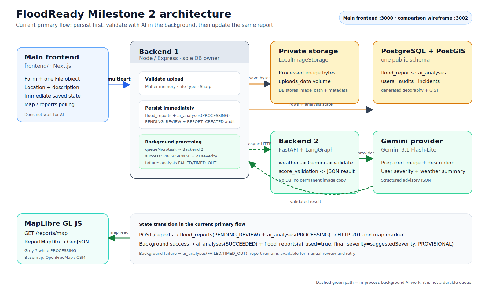
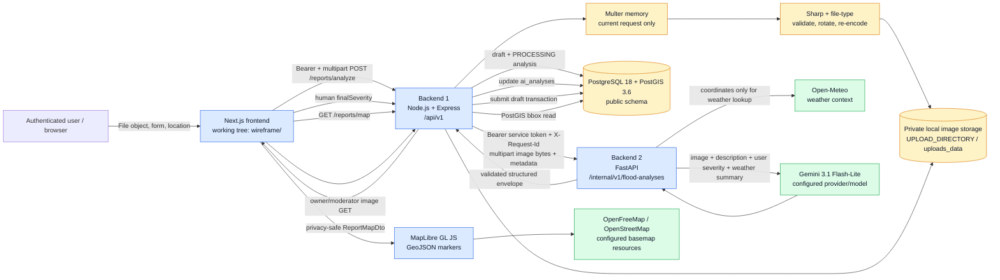

# Milestone 2 architecture

Verified against the current working tree on 2026-07-15. The implementation authority is the source code, environment files, Compose definition, Prisma schema, and migrations—not the older Milestone 1 prose.

## Working-tree note

The current checkout contains the Next.js application under `wireframe/`, while `docker-compose.yml`, package documentation, and several older evidence files still refer to `frontend/`. The diagram labels the application as **Next.js frontend (`wireframe/` in this checkout)** and records the Compose path mismatch rather than silently treating the old path as present.

## Presentation diagram

The editable Mermaid source is [architecture-presentation.mmd](architecture-presentation.mmd).

## Runtime responsibilities

| Component | Implemented responsibility | Explicit boundary |
|---|---|---|
| Browser + Next.js UI | Holds the selected `File` in React state, creates an object-URL preview, collects description/category/severity/location, calls Backend 1, presents AI output, asks for `finalSeverity`, and renders persisted map markers. | No database, upload-volume, or AI-provider access. The access token is held by the browser auth store; the refresh token remains in the backend-controlled cookie boundary. |
| Backend 1: Node/Express | Authenticates, rate-limits, parses one multipart file, validates metadata, re-encodes/stores the image, creates drafts and AI rows, calls Backend 2, validates its response with Zod, persists final reports, serves private images, and returns the map projection. | Sole application database owner. The direct `POST /reports` path also exists, but the Milestone 2 UI uses `/reports/analyze` followed by `/:draftId/submit`. |
| Private image storage | Local filesystem under `UPLOAD_DIRECTORY`; Compose mounts the durable `uploads_data` volume at `/app/uploads`. Keys are opaque `reports/YYYY/MM/<uuid>.<ext>` values. | Not public/static. PostgreSQL stores the key and metadata, not image bytes. |
| Backend 2: FastAPI | Protects the internal endpoint, validates metadata and image again, decodes/orientation-corrects/resizes/converts the image to JPEG, fetches weather context, invokes the configured provider, validates provider JSON, calculates the combined validation score, and returns a structured response. | No `DATABASE_URL`, report queries, user lookup, or permanent image storage. It receives the selected image bytes for one analysis request only. |
| Gemini provider | Receives the prepared JPEG plus a short prompt containing report description, user severity, allowed severities, and weather summary. The response is constrained by Gemini JSON response schema and parsed as JSON. | API key is backend 2 only. The model is advisory and does not verify reports or set the final severity. |
| PostgreSQL/PostGIS | Stores users, sessions, drafts, analyses, reports, incidents, and audit logs; generated geography points support bounded map reads. | Node/Express is the sole application owner; FastAPI does not connect to the database. |
| MapLibre + basemap | Turns `ReportMapDto` coordinates into GeoJSON `[longitude, latitude]` points and requests the configured style/tile resources. | The basemap provider does not receive FloodReady report records; markers come from Backend 1. |

## Exact image and AI lifecycle

1. The browser creates a `File` object when the user chooses one image. `ImagePreview` calls `URL.createObjectURL(file)` for a local preview and revokes it on cleanup. No permanent browser upload exists at this point.
2. The form sends one `image` part and the report fields to `POST /api/v1/reports/analyze`.
3. Backend 1 receives the request through `multer.memoryStorage()`, so the original upload is in request memory only. It accepts one file and applies field/part/byte limits.
4. `file-type` checks the signature and `sharp` checks decodability, dimensions, single-page status, and the configured pixel ceiling. Sharp rotates according to EXIF and re-encodes to JPEG/PNG/WebP. Backend 1 saves the processed bytes under a generated opaque key.
5. Backend 1 creates one `report_drafts` row and one `ai_analyses` row in a transaction. The draft stores `image_path`, `image_mime`, `image_size`, and `image_sha256`; the analysis starts as `PROCESSING`.
6. Backend 1 sends the same processed bytes—not a public URL—to Backend 2 as the `image` multipart part. It also sends `analysisId`, `reportId` (the draft UUID during analysis), `description`, `userSeverity`, `latitude`, `longitude`, `mimeType`, and `allowedSeverityValues`. `X-Request-Id` correlates the request.
7. Backend 2 reads and closes the upload, then Pillow validates the decoded image, applies EXIF orientation, converts to RGB, and bounds the largest dimension before producing a temporary JPEG byte buffer. It does not save a permanent copy.
8. Backend 2 calls Open-Meteo with the selected coordinates, the previous two days, and current conditions. It sends the prepared image, description, user severity, allowed severities, and weather summary to Gemini 3.1 Flash-Lite. User identity, email, password, storage key, and access tokens are not sent to the model.
9. Backend 2 validates the model JSON, combines image evidence at 70% and weather at 30%, and returns `SUCCEEDED` data or a controlled error. Backend 1 validates the response again and updates the `ai_analyses` row.
10. The user reviews the advisory output and submits a valid `finalSeverity`. A transaction creates `flood_reports` using the draft UUID as the report UUID, moves the analysis from `draft_id` to `report_id`, deletes the draft, and writes `REPORT_CREATED` to `audit_logs`.
11. The map calls `GET /api/v1/reports/map` with a bounded bbox. Backend 1 queries `flood_reports.location`, excludes `REJECTED` rows, returns `ReportMapDto`, and MapLibre renders the persisted coordinates as a marker. A refresh repeats this database read; it does not use frontend mock markers.

## What is not implemented

The repository has no `Media` table or `mediaId`; the stable image reference is `image_path`. There is no signed-URL flow, object-storage provider, AI queue, worker pool, scheduled draft cleanup job, malware scanner, duplicate-image rejection, idempotency key, AI retry/backoff, or per-user analysis concurrency lock. The current code records a 30-minute `report_drafts.expires_at`, but the inspected repository contains no cleanup job that deletes expired drafts/files. These are limitations, not hidden architecture boxes.

## Evidence references

- Frontend: `wireframe/src/features/reports/report-form.tsx`, `wireframe/src/features/reports/image-preview.tsx`, `wireframe/src/features/map/queries.ts`, `wireframe/src/app/(protected)/map/page.tsx`
- Backend 1: `backend/src/modules/reports/reports.routes.ts`, `reports.controller.ts`, `reports.service.ts`, `reports.ai-client.ts`, `reports.upload.ts`
- Image pipeline: `backend/src/shared/storage/image-processor.ts`, `backend/src/shared/storage/local-image-storage.ts`, `docker-compose.yml`
- Backend 2: `ai-service/app/routes/analysis.py`, `app/services/image_preprocessing.py`, `app/services/analysis.py`, `app/services/providers.py`, `app/services/weather.py`
- Schema: `backend/prisma/schema.prisma`, `backend/prisma/migrations/20260714200000_milestone2_ai_workflow/migration.sql`, `backend/prisma/migrations/20260715000000_weather_validated_ai_scores/migration.sql`
