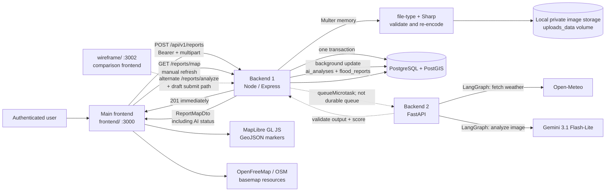

# Milestone 2 architecture — current implementation

Verified against the repository state on 2026-07-15. The canonical user-facing application is `frontend/` on port 3000. `wireframe/` is a second comparison/testing frontend on port 3002 and retains the older draft-review flow.

## Current report flow

Editable source: [architecture-presentation.mmd](architecture-presentation.mmd).

## Responsibilities and boundaries

| Component | Current responsibility | Boundary |
|---|---|---|
| `frontend/` | Main form sends one multipart report, shows the saved report immediately, lists own reports, polls report history while AI is processing, and renders map markers with AI status/assessment. | No database, filesystem, or provider access. It does not wait for AI before saving. |
| `wireframe/` | Preserved comparison UI. It uses the older `/reports/analyze` → `report_drafts` → `/:draftId/submit` flow and includes human AI-review controls. | Not the canonical port-3000 flow. Do not use its human-override behavior to describe the main frontend. |
| Backend 1 | Authenticates, rate-limits, validates, processes and stores the image, creates the final report and `ai_analyses(PROCESSING)` row, starts background analysis, persists the provider result, exposes retry, and serves map/private-image reads. | Sole application database owner. The background task is in-process and non-durable. |
| Private image storage | Stores processed bytes under `reports/YYYY/MM/<UUID>.<ext>` in `UPLOAD_DIRECTORY`, mounted as `uploads_data` by Compose. | Database stores the opaque `image_path` and image metadata; bytes are not in PostgreSQL. |
| Backend 2 | Runs the bounded LangGraph workflow: prepares the image, fetches selected-location weather, calls Gemini, validates provider JSON, calculates the combined score, and returns structured analysis. | No database credentials and no permanent image copy. |
| PostgreSQL/PostGIS | Stores `flood_reports`, `ai_analyses`, users, sessions, incidents, drafts, and audit logs. | Node/Express is the only application owner. |
| MapLibre | Renders Backend 1's report projection as GeoJSON points and draws the configured basemap. | Map tiles/style are external resources; report data comes from Backend 1. |

## Exact primary lifecycle

1. The main frontend keeps the selected browser `File` in component state and uses it only in the current `FormData` request. The preview is local to the browser.
2. `POST /api/v1/reports` reaches Backend 1 as one authenticated multipart request. The request is parsed into memory, not a temporary upload directory.
3. Backend 1 validates the file signature/MIME, decodes it with Sharp, applies EXIF rotation, re-encodes it, and saves the processed bytes under an opaque local key.
4. A transaction creates `flood_reports` with `final_severity = severity_claim`, `ai_used = false`, `verification_status = PENDING_REVIEW`, creates `ai_analyses(status = PROCESSING)`, and writes `REPORT_CREATED` to `audit_logs`.
5. Backend 1 returns HTTP 201 immediately. The report is already persisted and can appear on the map with a grey `?` marker / “AI validation in progress”.
6. Outside the request transaction, Backend 1 schedules `processReportAnalysis` with `queueMicrotask`. It passes the processed image bytes, report ID, analysis ID, description, user severity, coordinates, MIME, and the original request ID to Backend 2.
7. Backend 2 validates the internal token and runs its LangGraph: `fetch_weather_evidence` gets Open-Meteo context, `analyze_image_evidence` sends the prepared image plus minimal text context to Gemini 3.1 Flash-Lite, `validate_provider_output` validates the structured response, and `score_validation` computes the combined result.
8. On success, Backend 1 updates `ai_analyses` and the same `flood_reports` row in a transaction: `ai_used = true`, `final_severity = suggestedSeverity`, and `verification_status = PROVISIONAL`. On failure, `ai_analyses` becomes `FAILED` or `TIMED_OUT`; the report remains available with its user-claimed severity and `PENDING_REVIEW` status.
9. The main frontend polls `GET /api/v1/users/me/reports` every 4 seconds while any own report is `PROCESSING`. Failed analyses expose `Retry AI validation`, which calls `POST /api/v1/reports/:reportId/retry-ai` and re-reads the stored image.
10. `GET /api/v1/reports/map` returns the persisted row and its privacy-safe AI summary. MapLibre converts coordinates to GeoJSON `[longitude, latitude]` and renders the marker.

## Important current behavior

- The main frontend does not wait for AI and does not present an accept/override step before persistence. AI automatically changes the final severity and verification status on successful background processing.
- The `wireframe/` app still exercises the older draft/human-review path. That path is real code but is not the primary Compose port-3000 experience.
- The background execution uses Node's in-process `queueMicrotask`; it is not a durable queue, worker service, or retry job.
- There is no `Media` table or `mediaId`; `image_path` is the stable image reference.
- There is no signed URL, object-storage provider, malware scanner, duplicate rejection, or scheduled stale-image cleanup.

## Evidence

- Main frontend: `frontend/src/features/reports/report-form.tsx`, `frontend/src/features/reports/report-list.tsx`, `frontend/src/features/reports/api.ts`, `frontend/src/features/reports/queries.ts`, `frontend/src/app/(protected)/map/page.tsx`
- Comparison frontend: `wireframe/src/features/reports/report-form.tsx`, `wireframe/src/features/reports/api.ts`
- Backend 1: `backend/src/modules/reports/reports.routes.ts`, `reports.controller.ts`, `reports.service.ts`, `reports.ai-client.ts`
- Image pipeline: `backend/src/shared/storage/image-processor.ts`, `local-image-storage.ts`, `docker-compose.yml`
- Backend 2: `ai-service/app/routes/analysis.py`, `app/services/image_preprocessing.py`, `app/services/analysis.py`, `app/services/providers.py`, `app/services/weather.py`
- Schema: `backend/prisma/schema.prisma`, `backend/prisma/migrations/20260714200000_milestone2_ai_workflow/migration.sql`, `backend/prisma/migrations/20260715000000_weather_validated_ai_scores/migration.sql`
