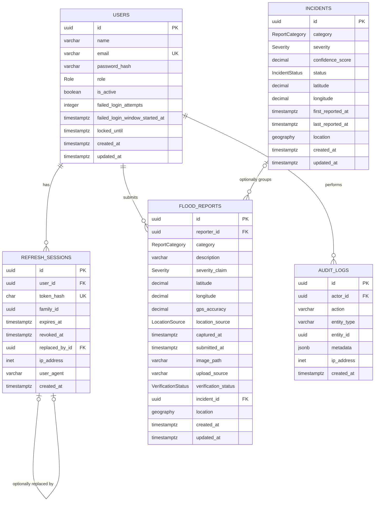

# Archived pre-AI schema notes

> Superseded by [02-schema.md](02-schema.md). Do not use this file for the current presentation.

## Sources of truth

The authoritative schema is the combination of:

1. `backend/prisma/schema.prisma`
2. `backend/prisma/migrations/20260711000000_init/migration.sql`
3. `backend/prisma/migrations/20260712000000_frontend_compatibility/migration.sql`
4. `backend/prisma/migrations/20260713000000_normalize_legacy_report_descriptions/migration.sql`
5. `backend/prisma/migrations/20260714000000_milestone2_required_description/migration.sql`

Prisma describes models, mapped names, enums, relations and indexes. Migration SQL additionally defines database-only checks, generated PostGIS columns, triggers and extension setup. [schema.dbml](./schema.dbml) is an editable documentation rendering of these sources; it does not replace them.

## Physical arrangement and ownership

- **Database instances:** one PostgreSQL 18 / PostGIS 3.6 instance.
- **Application schemas:** one PostgreSQL `public` schema.
- **Owner:** Node/Express microservice.
- **DAL:** one Prisma client shared only by modules inside the Node process.
- **FastAPI ownership:** no tables, schema, database credentials or cross-service identifiers.
- **Binary storage:** processed image bytes live in the separate `uploads_data` volume; `flood_reports.image_path` stores the opaque key.

## Full application ER diagram



`audit_logs.entity_id` is intentionally not a foreign key because audit rows can describe different entity types; `actor_id` is a real foreign key to `users`.

## Table contracts

### `users`

Stores normalized identities, password hashes, roles, active state and persistent login-lock state. `email` is unique and constrained to lowercase. Deleting a user is restricted while owned reports, sessions or audit rows reference it.

### `refresh_sessions`

Stores only SHA-256 refresh-token hashes, families, expiry/revocation state and replacement links. It has a required user FK and an optional self-FK. Access JWTs are not stored here.

### `flood_reports` — P0 aggregate

| Column | Contract |
|---|---|
| `id` | UUID primary key generated by Prisma |
| `reporter_id` | Required FK to `users.id`, `ON DELETE RESTRICT` |
| `category` | Required `ReportCategory` enum |
| `description` | Required `varchar(1000)`; trimmed length must be 10-1,000 characters |
| `severity_claim` | Required `Severity`; defaults to `UNKNOWN`; this is a citizen claim, not verification |
| `latitude` / `longitude` | Required decimal degrees, scale 6; database checks `[-90,90]` and `[-180,180]` |
| `gps_accuracy` | Required and `(0,100000]` only for `DEVICE_GPS`; null only for `MANUAL` |
| `location_source` | Required enum, `DEVICE_GPS` or `MANUAL` |
| `captured_at` | Required client capture timestamp; backend rejects values more than five minutes in the future |
| `submitted_at` | Required server timestamp; defaults to current time |
| `image_path` | Required opaque key for processed evidence bytes; never exposed in DTOs |
| `upload_source` | Required, currently `WEB` |
| `verification_status` | Required; created as `SUBMITTED` |
| `incident_id` | Optional FK to `incidents.id`, `ON DELETE SET NULL`; new reports are not automatically linked |
| `location` | Stored generated `geography(Point,4326)` derived from longitude and latitude |
| `created_at` / `updated_at` | Required server timestamps; update trigger and Prisma `@updatedAt` keep modification time |

### `incidents`

Read-only through the current API. It can group zero or more flood reports, but report submission does not create or update incidents. Its `confidence_score` is nullable and constrained to `[0,1]`; the current P0 flow does not compute it.

### `audit_logs`

Records security and report actions with actor, action, entity type/ID, metadata, IP and creation time. The report creation transaction inserts `REPORT_CREATED` with the report ID.

## Enums

- `Role`: `USER`, `MODERATOR`, `ADMIN`
- `ReportCategory`: `ROAD_WATERLOGGING`, `FLOODED_ROAD`, `CLOGGED_DRAIN`, `OVERFLOWING_DRAIN`, `OPEN_MANHOLE`, `FALLEN_TREE`, `STRANDED_VEHICLE`, `UNDERPASS_FLOODING`, `OTHER`
- `Severity`: `UNKNOWN`, `MINOR`, `MODERATE`, `SEVERE`, `IMPASSABLE`
- `VerificationStatus`: `SUBMITTED`, `PENDING_REVIEW`, `PROVISIONAL`, `VERIFIED`, `DISPUTED`, `REJECTED`, `RESOLVED`, `STALE`
- `IncidentStatus`: `ACTIVE`, `MONITORING`, `RESOLVED`, `STALE`
- `LocationSource`: `DEVICE_GPS`, `MANUAL`

The same report category, severity, status and location-source values appear in backend validation and frontend Zod contracts.

## Geographic representation and coordinate order

The public API uses named fields, so callers send `latitude` and `longitude` independently. PostgreSQL stores both scalars and generates the spatial value as:

```sql
ST_SetSRID(ST_MakePoint(longitude, latitude), 4326)::geography
```

This longitude-first order is correct for PostGIS/GeoJSON. Map bounding boxes use `west, south, east, north`, passed to `ST_MakeEnvelope` in that order. MapLibre receives `[longitude, latitude]`. The API rejects a partial bbox, inverted bounds, longitude or latitude spans above two degrees, or an area above one square degree.

## Important constraints

- Required non-null report description and database length check from the 14 July migration.
- Required report image key.
- Coordinate range checks at validation and database levels.
- `DEVICE_GPS` requires accuracy; `MANUAL` requires null accuracy.
- `verification_status` is created as `SUBMITTED`; no AI or user action can create a report as verified.
- `reporter_id` is derived from the authenticated actor, never accepted from multipart metadata.
- `incident_id` is null on create and cannot be mass-assigned by the reporter.
- Email must be lowercase and unique.
- Incident confidence and timestamp-order checks are enforced by SQL.

## Important indexes

| Index | Purpose |
|---|---|
| `flood_reports_location_gist_idx` | Bounded PostGIS report-map reads |
| `flood_reports_verification_status_submitted_at_id_idx` | Visibility/status filtering plus stable time ordering |
| `flood_reports_reporter_id_submitted_at_id_idx` | Own-report history and keyset pagination |
| `flood_reports_category_idx` / `severity_claim_idx` | Map/list filters |
| `flood_reports_incident_id_idx` | Optional incident relationship |
| `incidents_location_gist_idx` | Spatial incident reads |
| `incidents_status_last_reported_at_id_idx` | Incident status/time list queries |
| Session family, user and expiry indexes | Refresh rotation and cleanup paths |
| Audit actor/entity/action indexes | Operational and security audit lookup |

## Migration history

| Migration | Effective change |
|---|---|
| `20260711000000_init` | Enables PostGIS; creates enums, five application tables, constraints, foreign keys, generated geography points, triggers and indexes |
| `20260712000000_frontend_compatibility` | Adds `LocationSource`, makes GPS accuracy nullable, and enforces the source/accuracy combination |
| `20260713000000_normalize_legacy_report_descriptions` | Preserves and labels earlier short descriptions and gives null/blank legacy rows an explicit placeholder before enforcement |
| `20260714000000_milestone2_required_description` | Performs a defensive null/blank backfill, makes description non-null, and adds the 10-1,000 trimmed-character database check |

## API projections and privacy

The database row is richer than the map response. `ReportMapDto` intentionally omits `reporter_id`, GPS accuracy, description and image key. It includes `canViewDetails`; the owning user or a moderator/administrator may then fetch `ReportDto`. This keeps the map useful without making every reporter's precise evidence or identity public.

## Seed behavior

- `backend/prisma/seed.ts` optionally creates one configured administrator.
- `backend/prisma/demo-seed.ts` is explicitly development/test-only and creates fixed fictional users, reports, incidents, audit rows and processed images when the `demo` profile is requested.
- Neither seed is the P0 application data source. Live report markers come from `/reports/map`.

## AI metadata

There are no AI summary, suggested severity, provider, prompt, model or analysis columns. That accurately reflects the health-only FastAPI implementation. Do not add AI entities to the presentation ERD unless a real endpoint and persistence contract are implemented later.
