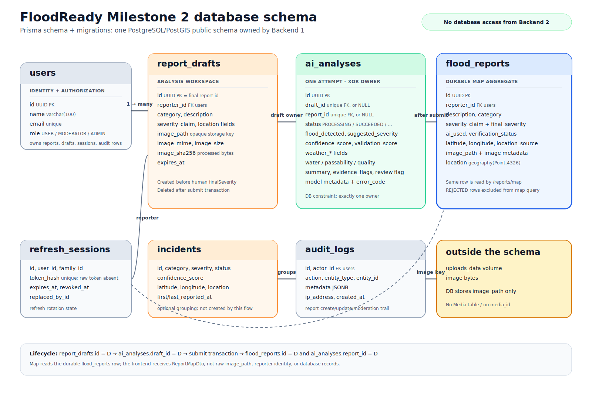

# Milestone 2 database schema

The source of truth is `backend/prisma/schema.prisma` plus every migration under `backend/prisma/migrations/`. The repository uses one PostgreSQL/PostGIS database. Backend 1 is the only service with database access; the frontend and Backend 2 never connect to PostgreSQL directly.

## Presentation diagram



Editable sources: [schema-presentation.mmd](schema-presentation.mmd) and [schema.dbml](schema.dbml).

```mermaid
erDiagram
  USERS ||--o{ REFRESH_SESSIONS : owns
  REFRESH_SESSIONS o|--|| REFRESH_SESSIONS : replaces
  USERS ||--o{ REPORT_DRAFTS : creates_alternate_path
  REPORT_DRAFTS ||--o| AI_ANALYSES : owns_optional_draft_analysis
  USERS ||--o{ FLOOD_REPORTS : submits
  FLOOD_REPORTS ||--o| AI_ANALYSES : owns_background_analysis
  INCIDENTS o|--o{ FLOOD_REPORTS : groups
  USERS ||--o{ AUDIT_LOGS : acts

  USERS {
    uuid id PK
    varchar name
    varchar email UK
    enum role
  }
  REPORT_DRAFTS {
    uuid id PK
    uuid reporter_id FK
    enum severity_claim
    varchar image_path
    varchar image_mime
    int image_size
    char image_sha256
    timestamptz expires_at
  }
  AI_ANALYSES {
    uuid id PK
    uuid draft_id FK_UK
    uuid report_id FK_UK
    enum status
    enum suggested_severity
    decimal confidence_score
    decimal validation_score
    varchar validation_outcome
  }
  FLOOD_REPORTS {
    uuid id PK
    uuid reporter_id FK
    enum severity_claim
    enum final_severity
    boolean ai_used
    varchar image_path
    geography location
    enum verification_status
  }
  INCIDENTS {
    uuid id PK
    enum severity
    geography location
  }
  AUDIT_LOGS {
    uuid id PK
    uuid actor_id FK
    varchar entity_type
    uuid entity_id
  }
  REFRESH_SESSIONS {
    uuid id PK
    uuid user_id FK
    char token_hash UK
    uuid replaced_by_id FK_UK
  }
```

## Entities used by the current report-to-map flow

| Table | Role | Important fields |
|---|---|---|
| `users` | Authenticated ownership and authorization | `id`, `role`, `is_active` |
| `flood_reports` | Durable report created by the main frontend and read by the map | `id`, `reporter_id`, `description`, `severity_claim`, `final_severity`, `ai_used`, coordinates, `image_path`, `verification_status`, PostGIS `location` |
| `ai_analyses` | One AI attempt linked to the report; starts `PROCESSING` and is updated in the background | `id`, `report_id`, `status`, model result, weather fields, validation fields, `error_code` |
| `audit_logs` | Audit trail for report creation, updates, and moderation | `actor_id`, `action`, `entity_type`, `entity_id`, `metadata` |
| `refresh_sessions` | Auth refresh-token rotation state | User/session relations; raw refresh tokens are not stored |
| `incidents` | Existing optional grouping entity | Nullable `incident_id`; the current submission path does not create or link incidents |
| `report_drafts` | Alternate older `/reports/analyze` flow used by the comparison `wireframe/` app | Temporary report/image metadata with `expires_at`; not used by the main `frontend/` direct-submit path |

## Current primary persistence sequence

```text
POST /api/v1/reports
  -> save processed image privately
  -> transaction creates flood_reports (finalSeverity = severityClaim)
  -> same transaction creates ai_analyses (status = PROCESSING, report_id = report.id)
  -> return 201 immediately
  -> queueMicrotask calls Backend 2

AI success
  -> ai_analyses = SUCCEEDED with structured result
  -> flood_reports.ai_used = true
  -> flood_reports.final_severity = suggestedSeverity
  -> flood_reports.verification_status = PROVISIONAL

AI failure or timeout
  -> ai_analyses = FAILED or TIMED_OUT with error_code
  -> report remains persisted with its claimed final severity and PENDING_REVIEW status
```

The report is therefore durable before AI completes. The main frontend does not show a pre-submit human override step. It displays the persisted report immediately, polls while analysis is processing, and exposes owner-triggered `POST /reports/:id/retry-ai` when an attempt fails.

The older path remains real but secondary:

```text
POST /reports/analyze
  -> report_drafts.id = D
  -> ai_analyses.id = A, draft_id = D

POST /reports/D/submit { finalSeverity }
  -> creates flood_reports and transfers A from draft_id to report_id
  -> deletes report_drafts row
```

The `ai_analyses_owner_check` constraint enforces that each analysis belongs to exactly one draft or one final report. There is no separate `Media` table or `media_id`.

## Image metadata truth

The database stores the opaque `image_path`, processed MIME, byte size, and SHA-256. The image bytes remain in the private local storage volume. For the primary flow the identifier chain is:

```text
X-Request-Id
  -> flood_reports.id
  -> ai_analyses.report_id
  -> flood_reports.image_path
  -> uploads_data/reports/YYYY/MM/<uuid>.<ext>
```

Backend 1 sends the processed bytes to Backend 2 for the current analysis request. Backend 2 does not write them to permanent storage and has no database access. The authenticated image route reads the private bytes only for an authorized report owner/moderator.

## Map projection

`GET /api/v1/reports/map` reads the generated PostGIS geography point from `flood_reports.location` and returns a privacy-safe projection. It includes the report ID, category, claimed/final severity, AI status/result summary, coordinates, timestamps, verification status, incident ID, and `canViewDetails`. It does not return `description`, `reporter_id`, `image_path`, image bytes, email, or authentication data. MapLibre converts the response to GeoJSON `[longitude, latitude]` points.

## Schema caveats

- `report_drafts.expires_at` exists for the alternate flow, but no scheduled cleanup worker was found.
- `ai_analyses.evidence_flags` is JSONB with array-type enforcement; result data is validated in Backend 2 and Backend 1.
- Weather and validation columns are added by `20260715000000_weather_validated_ai_scores`.
- `incidents` and its relation are real schema objects, but incident creation is outside this Milestone 2 submission path.
