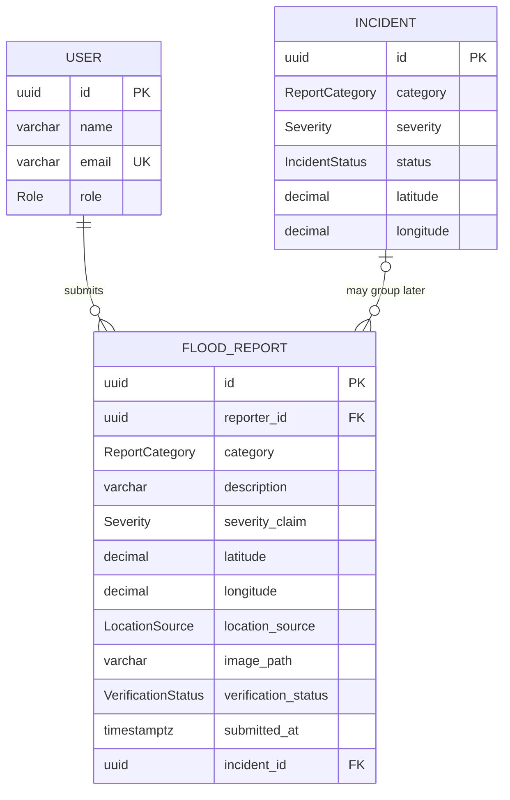

# Archived pre-AI schema presentation

> Superseded by [02-schema.md](02-schema.md). Do not use this file for the current presentation.

This is the two-minute ER view. It intentionally hides session and audit implementation detail while remaining faithful to the real schema. The slide-ready rendering is [schema-presentation.svg](./schema-presentation.svg).

## Simplified ER diagram

## Ownership label

**All three entities are owned by the Node/Express service in one PostgreSQL/PostGIS `public` schema. FastAPI owns no table.**

The `User -> FloodReport` and optional `Incident -> FloodReport` lines are real database foreign keys. There is no foreign key to FastAPI and no second map database.

## What matters for the two features

### Create a report

- `reporter_id` comes from the authenticated user.
- `description` is required and non-null.
- `severity_claim` is the user's claim, not an authority decision.
- `latitude` and `longitude` identify the marker location.
- `location_source` distinguishes a map click from device GPS.
- `image_path` is required, but stores only an opaque key; bytes live in the upload volume.
- `verification_status` starts as `SUBMITTED`.
- `submitted_at` proves the row was persisted by the server.

### Show it on the map

- The Node service reads `FloodReport`, not `Incident`, for the Milestone 2 report layer.
- PostGIS generates a spatial Point from `longitude, latitude` and indexes it.
- `/reports/map` returns a privacy-safe projection of the same row.
- MapLibre uses `[longitude, latitude]` to place the marker.
- Refreshing repeats the database read; it does not rebuild data from a frontend array.

## Exact two-minute talk track

> The central table is FloodReport. A signed-in User can submit many reports, and each report has one real reporter foreign key. The report stores required content, a claimed severity, latitude and longitude, its location source, required evidence key, status and timestamps. PostgreSQL generates a PostGIS point from longitude and latitude, so the map can query reports inside a bounding box efficiently.
>
> The optional Incident relationship already exists in the real schema, but new reports are not automatically converted into incidents. For Milestone 2 the map reads FloodReport directly, so the submitted row appears immediately with status Submitted. User, FloodReport and Incident are all owned by the Node service in one public schema. The FastAPI service is health-only and owns no tables, so there is no fake cross-service foreign key or shared database access.

## Why the schema is intentionally simple

- One row is written and the same row is read for the marker.
- Coordinates remain queryable as normal decimals while PostGIS supplies spatial indexing.
- Authentication is a real relation instead of a client-provided reporter ID.
- The optional incident link preserves existing work without making incident generation part of P0.
- No AI fields are shown because AI triage is not implemented.

## Supporting tables omitted from the presentation diagram

`refresh_sessions` and `audit_logs` are real Node-owned tables and appear in the technical schema. They are omitted here because they support authentication and traceability rather than the two-feature data story.
