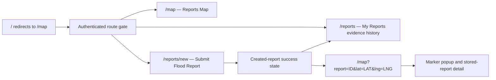

# Archived functional wireframe notes

> Superseded by [06-functional-wireframes.md](06-functional-wireframes.md). Do not use this file for the current presentation.

## Scope

The presentation interface contains exactly two core features: the authenticated reporting workflow and the persisted reports map. Those features are expressed through four implemented views:

1. Reports Map
2. Submit Flood Report
3. My Reports evidence history
4. Report marker popup/detail

There is no AI-analysis wireframe. The AI service currently exposes health and readiness endpoints only; it does not provide report triage.

All three application routes are authenticated by `frontend/src/app/(protected)/layout.tsx` and `frontend/src/features/auth/auth-gate.tsx`. The root route redirects to `/map`. The visible navigation in `frontend/src/components/app-shell/protected-shell.tsx` contains `/map`, `/reports`, and `/reports/new`; the latter two are views within the single reporting-workflow feature.



## Screen A — Reports Map

Route: `/map`

Primary component: `frontend/src/app/(protected)/map/page.tsx`

Supporting components and hooks:

- `frontend/src/features/map/map-canvas.tsx`
- `frontend/src/features/map/queries.ts` — `useReportMapQuery` and `useReportDetailQuery`
- `frontend/src/features/map/safety-notice.tsx`
- `frontend/src/lib/api/client.ts` — `api.mapReports` and `api.report`

### Editable wireframe

```text
+----------------------------------------------------------------------------+
| FloodReady · Milestone 2 | [Reports Map] [Submit Flood Report] [Sign out] |
+----------------------------------------------------------------------------+
| MILESTONE 2 WIREFRAME                                                     |
| Reports Map                          [Refresh] [Submit Flood Report]        |
| Persisted flood reports returned by the Report API.                       |
|                                                                            |
| ! Submitted evidence is unverified. No data does not mean safe.            |
|                                                                            |
| +------------------------------------------------------------------------+ |
| | [Loading / error+retry / empty / N persisted reports]                  | |
| |                                                                        | |
| |                         MAPLIBRE BASE MAP                              | |
| |                                                                        | |
| |                  ● report marker      ● report marker                  | |
| |                                                                        | |
| |                                                   [marker detail]      | |
| +------------------------------------------------------------------------+ |
+----------------------------------------------------------------------------+
```

### Exact behavior

| Concern | Current implementation |
|---|---|
| User action | Open the route, manually refresh, select a marker, or open the submission route. |
| Frontend state | Loading, fetching, populated, empty, API error with Retry, selected marker, selected report unavailable, and basemap load error. |
| API | Authenticated `GET /api/v1/reports/map?west=...&south=...&east=...&north=...&limit=100&sort=desc`. |
| Backend service | The Node/Express Report API validates the bounding box and reads report rows through Prisma. |
| Data read | Persisted `flood_reports` records inside the requested PostGIS bounding box. Rejected reports are excluded. |
| Success state | Up to 100 map DTOs are converted to GeoJSON point features and rendered as markers. A count is displayed. |
| Empty state | “No reports exist in this map area yet. Submit the first report.” |
| Error state | “Could not load reports” with a Retry button. A separate MapLibre message covers basemap/provider failure. |
| Refresh behavior | React Query polls every 30 seconds; the Refresh button calls `refetch()`. A browser refresh performs the database-backed query again. |

The initial query area is a `0.9° × 0.9°` box centered on `lat` and `lng` URL parameters, or on the configured default center. It is clamped at valid world bounds. Panning the map does not currently recalculate the query box.

Marker colors communicate severity/status, but the detail panel also prints the severity label so color is not the only signal.

## Screen B — Submit Flood Report

Route: `/reports/new`

Primary component: `frontend/src/features/reports/report-form.tsx`

Supporting code:

- `frontend/src/features/reports/report-form-schema.ts`
- `frontend/src/features/reports/api.ts` — `reportsApi.create`
- `frontend/src/features/map/map-canvas.tsx`
- `frontend/src/features/map/types.ts`
- `frontend/src/lib/api/request.ts`

### Editable wireframe

```text
+----------------------------------------------------------------------------+
| FloodReady · Milestone 2 | [Reports Map] [Submit Flood Report] [Sign out] |
+----------------------------------------------------------------------------+
| MILESTONE 2 WIREFRAME                                                     |
| Submit Flood Report                                                       |
| Select a real location, enter the report, and save it to PostgreSQL.       |
|                                                                            |
| +-------------------------------+  +-------------------------------------+ |
| | 1. Report details             |  | 3. Select location                  | |
| | Category          [select  v] |  | [Use device location]               | |
| | Reported severity [select  v] |  |                                     | |
| | Description                   |  |          MAPLIBRE PICKER             | |
| | [                           ] |  |                                     | |
| | [                           ] |  |             ◎ temporary pin          | |
| | 0/1000 · minimum 10           |  |                                     | |
| |                               |  | [28.xxxxxx, 77.xxxxxx · map/GPS]     | |
| | 2. Evidence image             |  +-------------------------------------+ |
| | [Choose one image]            |                                          |
| | JPEG/PNG/WebP · configured MB |                                          |
| |                               |                                          |
| | [validation/API error]        |                                          |
| | [Submit Flood Report] [Cancel]|                                          |
| +-------------------------------+                                          |
+----------------------------------------------------------------------------+
```

### Created-report success state

```text
+------------------------------------------------------------------+
|                         ✓ Persisted successfully                  |
|                      Flood report created                        |
| Backend report ID: <UUID>              Status: SUBMITTED         |
| Latitude: <stored value>                Longitude: <stored value> |
|                                                                  |
| [View submitted reports] [Show marker on map] [Submit another]    |
+------------------------------------------------------------------+
```

### Exact behavior

| Concern | Current implementation |
|---|---|
| User action | Select category and severity, enter a 10–1,000 character description, choose one evidence image, and select a map point or device location. |
| Frontend state | Idle, selected location, invalid input, missing location, missing evidence, submitting, API error, and created-report success. |
| API | Authenticated multipart `POST /api/v1/reports`. |
| Backend service | Node/Express Report API middleware authenticates, rate-limits, parses the upload, validates metadata, processes the image, and calls the report service/repository. |
| Data written | One `flood_reports` row, one `audit_logs` row, and one validated/re-encoded image in backend upload storage. |
| Success state | The exact `ReportDto` returned with HTTP 201 is shown; the report-map query cache is invalidated. |
| Error state | Field/location/evidence errors are local. Backend validation and expired-session failures have specific messages. A timeout or network interruption is labelled as an unknown outcome and tells the user to check the map before retrying. |
| Duplicate prevention | A synchronous `pending` ref ignores repeated clicks, and the button is disabled while saving. |

### Input contract

| Field | Rule |
|---|---|
| Category | One backend `ReportCategory` value. |
| Severity | One of `MINOR`, `MODERATE`, `SEVERE`, or `IMPASSABLE` in this form. |
| Description | Required, trimmed, 10–1,000 Unicode characters. |
| Location | Map click (`MANUAL`) or validated device geolocation (`DEVICE_GPS`). |
| Coordinates | Latitude and longitude are submitted as separate decimal strings. |
| GPS accuracy | Sent only for `DEVICE_GPS`; rejected for `MANUAL`. |
| Evidence | Exactly one JPEG, PNG, or WebP within `NEXT_PUBLIC_MAX_UPLOAD_SIZE_MB`. |

MapLibre supplies click coordinates as `event.lngLat.lat` and `event.lngLat.lng`. The frontend stores them as `{ latitude, longitude }`; GeoJSON later reverses them to the required `[longitude, latitude]` order.

The success screen does not navigate automatically. The user can open owner-only evidence history at `/reports`, submit another report, or select “Show persisted marker on map,” which opens:

```text
/map?report=<created UUID>&lat=<created latitude>&lng=<created longitude>
```

## Screen C — My Reports Evidence History

Route: `/reports`

Primary implementation: `frontend/src/features/reports/submitted-reports.tsx` and `frontend/src/features/reports/report-evidence-image.tsx`.

### Editable wireframe

```text
+----------------------------------------------------------------------------+
| FloodReady · Milestone 2 | [Reports Map] [My Reports] [Submit] [Sign out]  |
+----------------------------------------------------------------------------+
| REPORTING WORKFLOW                                 [Refresh] [Submit report]|
| Submitted Reports                                                         |
| Review your persisted reports and the evidence photo submitted with each. |
|                                                                            |
| +----------------------+ +----------------------+ +----------------------+ |
| | protected photo      | | protected photo      | | protected photo      | |
| | category · status    | | category · status    | | category · status    | |
| | severity · details   | | severity · details   | | severity · details   | |
| | [Show on map]        | | [Show on map]        | | [Show on map]        | |
| +----------------------+ +----------------------+ +----------------------+ |
|                         [Load older reports]                               |
+----------------------------------------------------------------------------+
```

### Exact behavior

| Concern | Current implementation |
|---|---|
| User action | Open My Reports, refresh, load an older cursor page, retry a failed image, or open a report on the map. |
| Report API | Authenticated `GET /api/v1/users/me/reports?limit=12&sort=desc[&cursor=...]` returns only the signed-in user's reports. |
| Image API | Each visible card lazily requests authorized `GET /api/v1/reports/:reportId/image`; evidence is returned as private bytes and displayed through a temporary blob URL, not a public storage path. |
| Success state | Cards show the persisted evidence photo, category, claimed severity, verification status, description, submission time, location source, coordinates, and a map link. |
| Pagination | “Load older reports” follows the opaque backend cursor without discarding already loaded cards. |
| Empty and error states | Loading, empty history, initial-list failure, later-page failure, and per-image failure remain distinct and retryable. |
| Privacy | The list is owner-scoped. The image endpoint independently authorizes the owner or a moderator/administrator and never exposes `image_path`. |

## Screen D — Marker Popup and Stored-Report Detail

Route: `/map`, after a marker is selected or a created-report link is followed.

Primary implementation: selected-report state and detail panel in `frontend/src/app/(protected)/map/page.tsx`, plus the MapLibre popup in `frontend/src/features/map/map-canvas.tsx`.

### Editable wireframe

```text
+--------------------------------------------------+
| STORED REPORT                                 [x]|
| Flooded road                                     |
|                                                  |
| Reported severity        Severe                  |
| Status                   Submitted               |
| Coordinates              28.xxxxxx, 77.xxxxxx    |
| Reported                 <local date and time>   |
|--------------------------------------------------|
| Description                                      |
| Water covers both lanes and vehicles cannot pass|
+--------------------------------------------------+
```

### Exact behavior

| Concern | Current implementation |
|---|---|
| User action | Click a marker, close the detail panel, or arrive with a `report` query parameter. |
| Immediate popup | MapLibre shows category and severity at the clicked coordinates. |
| Persistent panel | React shows category, severity, verification status, coordinates, and submitted timestamp. |
| Map API data | `ReportMapDto` supplies the marker fields and `canViewDetails`. It intentionally omits the description. |
| Detail API | If `canViewDetails` is true, authenticated `GET /api/v1/reports/:reportId` loads the stored description. |
| Privacy | A normal user can read full details only for their own report. Moderators/admins can read details. Other users see a privacy explanation and no detail request is made. |
| Selection behavior | The selected marker receives an outline and MapLibre flies to it at zoom 14 or closer. |
| Error states | Detail load failure is shown in the panel. A selected ID outside the current result box produces an “outside this map area or no longer visible” message. |

## Source-to-wireframe traceability

| Wireframe element | Source |
|---|---|
| Three-item, two-feature navigation | `frontend/src/components/app-shell/protected-shell.tsx` |
| Authentication gate | `frontend/src/features/auth/auth-gate.tsx` |
| Reports Map page and states | `frontend/src/app/(protected)/map/page.tsx` |
| Submission form and success state | `frontend/src/features/reports/report-form.tsx` |
| Owner evidence history | `frontend/src/features/reports/submitted-reports.tsx` |
| Protected evidence-photo loading | `frontend/src/features/reports/report-evidence-image.tsx` |
| Map rendering and coordinate conversion | `frontend/src/features/map/map-canvas.tsx` |
| Form validation | `frontend/src/features/reports/report-form-schema.ts` |
| Map/detail queries | `frontend/src/features/map/queries.ts` |
| Typed API contracts | `frontend/src/lib/api/contracts.ts` |
| Functional UI tests | `frontend/src/tests/integration/milestone2-wireframes.test.tsx`; `frontend/src/features/reports/__tests__/submitted-reports.test.tsx`; `frontend/src/features/reports/__tests__/report-evidence-image.test.tsx` |
