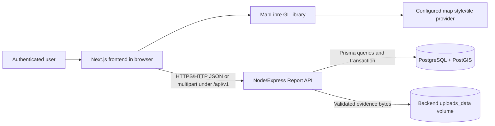
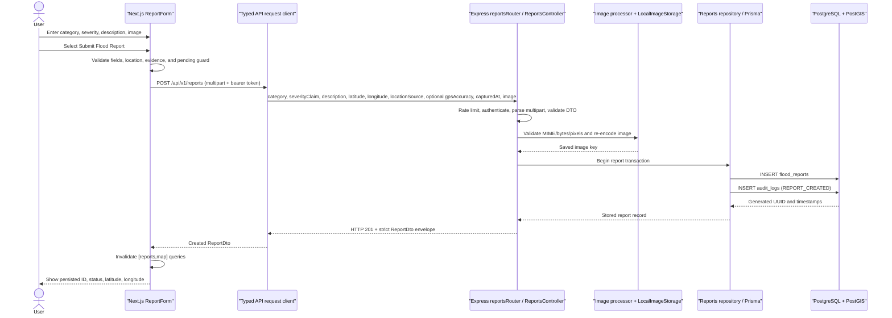
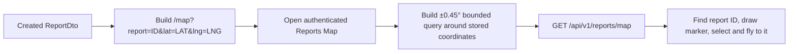
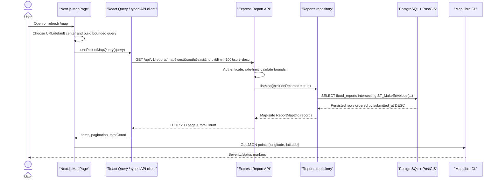

# Archived pre-AI data flow

> Superseded by [01-architecture.md](01-architecture.md) and [03-ai-workflow.md](03-ai-workflow.md). Do not use this file for the current presentation.

## Scope and ownership

The working Milestone 2 path is synchronous and intentionally simple:

- The Next.js frontend owns reporting-workflow and map presentation state.
- MapLibre GL runs inside the browser. It renders the configured base map and frontend-created GeoJSON markers; it is not a backend service.
- The Node/Express backend owns authentication, report validation, image processing, report writes, and report reads.
- PostgreSQL/PostGIS is the source of truth for report metadata and coordinates.
- Backend local image storage owns the validated evidence bytes; PostgreSQL stores only the image path.
- The Python AI service does not participate in this flow. It currently exposes health/readiness only, so AI triage is disabled.



The tile provider receives ordinary map style/tile requests. Report records are obtained from the Report API, not from the tile provider.

## Authentication precondition

All three presented routes—`/reports/new`, `/reports`, and `/map`—pass through `AuthGate`. On application startup, `AuthProvider` attempts session restoration through `POST /api/v1/auth/refresh`. After login/restoration, the access token remains in memory and Report API requests include `Authorization: Bearer <token>`. The shared request client also uses `credentials: "include"` for the refresh-cookie boundary.

If the user is anonymous, the protected layout shows the sign-in/create-account state rather than rendering the report form, owner evidence history, or reports map.

## Flow 1 — Select a geographic location

```mermaid
sequenceDiagram
    actor User
    participant Form as "ReportForm"
    participant Map as "MapCanvas / MapLibre"
    participant Geo as "Browser geolocation (optional)"

    alt User clicks the map
        User->>Map: Click visible map point
        Map-->>Form: latitude = event.lngLat.lat
        Map-->>Form: longitude = event.lngLat.lng
        Form->>Form: Store MANUAL location; gpsAccuracy = null
    else User chooses device location
        User->>Form: Select "Use device location"
        Form->>Geo: getCurrentPosition(high accuracy, 10 s timeout)
        Geo-->>Form: latitude, longitude, accuracy
        Form->>Form: validateDevicePosition(...)
        Form->>Form: Store DEVICE_GPS location and accuracy
    end
    Form-->>User: Show temporary pin and decimal coordinates
```

Invalid or denied geolocation never blocks manual map selection.

## Flow 2 — Create and persist a report



### Multipart request

| Field | Sent value |
|---|---|
| `category` | Selected `ReportCategory` |
| `severityClaim` | Selected severity |
| `description` | Trimmed 10–1,000 character description |
| `latitude` | Serialized latitude decimal |
| `longitude` | Serialized longitude decimal |
| `locationSource` | `MANUAL` or `DEVICE_GPS` |
| `gpsAccuracy` | Present only for `DEVICE_GPS` |
| `capturedAt` | Current ISO-8601 timestamp |
| `image` | One JPEG, PNG, or WebP file |

### Atomicity and controlled failure

- Invalid form data is rejected before the request.
- Backend validation errors do not create a report row.
- Image validation occurs before the database transaction.
- The report row and audit row are written in one Prisma transaction.
- If the database transaction fails after the image was saved, `ReportsService.create` deletes the saved image.
- The frontend keeps the form visible and displays a controlled validation, timeout, expired-session, or general persistence message.
- The `pending` ref and disabled button prevent two POST requests from rapid repeated clicks.

### Coordinate integrity

| Stage | Representation |
|---|---|
| MapLibre click | `event.lngLat.lat` and `event.lngLat.lng` |
| Form state | `{ latitude, longitude }` |
| Multipart body | Separate `latitude` and `longitude` fields |
| Database scalar columns | `latitude`, `longitude` |
| Generated PostGIS point | `ST_MakePoint(longitude, latitude)` with SRID 4326 |
| Frontend GeoJSON | `[longitude, latitude]` |
| MapLibre center/fly-to | `[longitude, latitude]` |

This conversion preserves the required GeoJSON/PostGIS longitude-first point order without swapping the form’s named fields.

## Flow 3 — Review owner-only evidence history

The created-report success state offers **View submitted reports**. This is part of the reporting workflow, not a third core feature.

```mermaid
sequenceDiagram
    actor User
    participant Page as "My Reports /reports"
    participant API as "Express Report API"
    participant DB as "PostgreSQL"
    participant Storage as "uploads_data"

    User->>Page: Open My Reports
    Page->>API: GET /api/v1/users/me/reports?limit=12&sort=desc
    API->>API: Authenticate actor; do not accept reporterId from browser
    API->>DB: SELECT owned flood_reports, newest first
    DB-->>API: Cursor page of ReportDto records
    API-->>Page: Owner-scoped report page
    loop Evidence card near viewport
        Page->>API: GET /api/v1/reports/:reportId/image
        API->>DB: Verify owner or privileged role; read opaque key
        API->>Storage: Read validated image bytes
        Storage-->>API: JPEG, PNG, or WebP bytes
        API-->>Page: private, no-store image response
        Page-->>User: Temporary blob URL rendered with report details
    end
```

The image route independently authorizes every request. It does not expose `image_path` or mount the upload directory as public static content. The frontend lazily loads images, revokes temporary blob URLs, and keeps list and per-image errors independently retryable.

## Flow 4 — Open the newly created marker

The success state uses the actual backend response to build this link:

```text
/map?report=<report UUID>&lat=<stored latitude>&lng=<stored longitude>
```

The transition is user-controlled: the form can link directly to the marker, while each My Reports card also builds the same map target from its persisted ID and coordinates.



## Flow 5 — Retrieve persisted reports for the map



The API response deliberately excludes reporter identity, evidence path, and description. It includes `canViewDetails`, which is true for the report owner and for moderators/admins.

The map query:

- requires all four bounding coordinates;
- permits a maximum longitude span of 2°, latitude span of 2°, and area of 1 square degree;
- returns at most 100 records in this screen;
- excludes `REJECTED` reports;
- polls every 30 seconds;
- can be manually retried/refreshed.

The current frontend query is centered on the URL/default center and is not recalculated after map pan or zoom.

## Flow 6 — Marker popup and authorized detail read

```mermaid
sequenceDiagram
    actor User
    participant Map as "MapLibre marker layer"
    participant Page as "MapPage detail panel"
    participant API as "Express Report API"
    participant DB as "PostgreSQL"

    User->>Map: Click report marker
    Map-->>User: Category + severity popup
    Map->>Page: selected report ID
    Page-->>User: Category, severity, status, coordinates, timestamp
    alt canViewDetails is true
        Page->>API: GET /api/v1/reports/:reportId
        API->>DB: Read report and enforce owner/moderator access
        DB-->>API: Stored report
        API-->>Page: ReportDto with description
        Page-->>User: Stored description
    else canViewDetails is false
        Page-->>User: Privacy explanation; no detail request
    end
```

## Why the marker survives refresh

The marker is not stored in React state or in a frontend array. The form writes the report to PostgreSQL, and `/map` rebuilds markers from `GET /api/v1/reports/map`. A browser refresh repeats the database query, so the same persisted UUID and coordinates produce the same marker. The backend integration test `backend/tests/integration/milestone2-report-map.test.ts` performs create, database lookup, first map read, detail read, and a second map read for the same UUID.

## Failure-state summary

| Failure | Result |
|---|---|
| Anonymous route access | `AuthGate` shows sign-in/create-account actions. |
| Invalid description/severity/location | Frontend or backend validation message; no database row. |
| Missing/invalid evidence | Submission is blocked or the backend returns a controlled image error. |
| Owner-history API failure | Existing page content is retained when possible; initial and older-page failures expose separate Retry actions. |
| Protected image failure | The report card remains visible with an image-unavailable state and a per-image Retry action. |
| Device location denied/invalid | Error explains that map selection remains available. |
| Session expired | Form asks the user to sign in again. |
| POST timeout/network interruption | Form remains available and explains that the outcome may be unknown; the user should check the reports map before retrying. |
| Confirmed backend rejection | Form remains available and shows the structured validation or service error; no success state is claimed. |
| Map API failure | Error panel with Retry. |
| Empty bounding box result | Explicit empty state; no fabricated marker. |
| Basemap provider failure | MapLibre error state; report API data remains separate. |
| Selected ID absent from result area | “Outside this map area or no longer visible” warning. |
| Unauthorized full detail | Map summary remains visible; description request is not made. |

## Source references

- `frontend/src/features/reports/report-form.tsx`
- `frontend/src/features/reports/report-form-schema.ts`
- `frontend/src/features/reports/api.ts`
- `frontend/src/features/reports/submitted-reports.tsx`
- `frontend/src/features/reports/report-evidence-image.tsx`
- `frontend/src/app/(protected)/map/page.tsx`
- `frontend/src/features/map/map-canvas.tsx`
- `frontend/src/features/map/queries.ts`
- `frontend/src/lib/api/request.ts`
- `frontend/src/lib/api/contracts.ts`
- `backend/src/modules/reports/reports.routes.ts`
- `backend/src/modules/reports/reports.controller.ts`
- `backend/src/modules/reports/reports.service.ts`
- `backend/src/modules/reports/reports.repository.ts`
- `backend/src/modules/reports/reports.validation.ts`
- `backend/prisma/schema.prisma`
- `backend/prisma/migrations/20260711000000_init/migration.sql`
- `backend/prisma/migrations/20260713000000_normalize_legacy_report_descriptions/migration.sql`
- `backend/prisma/migrations/20260714000000_milestone2_required_description/migration.sql`
- `backend/tests/integration/milestone2-report-map.test.ts`
- `backend/tests/integration/frontend-compatibility.test.ts`
- `frontend/src/tests/integration/milestone2-wireframes.test.tsx`
- `frontend/src/features/reports/__tests__/submitted-reports.test.tsx`
- `frontend/src/features/reports/__tests__/report-evidence-image.test.tsx`
